# Pawtropolis Tech Bot Handbook

Everything you need to know about the bot — what it does, who can use it, and how.

---

## Table of Contents

### 1. [Gate System (Application Review)](#gate-system-application-review)
- [How Applications Work](#how-applications-work)
- [What the Claim System Does](#what-the-claim-system-does)
- [/gate](#gate) — Setup and configure the application system
- [/accept](#accept) — Approve an application
- [/reject](#reject) — Reject an application
- [/kick](#kick) — Kick an applicant
- [/unclaim](#unclaim) — Release a claimed application
- [/listopen](#listopen) — View pending applications
- [/search](#search) — Look up application history
- [/unblock](#unblock) — Remove permanent rejection

### 2. [Moderator Tools](#moderator-tools)
- [How the Stats System Works](#how-the-stats-system-works)
- [Understanding Response Times](#understanding-response-times)
- [/modstats](#modstats) — View moderator analytics and leaderboards
- [Anomaly Detection: What It Means](#anomaly-detection-what-it-means)
- [/modhistory](#modhistory) — Detailed mod action history (leadership)
- [/analytics](#analytics) — Visual activity charts
- [/analytics-export](#analytics-export) — Export data as CSV
- [/flag](#flag) — Flag suspicious users
- [/approval-rate](#approval-rate) — Server-wide approval stats

### 3. [Suggestion System](#suggestion-system)
- [How It Works](#how-it-works)
- [How Voting Works](#how-voting-works)
- [Cooldown System](#cooldown-system)
- [/suggest](#suggest) — Submit a feature idea
- [/suggestions](#suggestions) — Browse suggestions
- [/suggestion](#suggestion) — Manage suggestions (staff)

### 4. [Artist Rotation](#artist-rotation)
- [How the Queue Works](#how-the-queue-works)
- [How Skipping Works](#how-skipping-works)
- [Sync System](#sync-system)
- [/artistqueue](#artistqueue) — Manage the artist queue
- [/redeemreward](#redeemreward) — Assign art rewards

### 5. [Movie Night](#movie-night)
- [How It Works](#how-it-works-1)
- [How Time Tracking Works](#how-time-tracking-works)
- [Tier Roles](#tier-roles)
- [/movie](#movie) — Movie night attendance commands

### 6. [Role Automation](#role-automation)
- [How Role Automation Works](#how-role-automation-works)
- [How It Integrates with Amaribot](#how-it-integrates-with-amaribot)
- [Level Tiers vs Level Rewards](#level-tiers-vs-level-rewards)
- [/roles](#roles) — Configure role mappings
- [/panic](#panic) — Emergency role automation shutoff

### 7. [Configuration](#configuration)
- [How Configuration Works](#how-configuration-works)
- [/config](#config) — Server-wide settings
- [Understanding Each Setting](#understanding-each-setting)
  - [Logging Channel](#logging-channel)
  - [Flags Channel and Threshold](#flags-channel-and-threshold)
  - [Dad Mode](#dad-mode)
  - [Ping Dev on App](#ping-dev-on-app)
  - [Suggestion Channel and Cooldown](#suggestion-channel-and-cooldown)
  - [Mod Roles](#mod-roles)
  - [Review Roles Mode](#review-roles-mode)
- [/review-set-notify-config](#review-set-notify-config) — Forum notifications
- [/review-get-notify-config](#review-get-notify-config) — View notification settings
- [/review-set-listopen-output](#review-set-listopen-output) — Listopen visibility

### 8. [Utility & Admin](#utility--admin)
- [/update](#update) — Bot presence and profile
  - [Activity Types](#activity-types)
  - [Banner Updates](#banner-updates)
  - [Avatar Updates](#avatar-updates)
- [/send](#send) — Post messages as the bot
  - [Understanding the Silent Option](#understanding-the-silent-option)
- [/purge](#purge) — Bulk delete messages
  - [How Purge Works](#how-purge-works)
  - [Important Limitations](#important-limitations)
- [/health](#health) — Bot status check
- [/activity](#activity) — Server activity heatmap
  - [What the Heatmap Shows](#what-the-heatmap-shows)
- [/backfill](#backfill) — Rebuild activity data
  - [When to Use Backfill](#when-to-use-backfill)
  - [How It Works](#how-it-works-2)
- [/poke](#poke) — Multi-channel ping (owner)
- [/database](#database) — Database management
  - [Database Check](#database-check)
  - [Database Recover](#database-recover)

### 9. [Permission Reference](#permission-reference)
- [What counts as "Staff"?](#what-counts-as-staff)

### 10. [Troubleshooting](#troubleshooting)
- [Quick Troubleshooting Decision Tree](#quick-troubleshooting-decision-tree)
- [Common Problems and Solutions](#common-problems-and-solutions)
  - [Buttons not working](#the-buttons-on-applications-arent-working)
  - [User left before review](#someone-left-before-i-could-acceptreject-them)
  - [Accidental permanent rejection](#i-accidentally-permanently-rejected-someone)
  - [Role automation issues](#role-automation-is-doing-something-weird)
  - [Bot not responding](#the-bot-isnt-responding-at-all)
  - [Config changes not taking effect](#config-changes-arent-taking-effect)
  - [Logging not working](#logging-isnt-working)
  - [Stats or history wrong](#application-stats-or-history-are-wrong)
- [When to Ask for Help](#when-to-ask-for-help)
- [Information to Include When Asking for Help](#information-to-include-when-asking-for-help)

### 11. [Quick Reference](#quick-reference)
- [Commands you'll use all the time](#commands-youll-use-all-the-time)
- [Emergency commands](#emergency-commands)

---

## Gate System (Application Review)

The gate system is how new members join the server. When someone wants in, they fill out an application in the gate channel. The bot creates a review embed in the staff channel with all their answers, and staff can claim it, look it over, and decide whether to accept, reject, or kick them.

### How Applications Work

Here's the flow from start to finish:

1. **Someone applies** — They click the Verify button in the gate channel and answer the questions you've set up (up to 5 questions)
2. **Bot creates a review** — An embed appears in the review channel showing their answers, how old their account is, when they joined, and a short code like `A1B2C3` for quick reference
3. **A mod claims it** — Click the Claim button so other mods know you're handling this one
4. **You make the call** — Use the Accept, Reject, or Kick buttons (or slash commands if the buttons aren't working)
5. **Bot handles the rest** — Accepted users get the member role and a welcome message. Rejected users get a DM explaining why. Kicked users are removed.

**Visual Flow:**

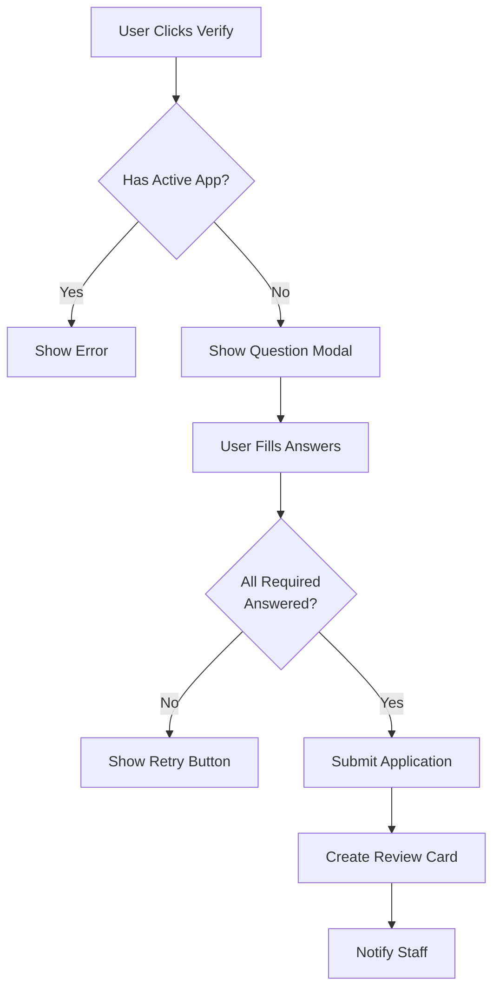

**What happens behind the scenes:**

When someone clicks Verify, the bot checks if they have a permanent rejection on file. If they do, the bot stops them right there. If they're clear, the bot creates a draft application in the database and shows them a modal (popup form) with the first set of questions.

If you've set up more than 5 questions, the bot splits them into multiple pages. Discord only allows 5 text inputs per modal, so the bot shows a Next button to continue. All answers get saved as they go, so if someone closes the modal by accident, their progress isn't lost.

Once they submit the final page, the bot does a few things at once:
- Marks the application as "submitted" in the database
- Creates a review card in your staff channel with all their answers
- Optionally scans their avatar for inappropriate content (if you have that feature enabled)
- Logs the submission for analytics

**The review card shows:**

- **Applicant info**: Username, user ID, account age
- **Application metadata**: When submitted, short code (like `A1B2C3`), whether it's claimed
- **Status indicators**: If they have modmail open, if they left the server, if they're flagged
- **Avatar scan results**: Risk score if avatar scanning is enabled
- **Application history**: Past applications from this same user (if any)
- **Action history**: Recent moderator actions on this application
- **All their answers**: Each question and response, formatted clearly

The review card updates live when mods take actions. If someone claims it, the card shows who claimed it. When accepted or rejected, the card changes color and shows the decision.

### What the Claim System Does

The claim system prevents two mods from working on the same application at the same time. When you click Claim Application, the bot records that you're reviewing it. Other mods see "Claimed by @YourName" and can't click the decision buttons until you release it.

Claims are stored in the database and survive bot restarts. If you claimed an app yesterday and the bot restarted overnight, your claim is still there.

**Why this matters:** Without claims, two mods could both click Accept at the same time. The applicant would get two welcome messages, or the database could get confused. Claims prevent that.

**Workflow:**

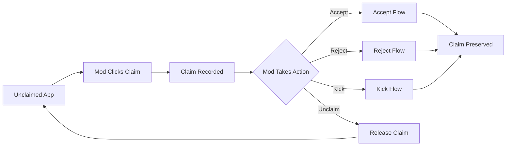

If you claimed something but need to step away, use `/unclaim` to release it. The app goes back to the unclaimed pool and another mod can grab it.

### `/gate`
**Who can use it:** Staff (Manage Messages)

This is how you set up and configure the whole application system.

| Subcommand | What it does |
|------------|--------------|
| `setup` | First-time setup — tells the bot which channels to use and what role to give accepted members |
| `status` | Shows you the numbers — how many apps total, how many pending, accepted, rejected, etc. |
| `config` | Displays all your current settings so you can double-check everything |
| `reset` | Wipes all application data and starts fresh. Be careful with this one! |
| `welcome set` | Change what the welcome message says when someone gets accepted |
| `welcome preview` | See what the welcome message will look like before going live |
| `welcome channels` | Pick which channels get welcome messages |
| `welcome role` | Choose a role to ping when welcoming new members |
| `set-questions` | Set the questions applicants have to answer (q1 through q5) |

**Placeholders you can use in welcome messages:**
- `{applicant.mention}` — @mentions the new member
- `{applicant.username}` — just their name
- `{applicant.id}` — their Discord ID
- `{channel.rules}` — links to #rules
- `{channel.roles}` — links to #roles
- `{server.name}` — the server name
- `{server.memberCount}` — current member count

**Examples:**
```
/gate setup review_channel:#staff-review gate_channel:#apply general_channel:#general accepted_role:@Member
/gate welcome set content:Welcome {applicant.mention}! 🎉 Check out {channel.rules} and grab some roles in {channel.roles}!
/gate set-questions q1:What is the password? q2:How did you find us? q3:Tell us about yourself
```

---

### `/accept`
**Who can use it:** Staff (Reviewer role or Manage Guild)

Use this to approve someone's application. They'll get the member role and a welcome message will be posted.

You need to tell the bot which application you mean. Pick ONE of these:
- `app:A1B2C3` — the short code shown on the review embed
- `user:@Username` — mention them or pick from the list
- `uid:123456789012345678` — their Discord ID (handy if they already left)

**What happens when you accept someone:**

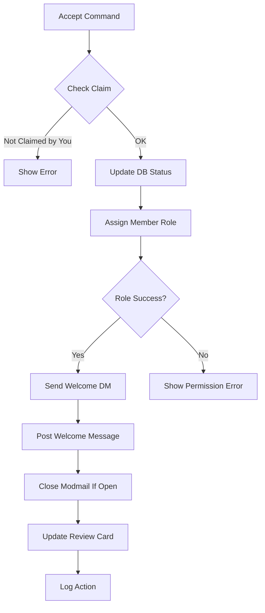

Step by step:
1. The bot checks if you're the one who claimed this app (or if it's unclaimed)
2. Changes the application status to "approved" in the database
3. Tries to give them the member role you configured in `/gate setup`
4. Sends them a DM letting them know they were accepted (if their DMs are open)
5. Posts a welcome message in your general channel (uses the template from `/gate welcome set`)
6. Closes their modmail thread if they had one open
7. Updates the review card to show "Approved" in green
8. Logs the action for `/modstats` tracking

**Common issues and what the bot does:**

- **Member role fails:** The bot tells you it couldn't assign the role. This usually means the bot's role is lower than the member role in your server's role list, or the bot lacks Manage Roles permission. Fix the permissions and manually assign the role.
- **DM fails:** If their DMs are closed, the bot still approves them but notes the DM failed. They won't get the acceptance notification.
- **Welcome message fails:** If the bot can't post in your general channel (wrong permissions, channel deleted), it tells you but still approves them.

**Examples:**
```
/accept app:A1B2C3
/accept user:@CoolPerson
/accept uid:123456789012345678
```

---

### `/reject`
**Who can use it:** Staff (Reviewer role or Manage Guild)

Use this when you need to turn someone down. You have to give a reason, and they'll get a DM explaining why (if their DMs are open).

| Option | Required? | What it does |
|--------|-----------|--------------|
| `reason` | **Yes** | Why you're rejecting them — this gets sent to the user and logged (max 500 characters) |
| `app` | No | The short code from the review embed |
| `user` | No | Mention them or pick from the list |
| `uid` | No | Their Discord ID |
| `perm` | No | Set this to `true` if they should never be allowed to apply again |

Pick ONE of app/user/uid — not multiple.

**What happens when you reject someone:**
1. They get a DM with your reason (if their DMs are open)
2. The review embed updates to show the rejection and reason
3. If you used `perm:true`, they're blocked from ever applying again
4. They get kicked from the server
5. It all gets logged for mod stats

**When to use permanent rejection:**
- Obvious spam or bot accounts
- People who break rules during the application
- Repeat offenders who keep getting rejected
- Underage users

**Examples:**
```
/reject app:A1B2C3 reason:Incorrect password - please re-read the rules and try again
/reject user:@SpamBot reason:Bot account perm:true
/reject uid:123456789012345678 reason:Underage perm:true
```

---

### `/kick`
**Who can use it:** Staff (Reviewer role or Manage Guild)

This removes someone from the server but doesn't count as a formal rejection. Good for situations where they just need to try again.

| Option | Required? | What it does |
|--------|-----------|--------------|
| `reason` | **Yes** | Why you're kicking them |
| `app` | No | Short code |
| `user` | No | Mention or picker |
| `uid` | No | Discord ID |

**When to kick vs when to reject:**
- **Kick:** They made a mistake, didn't finish their app, need another shot
- **Reject:** You're formally denying them and want it on record

**Examples:**
```
/kick app:A1B2C3 reason:Incomplete application - please try again
/kick user:@Username reason:Application timed out
```

---

### `/unclaim`
**Who can use it:** Staff

If you claimed an application but can't finish reviewing it, use this to release it so someone else can take over.

| Option | Required? | What it does |
|--------|-----------|--------------|
| `app` | No | Short code |
| `user` | No | Mention or picker |
| `uid` | No | Discord ID |

**Examples:**
```
/unclaim app:A1B2C3
/unclaim user:@Username
```

---

### `/listopen`
**Who can use it:** Staff (Reviewer role or Manage Guild)

See what applications are waiting for review. Shows up to 10 applications per page with navigation buttons.

| Option | Required? | What it does |
|--------|-----------|--------------|
| `scope` | No | What to show (default: `mine`) |

**Scope options:**
| Scope | What you'll see |
|-------|-----------------|
| `mine` | Just the apps you've claimed (default) |
| `all` | Everything that's open — claimed and unclaimed |
| `drafts` | Applications people started but haven't finished yet |

**What each scope shows:**

**Mine (default):** Only applications you personally claimed. Good for checking your own workload. If you haven't claimed anything, the list will be empty. The list is sorted by claim time (most recently claimed first).

**All:** Every application that's submitted and waiting for a decision, whether claimed or unclaimed. Shows who claimed each one (if anyone). Useful for managers checking overall queue health or finding unclaimed apps to grab. Sorted by submission time.

**Drafts:** Applications where someone clicked Verify, started filling out answers, but never hit submit. These are people who got partway through and stopped. Drafts don't create review cards and don't count in your stats. They're mostly useful for debugging (like "why didn't this person's app show up?"). After a while, old drafts can be safely ignored.

**The list shows:**
- Applicant's avatar thumbnail
- Username
- Application short code (the `A1B2C3` format)
- When it was submitted
- Who claimed it (if anyone)
- A link to jump directly to the review card in your review channel

If there are more than 10 apps, you'll see Previous/Next buttons to navigate between pages. The list updates every time you run the command (it's not live-updating).

**Examples:**
```
/listopen
/listopen scope:all
/listopen scope:drafts
```

---

### `/search`
**Who can use it:** Staff (Reviewer role or Manage Guild)

Look up someone's entire application history — every app they've submitted, what happened, and which mod handled it.

| Option | Required? | What it does |
|--------|-----------|--------------|
| `user` | **Yes** | Who to look up |

This command is essential for reviewing repeat applicants. When someone applies for the second (or third, or tenth) time, you want to know:
- How many times have they applied before?
- What happened to those previous applications?
- Did they get rejected? Why?
- Is there a pattern (like always getting the password wrong)?

**What you'll see:**

The search results show up to 10 most recent applications from this user. For each one:
- **App code** (like `A1B2C3`) — the short identifier
- **Status** — approved, rejected, kicked, or still pending
- **Date** — when they submitted it
- **Outcome** — if resolved, who handled it and when
- **Reason** — if rejected or kicked, the reason that was given
- **Link to review card** — click to see the full application

At the top, you'll see:
- Total number of applications from this user
- If they're currently permanently rejected (blocked)
- If they have any pending applications right now

**Example use cases:**

"This person applied 5 times and got rejected for wrong password every time. Maybe we should perm reject them for not reading."

"They were kicked last month for incomplete app, let's see if they actually finished it this time."

"They got accepted before but then got banned. Why are they applying again?"

The search works even if the person left the server — you just need their user ID or to mention them from a message they sent before leaving.

**Example:**
```
/search user:@Username
```

---

### `/unblock`
**Who can use it:** Staff

Made a mistake with a permanent rejection? Or did someone's appeal get approved? Use this to let them apply again.

| Option | Required? | What it does |
|--------|-----------|--------------|
| `target` | No | Mention the user |
| `user_id` | No | Their Discord ID (if they left) |
| `username` | No | Their username as a fallback |
| `reason` | No | Why you're unblocking them — gets logged |

**How unblocking works:**

When someone is permanently rejected, the bot sets a flag in the database that prevents them from even starting an application. When they click Verify, instead of seeing the questions, they get "You have been permanently rejected from this server."

Unblocking removes that flag. The next time they click Verify, they'll be able to fill out the application normally. Their previous applications (including the permanent rejection) stay in the history — you're not erasing the past, just giving them another chance.

**Common scenarios:**

- **Mistaken identity:** You perm rejected the wrong person
- **Appeal approved:** They contacted server leadership and got approved to reapply
- **They're now old enough:** They were perm rejected for being underage, but now they're 13+
- **Changed circumstances:** They were perm rejected for being in a rival community, but that's no longer an issue

**What gets logged:**

The unblock action goes into the database with:
- Who unblocked them
- When it happened
- The reason you provided
- Which user was unblocked

This creates an audit trail. If someone gets unblocked and perm rejected again, you can see the full history in `/search`.

**Examples:**
```
/unblock target:@Username reason:Appeal approved by leadership
/unblock user_id:123456789012345678 reason:Mistaken identity - wrong person
/unblock target:@Username reason:Now 13+ years old, ID verified
```

---

## Moderator Tools

These commands help you track how mods are doing, spot patterns, and keep an eye on things. The bot automatically tracks every action moderators take — claims, accepts, rejects, kicks — and turns that data into useful insights.

### How the Stats System Works

Every time a moderator takes an action on an application, the bot records it in a database table called the "action log." Think of it like a detailed diary of everything that happens with applications.

**What gets tracked:**
- When someone submits an application
- When a mod claims it
- When they approve, reject, or kick
- How long each step took
- Why they rejected someone (if they did)

This information then flows into different reports and tools you can use:

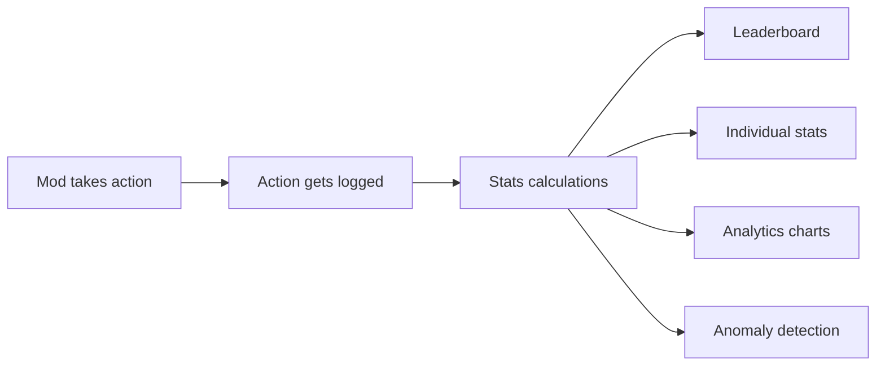

### Understanding Response Times

The bot tracks two different types of response time to help you understand how fast your team is working:

**Claim to Decision Time** — How long it takes a mod to make a decision after claiming an application. This is measured from when they click "Claim" to when they click "Accept" or "Reject." Fast claim-to-decision times mean mods are reviewing applications quickly.

**Submit to First Claim Time** — How long applications sit in the queue before anyone claims them. This is measured across the whole server, not per-mod. Long wait times here mean you might need more active reviewers.

The bot shows these as "p50" and "p95" which are percentiles:
- **p50** (median) — Half of the reviews were faster than this, half were slower
- **p95** — 95% of reviews were faster than this (shows your slowest cases)

### `/modstats`
**Who can use it:** Staff

See how active moderators are and how they're performing.

| Subcommand | What it does |
|------------|--------------|
| `leaderboard` | Ranks mods by how many apps they've handled |
| `user` | Deep dive into a specific mod's stats |
| `export` | Download everything as a CSV file |
| `reset` | Wipe and rebuild the stats (needs admin password) |

**Options:**
| Option | Works with | What it does |
|--------|------------|--------------|
| `days` | All | How far back to look (default: 30 days) |
| `moderator` | `user` | Which mod to analyze |

**The leaderboard shows:**
- Rankings by total decisions (approves + rejects + kicks + modmail opens)
- Accept and reject counts for each mod
- Average response time (how long from claim to decision)
- Color-coded by their highest role for easy identification
- Shows top 15 mods (use export to see everyone)

**Individual mod stats show:**
- Total decisions they've made
- Accept vs reject breakdown with exact counts
- Modmail threads opened (shows engagement with applicants)
- Avg Claim → Decision time (how fast they work)
- Server Avg: Submit → First Claim time (for comparison)

The individual stats let you compare a mod's speed to the server average. If someone's claim-to-decision time is way higher than the server's submit-to-first-claim time, it might mean they're being extra thorough (good!) or getting stuck on decisions (needs support).

**Examples:**
```
/modstats leaderboard days:7
/modstats user moderator:@ModName days:30
/modstats export days:90
```

---

### Anomaly Detection: What It Means

The bot uses something called "z-score analysis" to flag unusual patterns. Don't worry — it sounds complicated but the idea is simple.

**How it works:**
1. The bot looks at a mod's daily action counts over time
2. It calculates their normal average and how much they usually vary
3. If a recent day is way above or below their normal pattern, it flags it

**What the scores mean:**
- **Z-score under 2.5** — Normal variation, nothing to worry about
- **Z-score 2.5-3.0** — Noticeable change, worth checking
- **Z-score over 3.0** — Unusual pattern, investigate

**Why anomalies get flagged:**
- Sudden spike in activity (might be catching up after vacation)
- Sudden drop in activity (might be burnt out or taking a break)
- Way more rejects than usual (could indicate frustration or policy change)
- Way more approvals than usual (might be rushing through reviews)

Anomaly detection helps leadership spot problems early. If someone who usually handles 10 apps a day suddenly does 2, you can check in with them before they burn out completely.

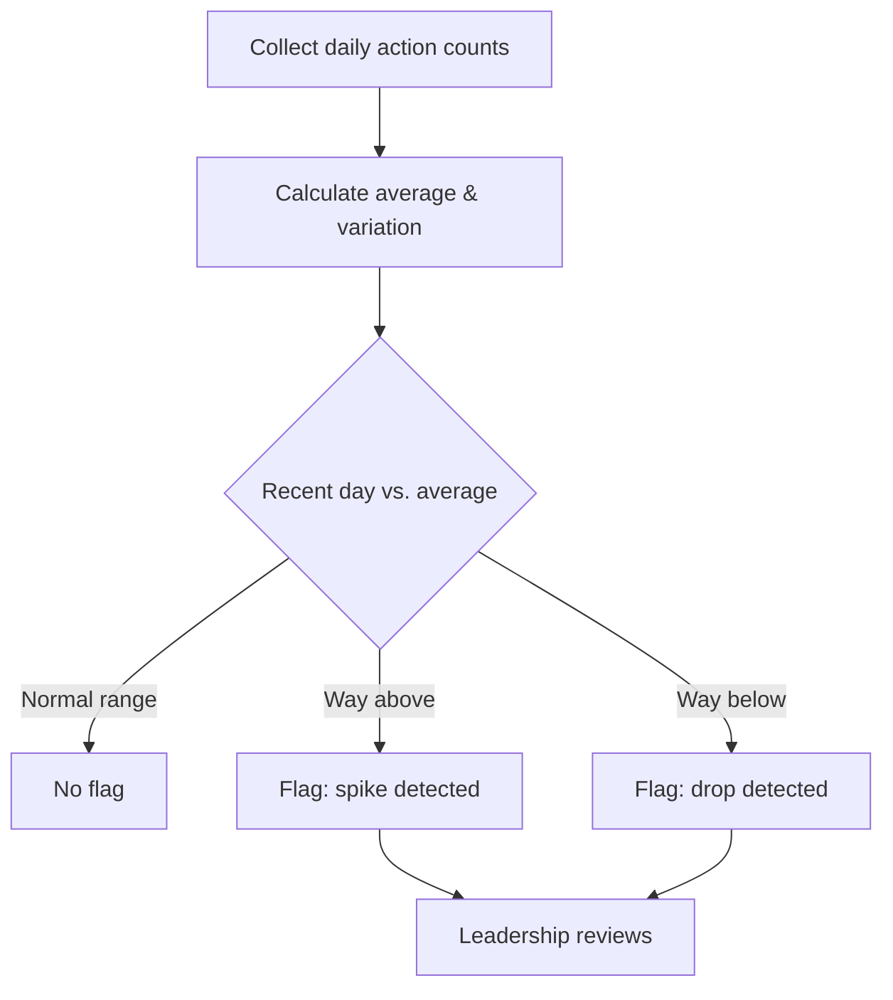

**Important note:** This compares each mod to their own history, not to other mods. A consistently slow mod won't trigger alerts because slow is their normal. If you want to compare mods to each other, use the leaderboard.

---

### `/modhistory`
**Who can use it:** Leadership only (server owners or designated leaders)

This gives you a detailed look at everything a specific mod has done. It's for oversight and performance reviews, which is why it's restricted to leadership.

| Option | Required? | What it does |
|--------|-----------|--------------|
| `moderator` | **Yes** | Who to look into |
| `days` | No | How far back (default: 30, max: 365) |
| `export` | No | Download as CSV |

**You'll see:**
- Every accept, reject, and kick they've made
- Timestamps for each action
- How long they took to respond
- The reasons they gave for rejections
- Anomaly scores (flags unusual patterns)
- Reject rate percentage (rejects divided by total decisions)
- Response time percentiles (p50 and p95)

**What the CSV export includes:**
When you export to CSV, you get a file with every single action that mod took. Each row has:
- Action type (approve, reject, kick, etc.)
- Timestamp (when it happened)
- Who they acted on (user ID)
- Reason given (for rejects)
- Response time (in milliseconds)
- Application ID (for reference)

The CSV link expires after 24 hours for security reasons.

**Examples:**
```
/modhistory moderator:@ModName days:60
/modhistory moderator:@ModName days:90 export:true
```

---

### `/analytics`
**Who can use it:** Staff

Visual charts showing review activity over time. Helpful for spotting busy periods or figuring out when you need more coverage.

| Option | Required? | What it does |
|--------|-----------|--------------|
| `from` | No | Start date (Unix timestamp) |
| `to` | No | End date (Unix timestamp) |
| `all-guilds` | No | Include all servers (bot owners only) |
| `bucket` | No | Group by `day` or `week` |

**The charts show:**
- How many apps came in over time (volume trends)
- Accept vs reject vs kick distribution
- Busiest days and times
- Whether activity is going up or down

**Time buckets explained:**
- **Daily buckets** — Each bar = one day. Good for spotting weekly patterns (like "Mondays are busy")
- **Weekly buckets** — Each bar = one week. Good for long-term trends (like "summer is slower")

Default time range is the last 7 days if you don't specify `from` and `to`.

**Examples:**
```
/analytics
/analytics bucket:daily
/analytics bucket:week
```

---

### `/analytics-export`
**Who can use it:** Staff

Same data as `/analytics` but downloaded as a CSV so you can dig into it yourself with Excel or Google Sheets.

| Option | Required? | What it does |
|--------|-----------|--------------|
| `from` | No | Start date (Unix timestamp) |
| `to` | No | End date (Unix timestamp) |
| `all-guilds` | No | Include all servers (owners only) |

The CSV includes columns for:
- Time bucket start and end
- Total actions
- Approvals count
- Rejections count
- Permanent rejects count
- Kicks count

---

### `/flag`
**Who can use it:** Staff

Mark someone as suspicious. Flagged users show a warning badge on their applications so other mods know to look closer.

| Option | Required? | What it does |
|--------|-----------|--------------|
| `user` | **Yes** | Who to flag |
| `reason` | No | Why — this shows to other staff |

**Good reasons to flag someone:**
- Suspicious account (brand new, no avatar, weird username)
- You think they're an alt of someone banned
- Other members reported them
- Bad history in other servers

Flags don't automatically reject people — they just warn other reviewers to pay extra attention.

**Examples:**
```
/flag user:@SuspiciousUser reason:Alt account of banned user
/flag user:@NewAccount reason:Suspicious join pattern - review carefully
```

---

### `/approval-rate`
**Who can use it:** Staff

See the big picture — what percentage of applications get approved vs rejected server-wide.

| Option | Required? | What it does |
|--------|-----------|--------------|
| `days` | No | How far back to look (default: 30) |

**You'll see:**
- Total applications received
- Approval rate percentage (approvals divided by all decisions)
- Rejection rate percentage
- Kick rate percentage
- Permanent reject rate percentage
- How it compares to the previous period (trend up or down)
- Common rejection reasons (top 5 most-used reasons)

**Understanding the trend:**
The bot compares your current period to the previous period of the same length. So if you ask for the last 30 days, it compares to the 30 days before that.

- **Trend up** — You're approving more than you used to
- **Trend down** — You're rejecting more than you used to
- **Stable** — Less than 1% change (basically the same)

A declining approval rate might mean:
- Stricter standards (intentional policy change)
- Lower quality applicants (need to review your advertising)
- Burnt out moderators being overly harsh (check in with the team)

**Examples:**
```
/approval-rate
/approval-rate days:7
/approval-rate days:90
```


## Suggestion System

A way for community members to submit feature ideas for the bot, vote on them, and for staff to manage them. Think of it like a suggestion box where everyone can see what others have suggested and vote on their favorites.

### How It Works

The suggestion system lets your community help shape the bot's future. Here's the complete flow from idea to implementation:

1. **Someone has an idea** — They use `/suggest` to submit a feature idea
2. **The bot posts it** — The suggestion appears in the configured suggestions channel as an embed with a unique ID number
3. **The community votes** — Other members can click upvote or downvote buttons on the suggestion
4. **Voting updates live** — Each time someone votes, the embed updates to show the current vote count
5. **Staff reviews it** — Staff can approve, deny, or mark it as implemented using `/suggestion`
6. **The embed updates** — When staff takes action, the suggestion embed changes color and shows the decision
7. **They get notified** — The person who suggested it gets a DM explaining what happened
8. **Voting closes** — Once a suggestion is approved, denied, or implemented, voting buttons are removed

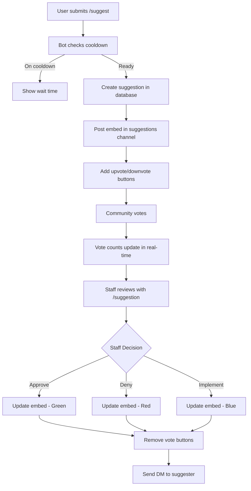

### How Voting Works

Anyone in the server can vote on open suggestions. Here's what you need to know:

- **One vote per person** — You can upvote or downvote, but not both
- **Change your mind** — Click the other button to switch your vote
- **Only open suggestions** — You can't vote on suggestions that have been approved, denied, or implemented
- **Vote counts are public** — Everyone can see how many upvotes and downvotes a suggestion has
- **Your vote is recorded** — The bot remembers your vote even if you switch it later

When you click a vote button, the bot instantly updates the suggestion embed to show the new vote totals. If you try to vote the same way twice, the bot will tell you that you've already voted that way.

### Cooldown System

To prevent spam, there's a cooldown between submissions. The cooldown is configurable by server admins (default is usually a few minutes to an hour). If you try to submit another suggestion too soon, the bot will tell you how many minutes you need to wait.

The cooldown only applies to new submissions, not to voting on other people's suggestions.

### `/suggest`
**Who can use it:** Everyone

Submit an idea for a new bot feature. There's a cooldown between submissions to prevent spam.

| Option | Required? | What it does |
|--------|-----------|--------------|
| `suggestion` | **Yes** | Your idea (max 1000 characters) |

**What happens when you submit:**
1. Bot checks if you're on cooldown (if so, shows how long to wait)
2. Bot checks if the suggestions channel is configured (if not, tells you to contact an admin)
3. Your suggestion gets saved to the database with a unique ID
4. An embed appears in the suggestions channel showing your suggestion
5. Upvote and downvote buttons are added below the embed
6. You get a confirmation message with a link to view your suggestion

**Tips for good suggestions:**
- Be specific about what you want (not just "make the bot better")
- Explain why it would be useful (helps staff understand the value)
- Keep it focused on one feature (don't bundle multiple ideas together)
- Check existing suggestions first so you don't duplicate (use `/suggestions` to browse)
- Stay under 1000 characters (Discord enforces this limit)

**Examples:**
```
/suggest suggestion:Add a command to view server statistics like member count over time
/suggest suggestion:Let users set their own timezone for event notifications
/suggest suggestion:Add a way to export mod stats as a spreadsheet for monthly reports
```

---

### `/suggestions`
**Who can use it:** Everyone

Browse through all the suggestions people have submitted. Results are shown 5 suggestions per page with navigation buttons.

| Option | Required? | What it does |
|--------|-----------|--------------|
| `status` | No | Filter by status (default: open) |

**Status options:**
| Status | What it shows |
|--------|---------------|
| `open` | New ones waiting for review (default) |
| `approved` | Approved and planned for the future |
| `denied` | Turned down with a reason why |
| `implemented` | Done and live in the bot! |
| `all` | Everything regardless of status |

**The list shows:**
- Suggestion ID number (you need this for `/suggestion` commands)
- Who suggested it and when
- Current vote counts (upvotes and downvotes)
- Current status (open, approved, denied, or implemented)
- Brief preview of the suggestion text

**Navigation:**
If there are more than 5 suggestions, you'll see Previous and Next buttons at the bottom. Click them to browse through the pages. The buttons remember your current filter (status) as you navigate.

**Examples:**
```
/suggestions
/suggestions status:approved
/suggestions status:implemented
/suggestions status:all
```

---

### `/suggestion`
**Who can use it:** Staff (Manage Messages)

Manage suggestions — approve them, deny them, or mark them done. When you take action, the suggestion embed updates and the user gets notified via DM.

| Subcommand | What it does |
|------------|--------------|
| `approve` | Green light it — means you're planning to add it |
| `deny` | Turn it down with a reason |
| `implement` | Mark it as shipped and live |
| `delete` | Remove it entirely (use sparingly) |

**Options:**
| Option | Works with | What it does |
|--------|------------|--------------|
| `id` | All | The suggestion's ID number (required) |
| `response` | `approve`, `implement` | Optional message to the suggester |
| `reason` | `deny` | Why you're denying it (required for deny) |

**What happens when you approve:**
1. Suggestion status changes to "approved" in the database
2. The embed in the suggestions channel updates with a green color and shows who approved it
3. Vote buttons are removed (voting closes after approval)
4. The suggester gets a DM saying their idea was approved, with your optional response
5. You get a confirmation message

**What happens when you deny:**
1. Suggestion status changes to "denied"
2. The embed updates with a red color, showing who denied it and why
3. Vote buttons are removed
4. The suggester gets a DM explaining why it was denied (your reason is included)
5. You get a confirmation message

**What happens when you implement:**
1. Suggestion status changes to "implemented"
2. The embed updates with a blue/purple color showing it's done
3. Vote buttons are removed
4. The suggester gets a DM celebrating that their idea is now live
5. You get a confirmation message

**What happens when you delete:**
1. The suggestion is removed from the database
2. The embed message in the channel is deleted (if possible)
3. No DM is sent to the suggester
4. You get a confirmation message

**When to use each action:**
- **Approve** — The idea is good and you plan to add it eventually
- **Deny** — The idea doesn't fit the bot's purpose, is too complex, or won't work
- **Implement** — The feature has been built and is now available
- **Delete** — The suggestion is spam, inappropriate, or was posted by mistake

**Examples:**
```
/suggestion approve id:42 response:Great idea! Adding to the roadmap for next month.
/suggestion deny id:43 reason:This is outside the scope of what the bot does.
/suggestion implement id:42 response:This is now live! Thanks for the suggestion.
/suggestion implement id:55
/suggestion delete id:99
```

---

## Artist Rotation

A queue system that fairly distributes art commissions among Server Artists. When someone redeems an art reward, the next artist in line gets assigned. This ensures everyone gets a fair share of work and no one artist gets overwhelmed or left out.

### How the Queue Works

The artist rotation is like a line at a store. When it's your turn, you help the next customer, then you go to the back of the line so everyone gets a turn.

1. **Artists join the queue** — Anyone with the Server Artist role (<@&1201395606455562341>) is automatically added to the queue
2. **Queue positions are assigned** — Artists are numbered from 1 (next up) to whatever the total count is. New artists go to the end
3. **Order is maintained** — The queue stays in order unless staff manually moves someone with `/artistqueue move`
4. **Someone redeems a reward** — When you use `/redeemreward`, the bot picks the artist at position 1 (unless they're skipped)
5. **Rotation happens** — After an assignment, that artist moves to the very end of the queue, and everyone else shifts up by one position
6. **Skip if needed** — Artists can be temporarily skipped if they're on vacation or too busy. Skipped artists stay in their position but won't be picked
7. **Stats are tracked** — The bot keeps count of how many assignments each artist has handled and when they last worked

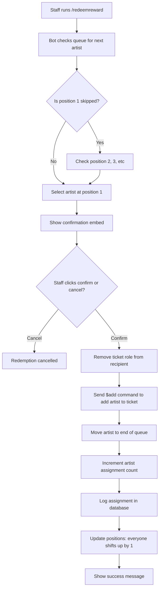

### How Skipping Works

Sometimes an artist needs a break or is temporarily unavailable. When you skip an artist:

- They stay in their current position in the queue
- They're marked as "skipped" with an optional reason
- When the bot looks for the next artist, it skips over them and picks the next non-skipped artist
- Their assignment count doesn't increase while they're skipped
- When you unskip them, they immediately become available again at their current position

**Example:** If the queue is Artist A (position 1, skipped), Artist B (position 2), Artist C (position 3), then Artist B gets the next assignment. Artist A stays at position 1 until they're unskipped.

### Sync System

The queue automatically stays in sync with who has the Server Artist role. When you run `/artistqueue sync`:

- Anyone with the Server Artist role who isn't in the queue gets added to the end
- Anyone in the queue who no longer has the role gets removed
- Existing artists keep their positions and assignment counts

This is useful after role changes, or if the queue gets out of sync for any reason.

### `/artistqueue`
**Who can use it:** Manage Roles permission

Manage who's in the queue and their order.

| Subcommand | What it does |
|------------|--------------|
| `list` | See the current queue order and who's skipped |
| `sync` | Update the queue to match who currently has the Server Artist role |
| `move` | Put an artist at a specific position in the queue |
| `skip` | Temporarily take an artist out of rotation |
| `unskip` | Put them back in rotation |
| `history` | See past art reward assignments |
| `setup` | First-time setup — syncs the queue and gets everything configured |

**Examples:**
```
/artistqueue list
/artistqueue sync
/artistqueue move user:@Artist position:1
/artistqueue skip user:@Artist reason:On vacation until Dec 15
/artistqueue unskip user:@Artist
/artistqueue history limit:20
/artistqueue history user:@Artist limit:10
```

---

### `/redeemreward`
**Who can use it:** Manage Roles permission

Use this in a ticket channel when someone is redeeming an art prize. It assigns the next artist and adds them to the ticket. This command is designed to work with the Ticket Tool bot and manages ticket roles automatically.

| Option | Required? | What it does |
|--------|-----------|--------------|
| `user` | **Yes** | Who's redeeming the reward |
| `type` | **Yes** | What kind of art (headshot, halfbody, fullbody, or emoji) |
| `artist` | No | Override the queue and pick a specific artist instead of the next in line |

**Art types:**
| Type | Description |
|------|-------------|
| `headshot` | Head/portrait |
| `halfbody` | Waist-up |
| `fullbody` | Full character |
| `emoji` | Discord emoji |

**The confirmation process:**

When you run the command, the bot shows you a confirmation embed before doing anything. This gives you a chance to double-check everything is correct. The confirmation shows:

- Who's redeeming the reward (the recipient)
- What type of art they're getting
- Whether they have the matching ticket role
- Any other ticket roles they currently have
- Who the next artist is (their position in queue)
- A warning if the ticket type doesn't match their role

You get two buttons: Confirm and Cancel. If you click Cancel, nothing happens and the embed disappears. If you click Confirm, the bot proceeds with the assignment.

**What happens when you click Confirm:**

1. **Ticket role is removed** — The bot removes the matching ticket role from the recipient (if they have it)
2. **Artist is added to ticket** — The bot sends `$add <@artistId>` in the channel to add the artist to the ticket (works with Ticket Tool bot)
3. **Queue rotates** — The artist moves from their current position to the very end of the queue
4. **Positions update** — Everyone else in the queue shifts up by one position
5. **Stats increase** — The artist's assignment count goes up by 1
6. **Assignment is logged** — Everything gets recorded in the database for history tracking
7. **You get confirmation** — The bot shows you a summary of what happened

**Override mode:**

If you specify an artist manually (using the `artist` option), the queue doesn't rotate. The chosen artist still gets their assignment count increased and the assignment is still logged, but they stay in their current queue position. This is useful for special requests or when someone specifically wants a certain artist.

**Ticket role validation:**

The bot checks if the recipient has the correct ticket role for the type of art they're redeeming. If they don't have it, you'll see a warning in the confirmation embed. You can still proceed if you want (maybe they lost the role by mistake, or this is a special case), but the warning lets you know something might be off.

**Examples:**
```
/redeemreward user:@Winner type:headshot
/redeemreward user:@Winner type:fullbody artist:@SpecificArtist
/redeemreward user:@EventPrizeWinner type:emoji
```

---

## Movie Night

Track who shows up to movie nights and automatically give out tier roles based on attendance.

### How It Works

Movie night tracking is all about watching the voice channel and counting how long people stay. Here's the step-by-step process:

1. **Start tracking** — When the movie begins, a staff member runs `/movie start` and picks the voice channel
2. **Bot starts watching** — The bot listens for voice channel events (joins, leaves, moves)
3. **Time gets counted** — Every time someone joins or leaves, the bot records a timestamp
4. **End the event** — When the movie's over, run `/movie end` to stop tracking
5. **Bot does the math** — The bot adds up all the time each person spent in the channel
6. **Roles get assigned** — Anyone who stayed 30+ minutes gets credit, and tier roles update automatically
7. **You get a DM** — The bot sends you a message showing your progress toward the next tier

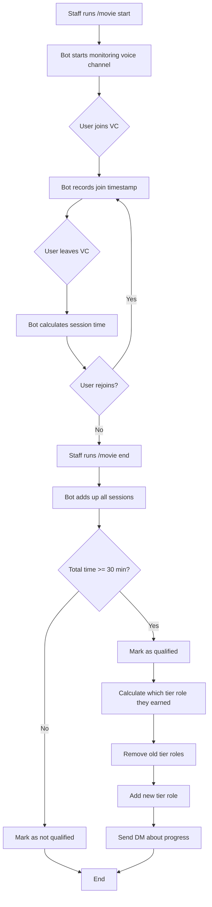

### How Time Tracking Works

The bot uses something called "sessions" to track your time. A session is the period from when you join the voice channel until you leave. Here's what happens behind the scenes:

**When you join the voice channel:**
- Bot saves the current time as your "session start"
- If you were already in the channel when tracking started, the bot counts from when `/movie start` was run

**When you leave the voice channel:**
- Bot looks at the current time and your session start time
- Calculates the difference (that's your session length)
- Adds the session length to your total time
- Saves your longest session (used for some servers that require continuous attendance)

**If you rejoin:**
- Bot starts a new session with a new start time
- All your sessions get added together for your total time
- Example: You watch 20 minutes, leave for a bathroom break, come back for 15 more minutes = 35 minutes total

**When the movie ends:**
- Bot finalizes all open sessions (people still in the VC get credit for their last session)
- Calculates totals for everyone
- Anyone with 30+ minutes total gets marked as "qualified"

### Tier Roles

You need to stay **at least 30 minutes** during a movie night for it to count toward your tier. This is called being "qualified" for that event.

| Tier | Role | How to earn it |
|------|------|----------------|
| T1 | <@&1388676461657063505> | Attend 1+ movie night |
| T2 | <@&1388676662337736804> | Attend 5+ movie nights |
| T3 | <@&1388675577778802748> | Attend 10+ movie nights |
| T4 | <@&1388677466993987677> | Attend 20+ movie nights |

**How tier assignment works:**
1. Bot counts how many qualified movies you've attended (ever, not just recently)
2. Looks at the tier list from highest to lowest
3. Finds the highest tier you've reached
4. Removes all other movie tier roles from you (so you only have one)
5. Adds the tier role you earned
6. Sends you a DM telling you your progress

**Important rules:**
- People only get promoted, never demoted
- If someone has <@&1388675577778802748> and misses a few movies, they keep the role
- You can't lose tiers by not attending — once earned, always earned
- Each movie night counts as one event, even if you attend for 3 hours

### `/movie`
**Who can use it:** Staff

| Subcommand | What it does |
|------------|--------------|
| `start` | Begin tracking attendance in a voice channel |
| `end` | Finish the event and hand out roles |
| `attendance` | See who attended or check a specific person's history |

**Start options:**
| Option | Required? | What it does |
|--------|-----------|--------------|
| `channel` | **Yes** | Which voice channel to track |

**Attendance options:**
| Option | Required? | What it does |
|--------|-----------|--------------|
| `user` | No | Check a specific person — leave blank to see everyone |

**Examples:**
```
/movie start channel:#movie-night-vc
/movie end
/movie attendance
/movie attendance user:@Username
```

**What you'll see in `/movie attendance`:**
- Total qualified movies for that person (the number that counts toward tiers)
- Current tier role they have
- Next tier and how many more movies they need
- Recent attendance history (last 10 events)
- Each event shows: date, total time, longest session, and whether they qualified

**Edge cases the bot handles:**
- Someone joins, leaves, and rejoins — all their time gets added up
- Someone was already in the VC when you started tracking — counted from start time
- Bot restarts mid-movie — session data is lost (in-memory only), so end and restart the event
- Multiple people leaving at once — each person's time is tracked separately
- Someone switches between voice channels — only time in the tracked channel counts

---

## Role Automation

Set up automatic role assignments based on Amaribot levels and movie night attendance. This feature watches for certain events (like someone leveling up) and automatically gives them roles without staff needing to do it manually.

### How Role Automation Works

The bot watches for specific triggers and then assigns roles automatically. Here's what happens behind the scenes:

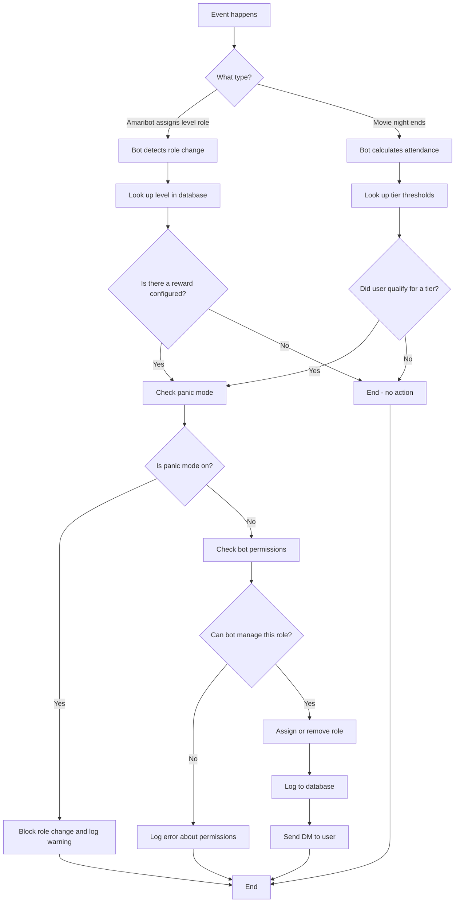

### How It Integrates with Amaribot

Amaribot is a separate bot that tracks message activity and assigns levels. Our bot works alongside it:

1. **Someone sends messages** — Amaribot counts their messages and gives them XP
2. **They level up** — Amaribot assigns them a level role (like "Level 15")
3. **Our bot notices** — We watch for role changes and detect when Amaribot adds a level role
4. **We check our database** — Is there a level tier or level reward configured for level 15?
5. **We assign rewards** — If configured, we give them token roles or other rewards
6. **User gets notified** — They get a DM telling them what they earned

**Important:** You need to configure level tiers to match Amaribot's level roles. If Amaribot gives people "Engaged Fur LVL 15" at level 15, you'd use:
```
/roles add-level-tier level:15 role:@Engaged Fur LVL 15
```

### Level Tiers vs Level Rewards

There are two types of level-based roles:

**Level Tiers** (the role Amaribot assigns):
- These are the roles Amaribot gives when someone levels up
- Examples: "Engaged Fur LVL 15", "Active Member LVL 30"
- You configure these so the bot knows which level each role represents
- The bot uses this to trigger level rewards

**Level Rewards** (bonus roles you give at certain levels):
- These are one-time bonus roles you want to give at specific levels
- Examples: "Byte Token [Common]", "Event Ticket", "Special Access"
- Someone can get multiple rewards at the same level
- Once earned, these don't get removed (unlike tier roles)

**Example workflow:**
- User reaches level 15
- Amaribot gives them "Engaged Fur LVL 15" role
- Our bot sees the role change, looks it up, finds it's level 15
- Our bot checks: are there any level rewards for level 15?
- Our bot gives them "Byte Token [Common]" and "Event Ticket" roles
- User gets a DM saying they earned 2 rewards for reaching level 15

### `/roles`
**Who can use it:** Manage Roles permission

Configure which roles get assigned automatically.

| Subcommand | What it does |
|------------|--------------|
| `add-level-tier` | Connect an Amaribot level to a role |
| `add-level-reward` | Give a one-time token role when someone hits a level |
| `add-movie-tier` | Set up a movie attendance tier |
| `list` | See all your configured mappings |
| `remove-level-tier` | Delete a level tier mapping |
| `remove-level-reward` | Delete a level reward |
| `remove-movie-tier` | Delete a movie tier |

**Examples:**
```
/roles add-level-tier level:15 role:@Engaged Fur LVL 15
/roles add-level-reward level:15 role:@Byte Token [Common]
/roles add-level-reward level:15 role:@Event Ticket
/roles add-movie-tier tier_name:Popcorn Club role:@Popcorn Club movies_required:5
/roles list type:level_tier
/roles list type:level_reward
/roles list type:movie_tier
```

**What `/roles list` shows you:**
- All configured level tiers (which Amaribot roles map to which levels)
- All configured level rewards (what bonus roles people get at each level)
- All configured movie tiers (how many movies needed for each tier role)
- Each entry shows the threshold/level and which role gets assigned

---

### `/panic`
**Who can use it:** Staff

Emergency stop button for role automation. If roles are getting assigned incorrectly, use this immediately.

| Subcommand | What it does |
|------------|--------------|
| `on` | **STOP** all automatic role grants right now |
| `off` | Resume normal operation |
| `status` | Check if panic mode is currently on |

**What panic mode does:**
- Stops ALL automatic role assignments (level rewards, movie tiers, etc.)
- Blocks the bot from adding or removing roles automatically
- Still allows manual role changes by staff
- Still allows applications to be accepted/rejected (but the accepted role won't be granted)
- Logs a warning every time it blocks a role change
- Survives bot restarts (stays on until you turn it off)

**When to hit the panic button:**
- Roles going to the wrong people
- Duplicate roles being added
- Any weird role behavior you don't understand
- Before making configuration changes (just to be safe)
- Testing new role configurations without affecting real users

**What happens when you turn panic mode on:**
1. All automatic role assignments stop immediately
2. Bot logs who activated it and when
3. A message is posted to the audit channel (if configured)
4. Every blocked role change gets logged with a warning

**What happens when you turn it off:**
1. Role automation resumes normal operation
2. Bot logs who deactivated it
3. Blocked role changes do NOT get retroactively applied
4. You may need to manually fix any roles that should have been assigned while panic was on

**Examples:**
```
/panic on
/panic status
/panic off
```

---

## Configuration

Set up how the bot behaves in your server. These settings control everything from where logs appear to fun features like Dad Mode.

### How Configuration Works

The bot uses a layered system for settings. Think of it like this:

1. **Database settings** (highest priority) - what you set with `/config`
2. **Environment variables** (fallback) - default settings for the whole bot
3. **Built-in defaults** (last resort) - hardcoded safe values

This means each server can customize settings, but if you haven't set something, the bot uses smart defaults.

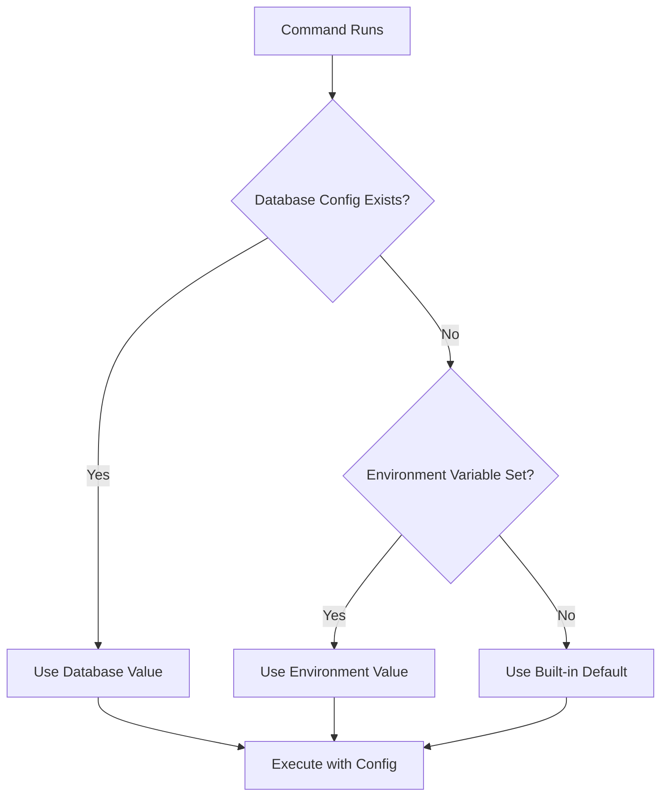

### `/config`
**Who can use it:** Administrator

This is your control panel for server-wide bot behavior.

####Setting Configuration

| Subcommand | What it does | Valid values |
|------------|--------------|--------------|
| `set logging_channel` | Where bot actions get logged | Any text channel |
| `set flags_channel` | Where Silent-Since-Join alerts go | Any text channel |
| `set flags_threshold` | How many days before flagging silent members | 7 to 365 days |
| `set dadmode` | Toggle the "Hi hungry, I'm Dad!" joke responses | On/Off + odds (1 in N) |
| `set pingdevonapp` | Toggle whether to ping Bot Dev when new apps come in | True/False |
| `set suggestion_channel` | Where suggestions get posted | Any text channel |
| `set suggestion_cooldown` | How long between suggestions | 1 to 1440 minutes |
| `set mod_roles` | Roles that can run all bot commands | 1-5 roles |
| `set gatekeeper` | Role for gatekeeper features | Any role |
| `set modmail_log_channel` | Where modmail logs go | Any text channel |
| `set review_roles` | How roles show on review cards | None/Level only/All |

#### Viewing Configuration

| Subcommand | What it does |
|------------|--------------|
| `get logging` | Check your logging settings with full details |
| `get flags` | Check your flags settings including channel health |
| `view` | See all your current settings in one embed |

### Understanding Each Setting

#### Logging Channel
This is where all moderator actions get recorded with nice looking embeds. Every time someone accepts an application, rejects someone, or uses modmail, it gets logged here.

**Why you need it:** Keeps a permanent record of who did what and when. Great for accountability and reviewing decisions later.

**What gets logged:**
- Application accepts, rejects, and kicks
- Modmail conversations
- Anonymous messages sent with `/send`
- Configuration changes

**Example:**
```
/config set logging_channel channel:#mod-logs
```

#### Flags Channel and Threshold
The flags system watches for suspicious accounts. If someone joins your server and stays completely silent for the threshold number of days, they get flagged in the flags channel.

**Why you need it:** Catches bot accounts, lurkers, and potential raiders who join but never participate.

**How it works:**
1. Member joins the server
2. Bot starts counting days
3. If they haven't sent a message after X days, bot sends an alert
4. Alert includes their join date, account age, and roles

**Threshold guidelines:**
- **7 days:** Very aggressive, catches almost everyone
- **14 days:** Good for active servers
- **30 days:** Moderate, gives people time to settle in
- **90+ days:** Only catches extreme lurkers

**Example:**
```
/config set flags_channel channel:#suspicious-users
/config set flags_threshold days:30
```

#### Dad Mode
Pure fun. When someone says "I'm tired" or "I'm hungry", the bot might respond "Hi tired, I'm Dad!" The odds setting controls how often this happens.

**Why it exists:** Community building. A little humor makes the server feel more welcoming.

**Understanding odds:**
- `chance:2` means 1 in 2 (50% of the time) - very annoying
- `chance:100` means 1 in 100 (1% of the time) - occasional fun
- `chance:500` means 1 in 500 (0.2% of the time) - rare surprise
- `chance:1000` means 1 in 1000 (0.1% of the time) - default, very rare

**Example:**
```
/config set dadmode state:on chance:500
```

#### Ping Dev on App
Controls whether the Bot Dev role gets pinged when new applications arrive. Useful during testing or when actively monitoring the system.

**When to enable:**
- Testing the application system
- Debugging issues with reviews
- Training new staff

**When to disable:**
- Normal operations (let staff handle it)
- High application volume (prevents ping spam)

**Example:**
```
/config set pingdevonapp enabled:false
```

#### Suggestion Channel and Cooldown
Sets up the suggestion system where members can submit ideas for new bot features.

**Cooldown prevents spam:** If someone submits a suggestion, they have to wait before submitting another one. This encourages thoughtful suggestions instead of rapid-fire ideas.

**Example:**
```
/config set suggestion_channel channel:#bot-suggestions
/config set suggestion_cooldown minutes:60
```

#### Mod Roles
These roles have full access to all bot commands, regardless of Discord permissions. Think of it as your "bot admin" role.

**Why this matters:** You might have moderators who don't have Administrator permission in Discord, but you still want them to use all bot features.

**You can set up to 5 different roles.** Most servers only need 1-2.

**Example:**
```
/config set mod_roles role1:@Moderator role2:@Senior Mod
```

#### Review Roles Mode
Controls how member roles appear on application review cards.

**The problem:** Some servers have 50+ roles. Showing them all makes review cards huge and hard to read.

**The solution:**
- `none` - Hide all roles completely
- `level_only` - Show just the highest level role (like "Level 15")
- `all` - Show every single role (default)

**Example:**
```
/config set review_roles mode:level_only
```

---

### `/review-set-notify-config`
**Who can use it:** Administrator

Set up notifications for new forum posts (for application review forums).

| Option | Required? | What it does |
|--------|-----------|--------------|
| `mode` | No | `post` (reply in the thread) or `channel` (send to a separate channel) |
| `role` | No | Which role to ping |
| `forum` | No | Which forum channel to watch |
| `channel` | No | Where to send notifications (for channel mode) |
| `cooldown` | No | Minimum seconds between notifications |
| `max_per_hour` | No | Cap on notifications per hour |

---

### `/review-get-notify-config`
**Who can use it:** Administrator

Check your current forum notification settings.

---

### `/review-set-listopen-output`
**Who can use it:** Manage Guild

Control whether `/listopen` results are visible to everyone or just you.

| Option | Required? | What it does |
|--------|-----------|--------------|
| `mode` | **Yes** | `public` or `ephemeral` |

---

## Utility & Admin

General-purpose tools and admin commands. These help you maintain the bot, communicate with members, and keep things running smoothly.

### `/update`
**Who can use it:** Bot Owner only

Change the bot's Discord presence and profile. This affects how the bot appears across all servers.

| Subcommand | What it does |
|------------|--------------|
| `activity` | What the bot is "doing" (Playing, Watching, Listening, Competing) |
| `status` | Custom status text (the green text below the username) |
| `banner` | Update banners (profile, gate embed, welcome embed, website) |
| `avatar` | Change the bot's profile picture (supports animated GIFs) |

#### Activity Types

- **Playing:** "Playing Minecraft" style
- **Watching:** "Watching over the gate" style
- **Listening:** "Listening to Spotify" style
- **Competing:** "Competing in Arena" style

The activity and custom status can both be active at the same time. They show up on different lines in the bot's profile.

#### Banner Updates

When you update the banner, the bot does several things at once:
1. Updates the bot's profile banner on Discord
2. Refreshes the gate message so new applicants see the new banner
3. Saves PNG and WebP versions to the `assets` folder for web use
4. The next welcome message will use the new banner

**Technical notes:**
- Maximum file size: 10MB
- Supports PNG, JPG, and WebP formats
- Recommended aspect ratio: 16:9 for best results
- Bot must have Nitro or be verified to use profile banners

#### Avatar Updates

The bot processes avatar images differently based on format:
- **GIF files:** Passed through unchanged to preserve animation
- **Other formats:** Cropped to square, resized to 1024x1024, converted to PNG

**Examples:**
```
/update activity type:watching text:over the gate
/update status text:Protecting the realm
/update banner image:<attachment>
/update avatar image:<attachment>
```

---

### `/send`
**Who can use it:** Manage Messages

Post an anonymous message as the bot. Good for announcements where you don't want to show who wrote it.

**Important:** Every use of `/send` gets logged in the configured logging channel. This creates accountability while still allowing anonymous communication.

| Option | Required? | What it does |
|--------|-----------|--------------|
| `message` | **Yes** | What to say (up to 2000 characters, or 4096 in embed mode) |
| `embed` | No | Make it a fancy embed (default: false) |
| `reply_to` | No | Reply to a specific message ID |
| `attachment` | No | Include a file or image |
| `silent` | No | Block all @mentions (default: true) |

#### Understanding the Silent Option

- `silent:true` (default) - Blocks ALL mentions. Even if you type @everyone, nobody gets pinged
- `silent:false` - Allows @user and @role mentions, but still blocks @everyone and @here for safety

**What gets logged:**
- Who used the command
- What channel it was sent in
- The full message content
- Whether it was an embed
- Whether mentions were allowed

**Embed mode benefits:**
- Higher character limit (4096 vs 2000)
- Cleaner look with Discord's blurple color
- Stands out more in chat

**Examples:**
```
/send message:Welcome to the server!
/send message:Important announcement embed:true
/send message:As requested... reply_to:123456789012345678
/send message:Check out this image attachment:<file>
/send message:@Moderators please check tickets silent:false
```

---

### `/purge`
**Who can use it:** Manage Messages + Password

Mass delete messages in a channel. Requires the admin password (set in environment variables) because this action is destructive and can't be undone.

| Option | Required? | What it does |
|--------|-----------|--------------|
| `password` | **Yes** | Admin password (from RESET_PASSWORD env variable) |
| `count` | No | How many messages to delete (default: all messages in channel) |

#### How Purge Works

The bot handles message deletion differently based on age:

**Messages less than 14 days old:**
- Deleted using Discord's bulk delete API
- Very fast (up to 100 messages at once)
- No rate limit issues

**Messages 14+ days old:**
- Discord doesn't allow bulk delete for these
- Bot deletes them one by one in small batches
- Much slower (about 5 messages per 1.5 seconds)
- Progress continues even if some messages fail

#### Important Limitations

- **14-day rule:** Discord's API won't bulk-delete messages older than 14 days. This is a hard limit that can't be bypassed.
- **Rate limits:** The bot paces itself to avoid hitting Discord's rate limits
- **Permissions:** Bot needs both ManageMessages and ReadMessageHistory permissions
- **No undo:** Once messages are deleted, they're gone forever

**Example:**
```
/purge password:*** count:50
```

After running, you'll see a summary showing how many messages were deleted and how many were older than 14 days (which took longer).

---

### `/health`
**Who can use it:** Everyone

Quick check to see if the bot is working properly. This is the first command to run if something seems off.

**Shows you:**
- **Status:** Whether the bot considers itself healthy
- **Uptime:** How long since the last restart (formatted like "2d 5h 30m")
- **WS Ping:** WebSocket latency to Discord's servers (should be under 200ms normally)

**What the ping means:**
- **Under 100ms:** Excellent connection
- **100-200ms:** Normal, healthy connection
- **200-500ms:** Slightly slow, but functional
- **Over 500ms:** Something might be wrong with the host or Discord's servers

**Example:**
```
/health
```

If the bot doesn't respond to `/health` within 5 seconds, it's probably stuck or offline.

---

### `/activity`
**Who can use it:** Staff

See a heatmap of when the server is most active. Shows message volume by day and hour, helping you understand when your community is online.

| Option | Required? | What it does |
|--------|-----------|--------------|
| `weeks` | No | How far back to look (1-8 weeks, default: 1) |

#### What the Heatmap Shows

The bot generates a visual heatmap image with:
- **Days of week** on one axis (Sunday through Saturday)
- **Hours of day** on the other axis (0-23, in UTC)
- **Color intensity** representing message volume (darker = more activity)
- **Trend analysis** comparing to previous periods

**Additional stats included:**
- Total messages in the period
- Average messages per hour
- Busiest hours (when the most messages happen)
- Least active hours (when it's quietest)
- Peak days (which days of the week are busiest)
- Quietest days
- Week-over-week growth percentage (if viewing multiple weeks)

**Use cases:**
- Figuring out when to schedule events for max attendance
- Understanding when you need more moderator coverage
- Spotting unusual activity patterns (raids, bots, etc.)
- Tracking server growth over time

**Examples:**
```
/activity
/activity weeks:4
/activity weeks:8
```

**Note:** All times are in UTC. If your community is primarily in a different timezone, you'll need to mentally adjust the hours (or the bot owner can configure a timezone offset).

---

### `/backfill`
**Who can use it:** Staff

Rebuild the activity data by scanning message history. Use this after first enabling activity tracking, or if the data seems incomplete.

| Option | Required? | What it does |
|--------|-----------|--------------|
| `weeks` | No | How far back to scan (1-8 weeks, default: 8) |
| `dry-run` | No | Test without actually saving anything (default: false) |

#### When to Use Backfill

- **First time setup:** When you first start using the bot and want historical data
- **Data looks wrong:** If the activity heatmap seems incomplete or inaccurate
- **After bot downtime:** If the bot was offline for a while and missed messages
- **Channel permissions changed:** If the bot recently gained access to new channels

#### How It Works

The bot scans through your server's message history and records when messages were sent. It processes messages in batches and can take several minutes for busy servers.

**What gets recorded:**
- Timestamp of each message
- Which channel it was in
- The hour and day (but not the specific content)

**What doesn't get recorded:**
- Message content
- Who sent it
- Attachments or embeds

**Performance notes:**
- 1 week of data: Usually takes 30-60 seconds
- 8 weeks of data: Can take 5-10 minutes for very active servers
- The bot shows progress as it works
- You can use the bot normally while backfill runs in the background

**Example:**
```
/backfill weeks:4
/backfill weeks:8 dry-run:true
```

Use dry-run first to see how many messages would be scanned without actually saving anything.

---

### `/poke`
**Who can use it:** Bot Owner only

Ping someone across multiple channels in a category. For when you really need to get someone's attention.

| Option | Required? | What it does |
|--------|-----------|--------------|
| `user` | **Yes** | Who to poke |

This command sends a message mentioning the user in every text channel within the current category. Use sparingly - it's intentionally annoying.

---

### `/database`
**Who can use it:** Bot Owner + Password

Database maintenance and recovery tools. These are advanced commands for troubleshooting database issues.

| Subcommand | What it does |
|------------|--------------|
| `check` | Run integrity checks and show database health stats |
| `recover` | Interactive assistant for recovering from database corruption |

#### Database Check

Shows you:
- Database file size
- Table sizes (which tables are using the most space)
- SQLite integrity check result
- Row counts for major tables
- Any schema warnings or issues

**When to run it:**
- Monthly health checkups
- Before making major changes
- If you suspect corruption
- After unexpected crashes

#### Database Recover

This is an interactive wizard that helps you:
1. Detect what's wrong with the database
2. Try automated fixes
3. Recover as much data as possible
4. Export data if the database can't be repaired

**Only use this if:**
- `/database check` shows errors
- The bot is crashing on startup
- Commands are failing with database errors
- You've been instructed by support to run recovery

---


---

## Permission Reference

| Level | Who has it | Example commands |
|-------|------------|------------------|
| **Everyone** | All server members | `/health`, `/activity`, `/suggest` |
| **Staff** | Reviewer role or Manage Guild | `/accept`, `/reject`, `/listopen`, `/modstats` |
| **Leadership** | Server owners + leadership role | `/modhistory` |
| **Administrator** | Administrator permission | `/config`, `/review-set-notify-config` |
| **Bot Owner** | Designated in config | `/update`, `/poke`, `/database` |

### What counts as "Staff"?

You're considered staff if you have ANY of these:
- The configured Reviewer role
- Manage Guild permission
- Administrator permission
- You're the server owner
- You're a bot owner

---

## Troubleshooting

When something goes wrong, follow these steps to fix it. Most issues have simple solutions.

### Quick Troubleshooting Decision Tree

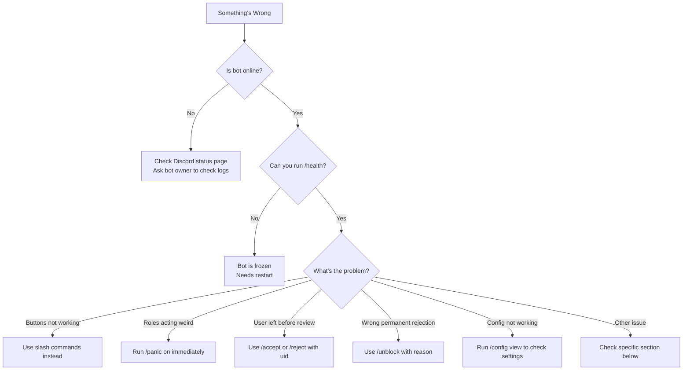

### Common Problems and Solutions

#### The buttons on applications aren't working

**Symptoms:**
- Clicking Accept/Reject/Kick does nothing
- Buttons are grayed out
- You get "This interaction failed" error

**Possible causes:**
1. The interaction token expired (buttons are only valid for 15 minutes after the message was posted)
2. The bot restarted and lost the interaction data
3. Discord is having issues

**Solution:**

Use slash commands instead of buttons. Every button has a command equivalent:

```
/accept app:A1B2C3
/reject app:A1B2C3 reason:Your reason here
/kick app:A1B2C3 reason:Your reason here
```

You can find the short code (like `A1B2C3`) at the top of the application embed.

**To prevent this:**
- Review applications promptly (within 15 minutes of claiming)
- Don't let applications sit for hours before acting

---

#### Someone left before I could accept/reject them

**Symptoms:**
- User is no longer in the server
- Their application is still open
- You can't @ mention them

**Solution:**

You can still process their application using their Discord ID. You can find their ID in the application embed.

```
/accept uid:123456789012345678
/reject uid:123456789012345678 reason:Left during review
/kick uid:123456789012345678 reason:Left server
```

**What happens:**
- If you accept them, they won't get the member role (they're not in the server)
- If you reject them, the rejection is recorded and they'll see it if they try to apply again
- The application gets marked as processed in the database

---

#### I accidentally permanently rejected someone

**Symptoms:**
- You clicked `perm:true` by mistake
- The person is now blocked from applying again
- They get an error when trying to submit an application

**Solution:**

Use `/unblock` to remove the permanent rejection:

```
/unblock user_id:123456789012345678 reason:Mistake - wrong person
/unblock target:@Username reason:Appeal approved by leadership
```

**What happens:**
- The permanent rejection is removed from the database
- They can apply again immediately
- The unblock action gets logged with your reason
- They don't get notified - you need to tell them manually

**To prevent this:**
- Double check before using `perm:true`
- Only use permanent rejection for serious cases (underage, bots, etc.)
- Have a second person review before perm-rejecting

---

#### Role automation is doing something weird

**Symptoms:**
- Roles being added to wrong people
- Duplicate roles appearing
- Roles not being added when they should
- Too many role grants happening at once

**Solution:**

**Step 1: Emergency stop**
```
/panic on
```

This immediately stops ALL automatic role assignments. The bot will stop listening to Amaribot level-up messages and won't process any role automation.

**Step 2: Check your configuration**
```
/roles list type:level_tier
/roles list type:level_reward
/roles list type:movie_tier
```

Look for:
- Duplicate entries for the same level
- Wrong roles configured
- Typos in level numbers

**Step 3: Fix the problem**

Delete any incorrect mappings:
```
/roles remove-level-tier level:15
/roles remove-level-reward level:10
```

Then recreate them correctly:
```
/roles add-level-tier level:15 role:@CorrectRole
```

**Step 4: Resume**
```
/panic off
```

**Common mistakes:**
- Adding the same level twice with different roles
- Confusing level-tier (persistent role) with level-reward (one-time token)
- Role hierarchy issues (bot's role is lower than the role it's trying to assign)

---

#### The bot isn't responding at all

**Symptoms:**
- Slash commands don't appear
- Commands show "Application did not respond"
- Bot shows as offline (gray circle)

**Solutions:**

**1. Check if Discord is down**
- Visit https://status.discord.com
- Check if there's an ongoing outage
- If yes, wait for Discord to fix it

**2. Check if the bot is actually online**
- Look at the member list
- Green circle = online
- Gray circle = offline

**3. If the bot is online but not responding:**
- It might be stuck in a loop or crashed internally
- Ask a bot owner to check the server logs
- The bot might need a restart

**4. If slash commands don't appear:**
- Discord might not have synced them yet
- Wait 5-10 minutes
- Try restarting your Discord client
- Check if you're in the right server

---

#### Config changes aren't taking effect

**Symptoms:**
- You set a config value but it's not being used
- `/config view` shows the right value but behavior is wrong
- Bot is using old settings

**Solution:**

**Step 1: Verify the setting**
```
/config view
```

Make sure the value actually saved. If it didn't, try setting it again.

**Step 2: Check the config hierarchy**

Remember, the bot uses this priority:
1. Database settings (from `/config set`)
2. Environment variables (set by bot owner)
3. Built-in defaults

If the setting is in the database but not working, there might be an environment variable overriding it. Ask the bot owner to check.

**Step 3: Check the channel health**

For channel-based settings, make sure the channel exists and the bot has permissions:

```
/config get logging
/config get flags
```

These commands will tell you if there's a problem with the configured channels.

**Common issues:**
- Channel was deleted after being configured
- Bot lacks permissions in the configured channel
- Channel ID was copied wrong (missing or extra digits)

---

#### Logging isn't working

**Symptoms:**
- Actions aren't being logged
- Logging channel is configured but nothing appears
- Logs were working before but stopped

**Solution:**

**Step 1: Check if logging is configured**
```
/config get logging
```

This shows:
- What logging channel is set
- If it's from the database or environment variable
- If the bot has permissions in that channel

**Step 2: Verify bot permissions**

The bot needs these permissions in the logging channel:
- View Channel
- Send Messages
- Embed Links

**Step 3: Test with a simple action**

Try accepting or rejecting a test application. If nothing appears in the logging channel:
- The channel might be configured wrong
- Check `/config view` to see the exact channel ID
- Make sure the channel ID is a real channel in your server

**Step 4: Check for environment override**

Ask the bot owner if `LOGGING_CHANNEL` is set in the environment variables. If it is, that takes priority over your `/config` setting.

---

#### Application stats or history are wrong

**Symptoms:**
- `/modstats` shows zero for a mod who definitely processed apps
- `/search` doesn't show applications you know exist
- Counts don't match what you remember

**Possible causes:**
1. Database got reset at some point
2. The stats tracking wasn't enabled when those actions happened
3. There's a date range filter limiting what you see

**Solution:**

**Check the date range:**
```
/modstats leaderboard days:90
/search user:@Username
```

Use a longer date range to see older data.

**If data is truly missing:**
- It might have been lost in a database reset
- Stats before a certain date might not have been recorded
- There's no way to recover lost data - it's gone
- Ask the bot owner when the database was created/reset

---

### When to Ask for Help

You should contact the bot owner or support when:

1. **Database errors** - If you see errors mentioning "database" or "SQL"
2. **Repeated crashes** - Bot keeps going offline every few minutes
3. **Permissions issues you can't fix** - Even after giving the bot Administrator, things don't work
4. **Data corruption** - Commands fail with weird errors about missing data
5. **Bot is responding but commands don't work** - `/health` works but everything else fails

### Information to Include When Asking for Help

When reporting a problem, include:

- **What you were trying to do** - "I was trying to accept an application"
- **What happened instead** - "The command failed with error X"
- **The exact error message** - Screenshot or copy-paste it
- **When it started** - "This started happening yesterday" or "It's never worked"
- **What you've tried** - "I tried restarting Discord and using a different channel"
- **Your permissions** - "I have Administrator permission"

The more details you provide, the faster support can help you.

---


---

## Quick Reference

### Commands you'll use all the time

| Command | What it's for |
|---------|---------------|
| `/accept` | Approve an application |
| `/reject` | Reject an application |
| `/listopen` | See what's pending |
| `/search` | Look up someone's history |
| `/modstats leaderboard` | See mod activity |
| `/health` | Check if bot's working |

### Emergency commands

| Command | What it's for |
|---------|---------------|
| `/panic on` | Stop all role automation NOW |
| `/purge` | Emergency message cleanup |
| `/database check` | Make sure the database is okay |
| `/unblock` | Fix an accidental perm rejection |

---

*Last revised: November 29, 2025*
