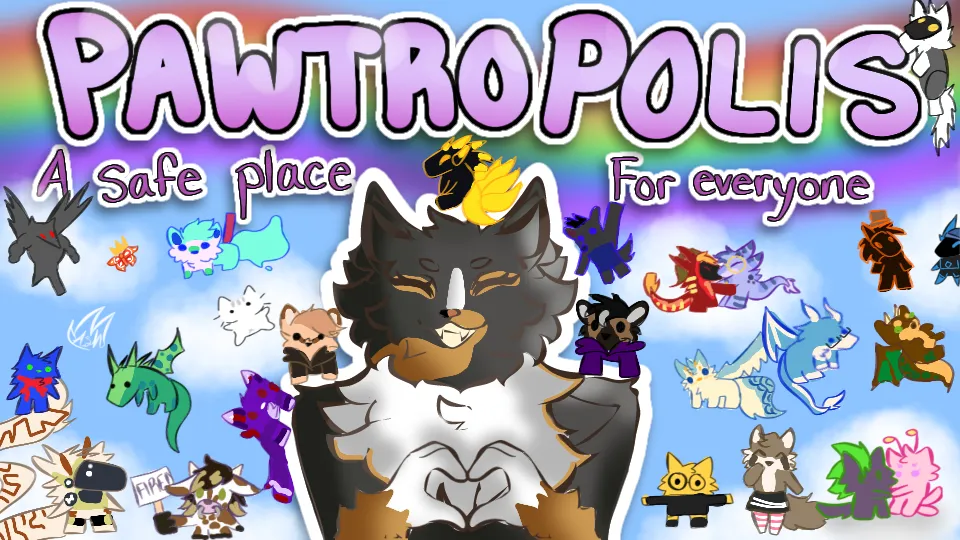

<p align="center">
  
</p>

<h1 align="center">Pawtropolis Tech</h1>

<p align="center">
  
</p>

<p align="center">
  <strong>Production-ready Discord bot for community gating and moderation</strong>
</p>

<p align="center">
  <!-- CI Status -->
  <a href="https://github.com/watchthelight/pawtropolis-tech/actions/workflows/ci.yml">
    
  </a>
  <!-- Dynamic Badges from Gist -->
  
  
  
  
</p>

<p align="center">
  <!-- Static Badges -->
  
  
  
  
  
</p>

---

> **Staff? Read these first:**
> - **[BOT-HANDBOOK](docs/BOT-HANDBOOK.md)** — Every command, explained
> - **[MOD-QUICKREF](docs/MOD-QUICKREF.md)** — Cheat sheet for daily mod work
> - **[PERMS-MATRIX](docs/PERMS-MATRIX.md)** — Who can run what

---

## Overview

Pawtropolis Tech is a server-owned verification system that modernizes community onboarding through structured application flows. It replaces manual DM-based screening with an elegant, permission-gated workflow that keeps staff accountable and applicants informed.

**Core Philosophy:**
- Transparency over opacity
- Auditability over trust
- Minimal surface area over feature bloat

---

## Quick Start

```bash
# Clone and install
git clone https://github.com/watchthelight/pawtropolis-tech.git
cd pawtropolis-tech
npm install

# Configure environment
cp .env.example .env
# Edit .env with your DISCORD_TOKEN and CLIENT_ID

# Run all checks
npm run check

# Start development server
npm run dev
```

**Key Scripts:**
| Command | Description |
|---------|-------------|
| `npm run dev` | Development mode with hot reload |
| `npm run build` | Build for production |
| `npm run test` | Run test suite |
| `npm run check` | Run all quality checks |
| `npm run deploy:cmds` | Deploy slash commands to Discord |

---

## Features

### Application Gating
- Interactive modal forms with multi-page question flows
- Configurable per-guild questions via SQLite schema
- Draft recovery for incomplete applications
- Submission validation with required field enforcement

### Review & Decision Making
- Reviewer dashboards with rich embeds and action buttons
- Claim system to prevent review collisions
- Full audit trail of approve/reject/kick decisions
- Permanent rejection feature to block repeat applications

### Modmail System
- Private thread bridge for staff-applicant DM routing
- Automatic transcript logging
- Bidirectional message forwarding with reply threading

### Avatar Risk Analysis
- Google Cloud Vision SafeSearch integration
- Configurable detection thresholds
- One-click Google Lens reverse image search

### Operations
- Health monitoring with uptime checks
- Sentry integration for error tracking
- Pino-based structured JSON logging

---

## Configuration

### Required Environment Variables

| Variable | Description |
|----------|-------------|
| `DISCORD_TOKEN` | Bot token from Discord Developer Portal |
| `CLIENT_ID` | Application ID from Discord Developer Portal |

### Optional Environment Variables

| Variable | Description |
|----------|-------------|
| `GUILD_ID` | Guild ID for per-guild command registration |
| `SENTRY_DSN` | Sentry error tracking DSN |
| `LOG_LEVEL` | Pino log level (trace/debug/info/warn/error) |
| `RESET_PASSWORD` | Password for admin reset commands |

---

## Initial Setup

```bash
# 1. Configure the gate system
/gate setup review_channel:#staff-review gate_channel:#gate general_channel:#general accepted_role:@Verified

# 2. Customize questions (optional)
/gate set-questions q1:"What is your age?" q2:"How did you find us?"

# 3. Preview welcome message
/gate welcome preview
```

### Common Commands

| Command | Description |
|---------|-------------|
| `/gate setup` | Initialize guild configuration |
| `/gate status` | View application statistics |
| `/accept @user` | Approve application |
| `/reject @user reason:"..."` | Reject with reason |
| `/modstats` | View moderator statistics |

For full command reference, see [docs/BOT-HANDBOOK.md](docs/BOT-HANDBOOK.md).

---

## Documentation

| Document | Description |
|----------|-------------|
| [BOT-HANDBOOK.md](docs/BOT-HANDBOOK.md) | Complete command reference |
| [MOD-QUICKREF.md](docs/MOD-QUICKREF.md) | Quick reference for moderators |
| [PERMS-MATRIX.md](docs/PERMS-MATRIX.md) | Permission requirements |
| [CHANGELOG.md](CHANGELOG.md) | Version history |

---

## License

Licensed under the **Attribution–No Wholesale Copying License (ANW-1.0)**.

You are free to use and modify the code for your own projects with proper attribution. You may not redistribute the entire project as-is or rebrand it as your own work.

See [LICENSE](LICENSE) for full terms.

---

<p align="center">
  <strong>Built with care for communities that care about moderation.</strong>
</p>

<p align="center">
  <a href="https://github.com/watchthelight">watchthelight</a> &bull;
  <a href="mailto:admin@watchthelight.org">admin@watchthelight.org</a>
</p>
