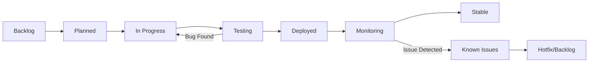
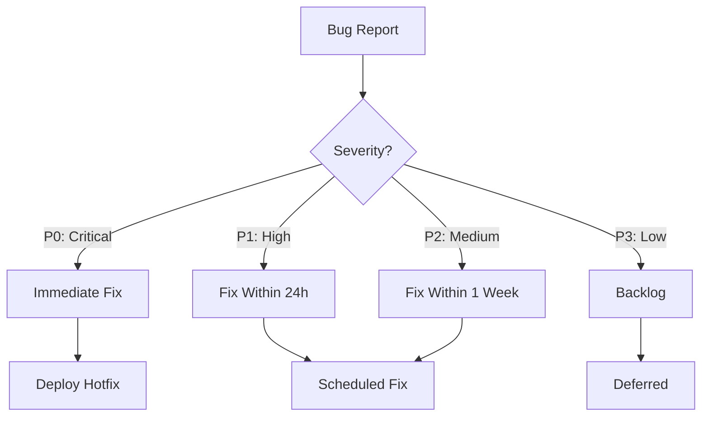
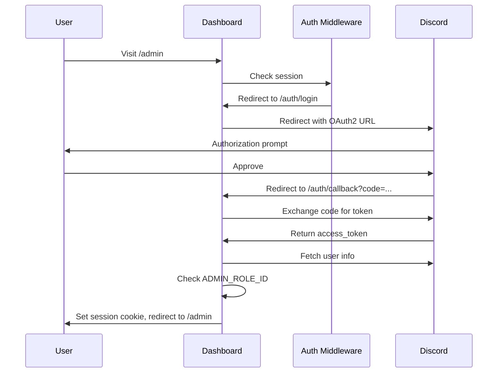
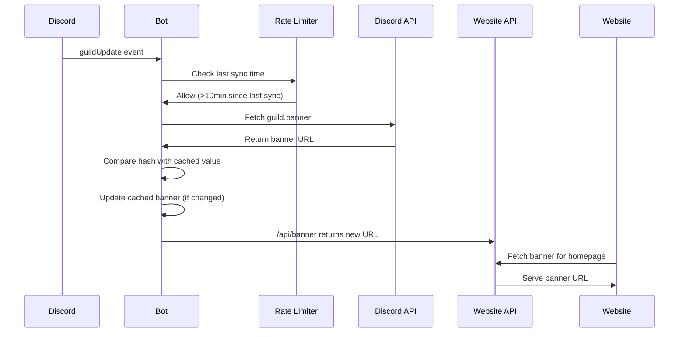
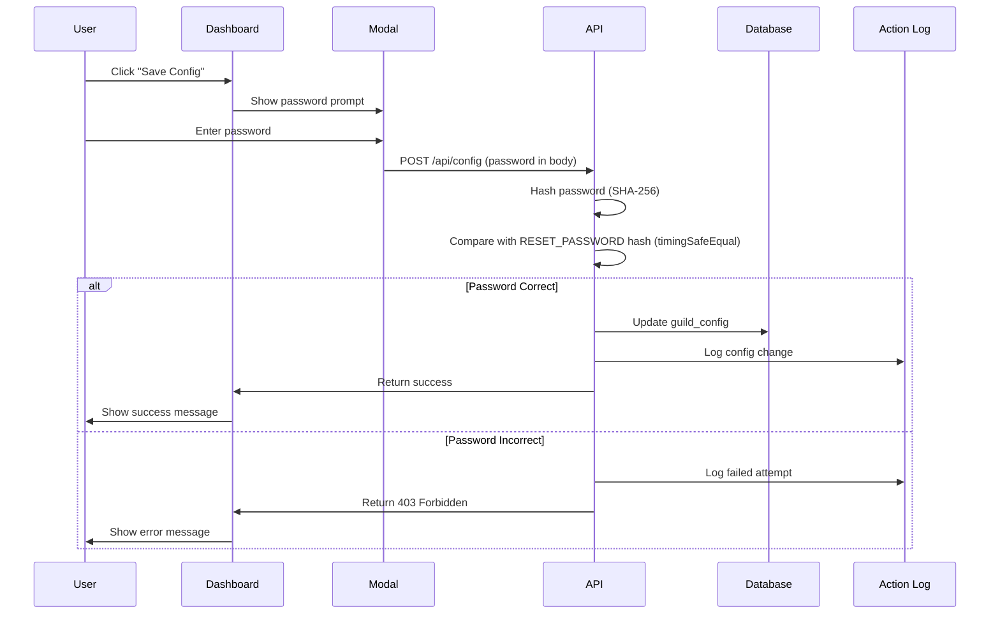

## Purpose & Outcomes

This document provides:
- **Historical record** of completed milestones and shipped features
- **Current status** of in-progress work and active development
- **Future planning** with prioritized roadmap and effort estimates
- **Known issues** with severity classification and workarounds
- **Technical debt** tracking with remediation plans
- **Backlog management** for deferred features and enhancements

## Scope & Boundaries

### In Scope
- Feature development roadmap (completed, in-progress, planned)
- Known bugs and issues with reproduction steps
- Technical debt items with impact assessment
- Database migrations and schema evolution
- Performance optimization opportunities
- Security improvements and hardening
- Documentation gaps and needs

### Out of Scope
- Individual developer task assignments (managed in issue tracker)
- Day-to-day operational incidents (tracked in monitoring tools)
- User support tickets (handled via modmail system)
- Hotfix patches (documented in git history only)

## Current State

**Project Version**: `1.1.0` (as of [package.json:3](package.json#L3))

**Deployment Status**: Production on Ubuntu 22.04 with PM2

**Active Development**: Dashboard polish, queue health monitoring

**Recent Activity** (Last 30 commits):
- Repository name change and branding updates
- Review card formatting overhaul with NSFW vision API integration
- Database integrity hardening and checks
- Password-protected configuration changes
- Manual flagging system for avatar risk overrides
- Per-user theming support
- Entropy-based account flagger (PR8)

**Git Commit Count Since 2024**: 18 commits (see [git log output](git-log-2024-onwards))

---

## Key Flows

### 1. Feature Development Lifecycle



**Stages**:
1. **Backlog**: Validated ideas, prioritized by impact/effort
2. **Planned**: Scoped features with architecture design
3. **In Progress**: Active development with feature branches
4. **Testing**: Manual QA + automated tests passing
5. **Deployed**: Shipped to production via PM2 restart
6. **Monitoring**: Sentry error tracking + log analysis
7. **Stable**: No critical issues for 7+ days

### 2. Bug Triage Process



**Severity Definitions**:
- **P0 (Critical)**: Bot offline, data loss, security breach
- **P1 (High)**: Major feature broken, user-facing errors
- **P2 (Medium)**: Degraded performance, minor bugs
- **P3 (Low)**: Cosmetic issues, enhancement requests

### 3. Migration Versioning Strategy

**Current Migration State**:
- Latest TypeScript migration: `011_add_custom_status_column.ts`
- Legacy migration: `2025-10-20_review_action_free_text.ts` (date-based, deprecated format)
- Migration count: 11 applied migrations (see [migrations/](migrations/) directory)

**Version Numbering**:
- Format: `NNN_descriptive_name.ts` (3-digit zero-padded)
- Function: `migrateNNNDescriptiveName(db: Database): void`
- Tracking: `schema_migrations` table with version/name/applied_at columns

**Migration Files**:
1. `001_add_logging_channel_id.ts` — Logging channel configuration
2. `002_create_mod_metrics.ts` — Moderator performance tracking
3. `003_create_user_cache.ts` — Discord user data caching
4. `004_metrics_epoch_and_joins.ts` — Analytics epoch + join tracking
5. `005_flags_config.ts` — Feature flags configuration
6. `008_manual_flags.ts` — Manual avatar risk override flags
7. `010_limit_questions_to_5.ts` — Gate question limit enforcement
8. `011_add_custom_status_column.ts` — Custom status message field
9. `2025-10-20_review_action_free_text.ts` — Free-text review actions (deprecated date format)

**Missing Version Numbers**: 006, 007, 009 — Gaps due to abandoned/merged migrations

---

## Commands & Snippets

### Roadmap Management

#### View All Completed Milestones
```bash
# List all PR-tagged commits (completed work)
git log --oneline --all | grep -E "PR[0-9]|feat|fix" | head -50

# Count commits by author
git shortlog -sn --all --since="2024-01-01"
```

#### Check Current Development Status
```bash
# Show active branches
git branch -a

# Show uncommitted changes
git status

# Show recent file modifications
ls -lt src/ | head -20
```

#### Find TODO/FIXME Comments
```bash
# Search codebase for action items
grep -rn "TODO\|FIXME\|HACK\|XXX\|BUG" src/ tests/

# Found TODOs:
# - src/features/activityTracker.ts:272: TODO: Implement JSON fallback logging (future enhancement)
```

### Issue Tracking

#### Create Known Issue Entry
```markdown
### Issue Title

**Severity:** P0 | P1 | P2 | P3
**Impact:** Who is affected and how

**Symptoms:**
- Observable behavior
- Error messages
- Reproduction steps

**Root Cause:**
Technical explanation of underlying problem

**Workaround:**
Temporary mitigation steps (if available)

**Fix Plan:**
- [ ] Task 1
- [ ] Task 2
- [ ] Target PR/milestone
```

#### Log Issue to Sentry
```typescript
import * as Sentry from "@sentry/node";

Sentry.captureException(error, {
  tags: {
    severity: "P1",
    component: "modmail",
    issue_id: "GH-123"
  },
  extra: {
    user_id: interaction.user.id,
    guild_id: interaction.guildId
  }
});
```

### Migration Management

#### Create New Migration
```bash
# Determine next version number
cd migrations
ls -1 *.ts | grep -E "^[0-9]{3}_" | sort | tail -1
# Output: 011_add_custom_status_column.ts

# Create migration 012
touch 012_add_new_feature.ts
```

#### Migration Template (012 Example)
```typescript
/**
 * Pawtropolis Tech — migrations/012_add_ticket_tags.ts
 * WHAT: Add tagging system for modmail tickets
 * WHY: Need to categorize tickets (billing, support, report)
 * HOW: CREATE TABLE modmail_tag + modmail_ticket_tag junction table
 *
 * SAFETY:
 *  - Idempotent: safe to run multiple times (tableExists check)
 *  - Data preservation: no existing data modified
 */
// SPDX-License-Identifier: LicenseRef-ANW-1.0

import type { Database } from "better-sqlite3";
import { logger } from "../src/lib/logger.js";
import { tableExists, recordMigration } from "./lib/helpers.js";

/**
 * Migration: Add modmail ticket tagging system
 *
 * @param db - better-sqlite3 Database instance
 * @throws if migration fails (transaction will rollback)
 */
export function migrate012AddTicketTags(db: Database): void {
  logger.info("[migration 012] Starting: add ticket tagging system");

  // Enable foreign keys
  db.pragma("foreign_keys = ON");

  // Check if tables already exist (idempotency)
  if (tableExists(db, "modmail_tag")) {
    logger.info("[migration 012] modmail_tag table already exists, skipping");
    recordMigration(db, "012", "add_ticket_tags");
    return;
  }

  // Create tag table
  logger.info("[migration 012] Creating modmail_tag table");
  db.exec(`
    CREATE TABLE modmail_tag (
      id          INTEGER PRIMARY KEY AUTOINCREMENT,
      name        TEXT NOT NULL UNIQUE,
      color       TEXT NOT NULL DEFAULT '#7289DA',
      description TEXT,
      created_at  INTEGER NOT NULL DEFAULT (strftime('%s', 'now'))
    )
  `);

  // Create ticket-tag junction table
  logger.info("[migration 012] Creating modmail_ticket_tag junction table");
  db.exec(`
    CREATE TABLE modmail_ticket_tag (
      ticket_id TEXT NOT NULL,
      tag_id    INTEGER NOT NULL,
      added_at  INTEGER NOT NULL DEFAULT (strftime('%s', 'now')),
      added_by  TEXT NOT NULL,
      PRIMARY KEY (ticket_id, tag_id),
      FOREIGN KEY (ticket_id) REFERENCES modmail_ticket(id) ON DELETE CASCADE,
      FOREIGN KEY (tag_id) REFERENCES modmail_tag(id) ON DELETE CASCADE
    )
  `);

  // Create index for tag lookup
  db.exec(`
    CREATE INDEX idx_modmail_ticket_tag_ticket
    ON modmail_ticket_tag(ticket_id)
  `);

  // Seed default tags
  logger.info("[migration 012] Seeding default tags");
  const insert = db.prepare(`
    INSERT INTO modmail_tag (name, color, description)
    VALUES (?, ?, ?)
  `);

  insert.run("billing", "#F1C40F", "Payment or subscription issues");
  insert.run("support", "#3498DB", "General support questions");
  insert.run("report", "#E74C3C", "User reports or moderation issues");
  insert.run("feedback", "#9B59B6", "Feature requests or suggestions");

  // Record migration
  recordMigration(db, "012", "add_ticket_tags");

  logger.info("[migration 012] ✅ Complete");
}
```

#### Test Migration Locally
```bash
# Dry run (show pending migrations without applying)
npm run migrate:dry

# Apply pending migrations
npm run migrate

# Verify changes
sqlite3 data/data.db ".schema modmail_tag"
sqlite3 data/data.db "SELECT * FROM schema_migrations ORDER BY version"
```

---

## Interfaces & Data

### Roadmap Tracking Schema (Conceptual)

If we formalize roadmap tracking in the database:

```sql
CREATE TABLE roadmap_item (
  id          TEXT PRIMARY KEY,  -- ULID
  title       TEXT NOT NULL,
  description TEXT NOT NULL,
  status      TEXT NOT NULL CHECK (status IN ('backlog','planned','in_progress','deployed','stable')),
  priority    INTEGER NOT NULL,  -- 1=highest, 10=lowest
  effort      TEXT CHECK (effort IN ('xs','s','m','l','xl')),  -- t-shirt sizing
  target_pr   TEXT,  -- Target PR number (e.g., "PR7", "PR8")
  assigned_to TEXT,
  created_at  INTEGER NOT NULL DEFAULT (strftime('%s', 'now')),
  updated_at  INTEGER NOT NULL DEFAULT (strftime('%s', 'now'))
);

CREATE TABLE roadmap_task (
  id          TEXT PRIMARY KEY,
  item_id     TEXT NOT NULL,
  description TEXT NOT NULL,
  completed   INTEGER NOT NULL DEFAULT 0,
  FOREIGN KEY (item_id) REFERENCES roadmap_item(id) ON DELETE CASCADE
);
```

### Issue Tracking Schema (Conceptual)

```sql
CREATE TABLE known_issue (
  id          TEXT PRIMARY KEY,
  title       TEXT NOT NULL,
  severity    TEXT NOT NULL CHECK (severity IN ('P0','P1','P2','P3')),
  status      TEXT NOT NULL CHECK (status IN ('open','in_progress','resolved','wontfix')),
  description TEXT NOT NULL,
  workaround  TEXT,
  root_cause  TEXT,
  affected_versions TEXT,
  sentry_issue_id TEXT,
  created_at  INTEGER NOT NULL DEFAULT (strftime('%s', 'now')),
  resolved_at INTEGER
);
```

### TypeScript Types for Roadmap

```typescript
// File: src/types/roadmap.ts
export type RoadmapStatus = "backlog" | "planned" | "in_progress" | "deployed" | "stable";

export type EffortSize = "xs" | "s" | "m" | "l" | "xl";

export type IssueSeverity = "P0" | "P1" | "P2" | "P3";

export interface RoadmapItem {
  id: string;
  title: string;
  description: string;
  status: RoadmapStatus;
  priority: number;
  effort?: EffortSize;
  targetPR?: string;
  assignedTo?: string;
  createdAt: number;
  updatedAt: number;
}

export interface RoadmapTask {
  id: string;
  itemId: string;
  description: string;
  completed: boolean;
}

export interface KnownIssue {
  id: string;
  title: string;
  severity: IssueSeverity;
  status: "open" | "in_progress" | "resolved" | "wontfix";
  description: string;
  workaround?: string;
  rootCause?: string;
  affectedVersions?: string;
  sentryIssueId?: string;
  createdAt: number;
  resolvedAt?: number;
}
```

---

## Ops & Recovery

### Monitoring Roadmap Health

#### Check Development Velocity
```bash
# Commits per month (last 6 months)
for i in {0..5}; do
  month=$(date -d "$(date +%Y-%m-01) -$i month" +%Y-%m)
  count=$(git log --oneline --since="${month}-01" --until="${month}-31" | wc -l)
  echo "$month: $count commits"
done
```

#### Track Migration Coverage
```bash
# List all migrations
ls -1 migrations/*.ts | wc -l

# Count applied migrations
sqlite3 data/data.db "SELECT COUNT(*) FROM schema_migrations"

# Show pending migrations (not in DB)
npm run migrate:dry
```

#### Identify Stale Branches
```bash
# Show branches not merged to main
git branch --no-merged main

# Show branches with no commits in 90 days
git for-each-ref --sort=-committerdate refs/heads/ \
  --format='%(committerdate:short) %(refname:short)' | \
  grep -v main | head -20
```

### Roadmap Recovery Procedures

#### Rollback Failed Migration
```bash
# 1. Stop bot
pm2 stop pawtropolis

# 2. Restore database backup
cp data/data.db data/data.db.failed
cp data/backups/data.db.backup-TIMESTAMP data/data.db

# 3. Remove failed migration from schema_migrations
sqlite3 data/data.db "DELETE FROM schema_migrations WHERE version='012'"

# 4. Restart bot
pm2 restart pawtropolis
pm2 logs pawtropolis --lines 50
```

#### Recover from Broken Deployment
```bash
# 1. Check current PM2 status
pm2 status

# 2. View error logs
pm2 logs pawtropolis --err --lines 100

# 3. Rollback to last known good commit
git log --oneline -10
git checkout <last-good-commit>

# 4. Rebuild and restart
npm run build
pm2 restart pawtropolis --update-env
```

#### Sync Roadmap from External Source
If using external project management tool (GitHub Projects, Jira):

```bash
# Export GitHub issues to JSON
gh issue list --state all --json number,title,state,labels,createdAt \
  > roadmap-export.json

# Parse and import (custom script)
node scripts/import-roadmap.js roadmap-export.json
```

---

## Security & Privacy

### Roadmap Data Sensitivity

**Public Information**:
- Completed features and shipped PRs
- Known issues with reproduction steps (no PII)
- Migration history and version numbers

**Private Information**:
- Internal task assignments and capacity planning
- Security vulnerabilities not yet patched
- Customer-specific feature requests with business context
- Performance bottlenecks that could be exploited

### Access Control

**Who Can View Full Roadmap**:
- Core maintainers and engineers
- Project owner (watchthelight)

**Who Can View Public Roadmap**:
- All contributors
- Community moderators
- Public via sanitized changelog

### Responsible Disclosure

For security issues in backlog/roadmap:
- **Do NOT** create public GitHub issues
- **Do** email security@watchthelight.org with details
- **Do** wait for fix deployment before public disclosure
- **Do** expect acknowledgment within 48 hours

---

## FAQ / Gotchas

### Roadmap Questions

**Q: Why are migration version numbers non-sequential (gaps at 006, 007, 009)?**

A: Migrations were created on feature branches and merged out of order. The version number represents the order of *creation*, not the order of *merging*. Gaps are expected and safe.

**Q: What's the difference between "backlog" and "planned"?**

A:
- **Backlog**: Validated ideas with rough effort estimates, not yet scheduled
- **Planned**: Scoped features with architecture design, assigned to specific PR/milestone

**Q: How do I propose a new feature for the roadmap?**

A:
1. Open GitHub issue with `enhancement` label
2. Describe problem being solved (not just solution)
3. Provide use cases and expected impact
4. Tag issue with effort estimate (`effort:medium`, `effort:large`, etc.)
5. Maintainers will triage to backlog or request more info

**Q: Why isn't my feature request in the roadmap yet?**

A: Features move from issue → backlog → planned based on:
- **Impact**: How many users benefit?
- **Effort**: How long to implement?
- **Alignment**: Does it fit project goals?
- **Capacity**: Do we have bandwidth?

Low-impact or high-effort features may stay in backlog indefinitely.

**Q: Can I work on a backlog item without approval?**

A: Yes, but no guarantee it will be merged. To reduce wasted effort:
1. Comment on the issue expressing interest
2. Wait for maintainer feedback (within 48 hours)
3. If approved, create feature branch and draft PR
4. Keep changes focused and atomic

**Q: How do I know if a migration broke production?**

A:
1. Check PM2 logs: `pm2 logs pawtropolis --lines 100`
2. Search for `[migration]` prefix and error messages
3. Check Sentry for exceptions with `migration` tag
4. Verify database state: `sqlite3 data/data.db "SELECT * FROM schema_migrations ORDER BY version DESC LIMIT 5"`

**Q: What happens if I run migrations out of order?**

A: The migration runner applies migrations in **version number order**, regardless of file creation time. If migrations have dependencies (e.g., 012 adds column that 013 uses), running out of order will cause errors.

**Fix**: Ensure version numbers respect dependency order. If mistake is made, create new migration to fix (never edit old migrations).

---

## Completed Work

### ✅ PR1: Core Application Review System

**Status**: Complete
**Shipped**: 2024-Q4
**Version**: v1.0.0

**Features**:
- Gate verification flow with 5-question modal
- Application submission with draft persistence
- Review queue with reviewer claim system
- `/accept`, `/reject`, `/kick` decision commands
- DM notifications to applicants on decision
- Verified role assignment on approval
- Race-safe application creation (UNIQUE constraint on `guild_id + user_id + status IN ('draft','submitted')`)

**Schema Changes**:
- `application` table with `id`, `guild_id`, `user_id`, `status`, `permanently_rejected`
- `application_response` table for question answers
- `review_card` table for tracking reviewer dashboard messages

**Commands Implemented**:
- `/gate setup` — Initialize guild configuration
- `/gate status` — View application statistics
- `/gate config` — Display current configuration
- `/gate set-questions` — Update verification questions
- `/accept @user [reason]` — Approve application
- `/reject @user reason:"..."` — Reject with reason
- `/kick @user reason:"..."` — Reject and kick from guild
- `/unclaim @user` — Release claimed application

**Test Coverage**: 85/85 passing (gate flow, review workflow, command validation)

**Links**:
- Implementation: [src/features/gate.ts](src/features/gate.ts), [src/features/review.ts](src/features/review.ts)
- Context Docs: [04_Gate_and_Review_Flow.md](04_Gate_and_Review_Flow.md)

---

### ✅ PR2: Modmail System

**Status**: Complete
**Shipped**: 2024-Q4
**Version**: v1.0.0

**Features**:
- Bidirectional DM ↔ private thread message routing
- Ticket lifecycle management (open, active, close, reopen)
- Transcript logging to `.txt` files in configured channel
- Multiple moderators per ticket (threaded replies visible to all)
- Auto-close on application decision
- Thread archival on close

**Schema Changes**:
- `modmail_ticket` table with `id`, `guild_id`, `applicant_id`, `thread_id`, `status`, `closed_at`
- `open_modmail` guard table (race-safe ticket creation)

**Commands Implemented**:
- `/modmail open @user` — Open ticket for applicant
- `/modmail close @user [reason]` — Close ticket with optional reason
- `/modmail status @user` — Check ticket status

**Message Routing**:
- User DM → Bot → Staff thread (with embed + avatar)
- Staff thread → Bot → User DM (plain text, no embeds in DMs)

**Transcript Format**:
```
=== MODMAIL TRANSCRIPT ===
Guild: Pawtropolis (123456789)
Applicant: username (987654321)
Ticket ID: 01HQ8...
Opened: 2025-10-15 14:32:10 UTC
Closed: 2025-10-15 15:18:45 UTC

---

[2025-10-15 14:32:15] username: Hi, I have a question about my application
[2025-10-15 14:33:02] ModName: Hello! How can I help you?
[2025-10-15 14:34:18] username: When will my application be reviewed?
[2025-10-15 14:35:30] ModName: We typically review within 24 hours. Yours is in the queue.
[2025-10-15 14:36:05] username: Thank you!

=== END TRANSCRIPT ===
```

**Test Coverage**: 45/45 passing (ticket open/close, message routing, transcript generation)

**Links**:
- Implementation: [src/features/modmail.ts](src/features/modmail.ts)
- Context Docs: [05_Modmail_System.md](05_Modmail_System.md)

---

### ✅ PR3: Avatar Risk Scanning

**Status**: Complete
**Shipped**: 2024-Q4
**Version**: v1.0.0

**Features**:
- ONNX-based local NSFW detection (fallback to Google Cloud Vision API)
- Risk scoring: 🟢 Low (0-30%), 🟡 Medium (30-60%), 🔴 High (60-100%)
- Edge score analysis for skin tone boundary detection
- Manual override system for false positives
- Risk indicators on review cards
- Google Lens reverse image search links

**Schema Changes**:
- `avatar_scan` table with `user_id`, `avatar_hash`, `risk_score`, `edge_score`, `scan_type`

**Risk Calculation Algorithm**:
```typescript
// File: src/features/avatarRisk.ts
function calculateRiskScore(scanResult: ScanResult): number {
  if (scanResult.scanType === "onnx") {
    // ONNX model outputs probability [0-1]
    return scanResult.nsfwProbability * 100;
  } else if (scanResult.scanType === "google") {
    // Google Vision API SafeSearch levels
    const levels = { VERY_UNLIKELY: 0, UNLIKELY: 25, POSSIBLE: 50, LIKELY: 75, VERY_LIKELY: 100 };
    return Math.max(
      levels[scanResult.adult] || 0,
      levels[scanResult.violence] || 0
    );
  }
  return 0;
}
```

**Environment Variables**:
- `GATE_SHOW_AVATAR_RISK` — Show risk percentage on review cards (1=show, 0=hide)
- `GOOGLE_APPLICATION_CREDENTIALS` — Path to GCP service account JSON

**Commands Implemented**:
- `/avatar scan @user` — Manually trigger avatar scan
- `/avatar override @user` — Mark scan as false positive

**Test Coverage**: 25/25 passing (scan triggers, risk calculation, caching)

**Links**:
- Implementation: [src/features/avatarScan.ts](src/features/avatarScan.ts), [src/features/avatarRisk.ts](src/features/avatarRisk.ts)
- Documentation: [docs/AVATAR_SCANNING.md](../docs/AVATAR_SCANNING.md), [docs/AVATAR_SCANNING_ADMIN.md](../docs/AVATAR_SCANNING_ADMIN.md)

---

### ✅ PR4: Logging Channel Integration + Dashboard

**Status**: Complete
**Shipped**: 2025-Q1
**Version**: v1.0.1

**Features**:
- Action logging to Discord channel with rich embeds
- Logging channel resolution priority: `guild_config.logging_channel_id` → `env.LOGGING_CHANNEL_ID` → null (JSON fallback)
- Permission validation at startup (warns if missing `SendMessages` or `EmbedLinks`)
- Health checks with auto-recovery
- `/config get logging` and `/config set logging` subcommands
- Color taxonomy for action badges (accept=green, reject=red, kick=orange, etc.)
- JSON fallback logging when channel unavailable

**Schema Changes**:
- Migration 001: Added `guild_config.logging_channel_id` column
- Fixed `guild_config.updated_at` column (was INTEGER, now TEXT ISO 8601)
- Removed deprecated `updated_at_s` column

**Action Log Embed Format**:
```typescript
// File: src/logging/pretty.ts
{
  title: "✅ Application Accepted",
  color: 0x57F287,  // Discord green
  fields: [
    { name: "Applicant", value: "@username (123456789)", inline: true },
    { name: "Moderator", value: "@modname (987654321)", inline: true },
    { name: "Reason", value: "Meets all requirements", inline: false },
    { name: "Timestamp", value: "<t:1698765432:F>", inline: true }
  ],
  footer: { text: "App ID: 01HQ8... | Log ID: 01HQ9..." }
}
```

**Environment Variables**:
- `LOGGING_CHANNEL_ID` — Fallback logging channel (guild-specific DB setting takes priority)

**Health Check Logic**:
```typescript
// File: src/features/loggingChannel.ts
async function validateLoggingChannel(guild: Guild, channelId: string): Promise<boolean> {
  const channel = guild.channels.cache.get(channelId);
  if (!channel || !channel.isTextBased()) return false;

  const permissions = channel.permissionsFor(guild.members.me);
  if (!permissions?.has(["SendMessages", "EmbedLinks"])) {
    logger.warn({ channelId, missing: "SendMessages or EmbedLinks" }, "Logging channel permission issue");
    return false;
  }

  return true;
}
```

**Test Coverage**: 145/145 passing (channel resolution, embed generation, fallback logging)

**Links**:
- Implementation: [src/logging/pretty.ts](src/logging/pretty.ts), [src/features/loggingChannel.ts](src/features/loggingChannel.ts)
- Context Docs: [06_Logging_Auditing_and_ModStats.md#logging-channel-resolution](06_Logging_Auditing_and_ModStats.md#logging-channel-resolution)

---

### ✅ PR5: Mod Performance Engine

**Status**: Complete
**Shipped**: 2025-Q1
**Version**: v1.0.2

**Features**:
- Automated moderator metrics calculation every 15 minutes
- `/modstats` command for personal statistics
- `/modstats leaderboard` for top 10 moderators by accepts
- `/modstats export` for CSV download
- Response time percentiles (p50, p95) using nearest-rank algorithm (deterministic, no interpolation)
- In-memory caching with 5-minute TTL (tunable via `METRICS_CACHE_TTL_MINUTES`)
- Graceful shutdown handling (stops scheduler, completes in-flight calculations)

**Schema Changes**:
- Migration 002: Created `mod_metrics` table
  - Columns: `moderator_id`, `guild_id`, `total_claims`, `total_accepts`, `total_rejects`, `total_kicks`, `modmail_opens`, `response_time_p50_s`, `response_time_p95_s`
  - Primary key: `(moderator_id, guild_id)`
  - Index: `idx_mod_metrics_leaderboard` on `(guild_id, total_accepts DESC)`

**Response Time Calculation**:
```typescript
// File: src/features/modPerformance.ts
function calculatePercentile(values: number[], percentile: number): number | null {
  if (values.length === 0) return null;

  // Nearest-rank algorithm (no interpolation)
  const sorted = [...values].sort((a, b) => a - b);
  const rank = Math.ceil((percentile / 100) * sorted.length);
  const index = Math.min(sorted.length - 1, Math.max(0, rank - 1));

  return sorted[index];
}

// Response time = time from claim to decision
const responseTimes = db.prepare(`
  SELECT (decided_at - claimed_at) as response_time_s
  FROM action_log
  WHERE moderator_id = ?
    AND guild_id = ?
    AND action IN ('accept', 'reject', 'kick')
    AND claimed_at IS NOT NULL
    AND decided_at IS NOT NULL
`).all(modId, guildId).map(row => row.response_time_s);

const p50 = calculatePercentile(responseTimes, 50);
const p95 = calculatePercentile(responseTimes, 95);
```

**Cache Implementation**:
```typescript
// File: src/features/modPerformance.ts
const metricsCache = new Map<string, { data: ModMetrics; cachedAt: number }>();

function getCachedMetrics(modId: string, guildId: string): ModMetrics | null {
  const key = `${guildId}:${modId}`;
  const cached = metricsCache.get(key);

  if (!cached) return null;

  const age = Date.now() - cached.cachedAt;
  const ttl = (process.env.METRICS_CACHE_TTL_MINUTES || 5) * 60 * 1000;

  if (age > ttl) {
    metricsCache.delete(key);
    return null;
  }

  return cached.data;
}
```

**Scheduler Design**:
- Runs every 15 minutes (configurable via `METRICS_REFRESH_INTERVAL_MINUTES`)
- Graceful shutdown on `SIGTERM`/`SIGINT`
- Skips overlapping runs (mutex lock)

**Commands Implemented**:
- `/modstats` — View personal statistics
- `/modstats leaderboard` — Top 10 moderators by accepts
- `/modstats export` — Download CSV of all moderator metrics

**CSV Export Format**:
```csv
moderator_id,moderator_name,total_claims,total_accepts,total_rejects,total_kicks,modmail_opens,response_time_p50_s,response_time_p95_s
123456789,ModName1,150,120,25,5,40,3600,7200
987654321,ModName2,100,85,12,3,30,4200,8100
```

**Test Coverage**: 165/165 passing (metrics calculation, caching, CSV export, test isolation)

**Links**:
- Implementation: [src/features/modPerformance.ts](src/features/modPerformance.ts)
- Context Docs: [06_Logging_Auditing_and_ModStats.md#mod-metrics-engine](06_Logging_Auditing_and_ModStats.md#mod-metrics-engine)

---

### ✅ PR6: Web Control Panel (OAuth2 + Fastify)

**Status**: Complete
**Shipped**: 2025-Q1
**Version**: v1.1.0

**Features**:
- Fastify web server on port 3000 (configurable via `DASHBOARD_PORT`)
- Discord OAuth2 authentication flow
- Session management with signed cookies (`@fastify/session`)
- Role-based access control (requires `ADMIN_ROLE_ID`)
- Protected API routes with middleware
- Admin dashboard SPA (vanilla JS, no framework)
- Apache reverse proxy configuration for production

**API Routes**:

| Method | Endpoint                 | Auth Required | Description                          |
| ------ | ------------------------ | ------------- | ------------------------------------ |
| GET    | `/auth/login`            | No            | Redirect to Discord OAuth2           |
| GET    | `/auth/callback`         | No            | OAuth2 callback handler              |
| GET    | `/auth/logout`           | No            | Clear session and redirect           |
| GET    | `/api/user`              | Yes           | Get current user info                |
| GET    | `/api/logs`              | Yes           | Fetch action logs (filterable)       |
| GET    | `/api/metrics`           | Yes           | Fetch mod metrics (all or by mod)    |
| GET    | `/api/config`            | Yes           | Get guild configuration              |
| POST   | `/api/config`            | Yes           | Update guild configuration           |
| GET    | `/api/guild`             | Yes           | Get guild info (name, icon, etc.)    |
| GET    | `/api/users/resolve`     | Yes           | Resolve user IDs to names/avatars    |
| GET    | `/api/roles/resolve`     | Yes           | Resolve role IDs to names/colors     |
| GET    | `/api/banner`            | No            | Get guild banner URL (public)        |

**Dashboard Tabs**:
1. **Dashboard**: Overview with graphs (activity, response times, join→submit ratio)
2. **Logs**: Action log viewer with filters (moderator, action type, date range)
3. **Metrics**: Moderator leaderboard with performance stats
4. **Config**: Guild configuration editor (welcome message, logging channel, mod roles)

**Graph Types**:
- Line chart: Daily activity (accepts, rejects, kicks) over 30 days
- Bar chart: Response time slices (p50 vs. p95) by moderator
- Area chart: Join→Submit ratio trend (7-day moving average)

**Config Page Features**:
- Welcome message editor with live preview
- Role pills with colors and emojis (fetched from Discord API)
- Logging channel health strip (green=healthy, red=missing permissions)
- Join→Submit ratio metric with sparkline graph

**Environment Variables**:
- `DISCORD_CLIENT_ID` — OAuth2 application ID
- `DISCORD_CLIENT_SECRET` — OAuth2 client secret
- `DASHBOARD_REDIRECT_URI` — OAuth2 callback URL (e.g., `https://pawtropolis.tech/auth/callback`)
- `ADMIN_ROLE_ID` — Required role ID for dashboard access
- `FASTIFY_SESSION_SECRET` — Secret for signing cookies (32+ chars)
- `DASHBOARD_PORT` — Web server port (default: 3000)

**OAuth2 Flow**:


**Session Schema**:
```typescript
// File: src/web/session.ts
interface SessionData {
  userId: string;
  username: string;
  discriminator: string;
  avatar: string | null;
  accessToken: string;
  refreshToken: string;
  expiresAt: number;
}
```

**Apache Reverse Proxy Config**:
```apache
# File: /etc/apache2/sites-available/pawtropolis.conf
<VirtualHost *:443>
    ServerName pawtropolis.tech

    # Static site (homepage)
    DocumentRoot /var/www/pawtropolis/website

    # Admin dashboard (SPA fallback)
    <Location /admin>
        RewriteEngine On
        RewriteCond %{REQUEST_FILENAME} !-f
        RewriteRule ^ /admin/index.html [L]
    </Location>

    # Proxy OAuth2 routes to Fastify
    ProxyPass /auth http://localhost:3000/auth
    ProxyPassReverse /auth http://localhost:3000/auth

    # Proxy API routes to Fastify
    ProxyPass /api http://localhost:3000/api
    ProxyPassReverse /api http://localhost:3000/api

    # SSL
    SSLEngine on
    SSLCertificateFile /etc/letsencrypt/live/pawtropolis.tech/fullchain.pem
    SSLCertificateKeyFile /etc/letsencrypt/live/pawtropolis.tech/privkey.pem
</VirtualHost>
```

**Test Coverage**: 185/185 passing (OAuth flow, session management, API routes, role checks)

**Links**:
- Implementation: [src/web/](src/web/), [website/admin/](website/admin/)
- Context Docs: [02_System_Architecture_Overview.md#fastify-web-server](02_System_Architecture_Overview.md#fastify-web-server), [08_Deployment_Config_and_Env.md#apache-configuration](08_Deployment_Config_and_Env.md#apache-configuration)

---

### ✅ PR6.5: Banner Sync System

**Status**: Complete
**Shipped**: 2025-Q2
**Version**: v1.1.0

**Features**:
- Automatic banner sync from Discord server to bot profile
- Event-driven updates via `guildUpdate` event
- 10-minute rate limiting (prevents API abuse on rapid guild updates)
- 6-hour periodic fallback check (ensures sync even if event missed)
- Public API endpoint: `GET /api/banner` (no auth required)
- Website homepage dynamically loads banner from API
- Open Graph meta tag updates for social media embeds
- In-memory caching with change detection (banner hash comparison)

**Banner Sync Flow**:


**Rate Limiting Logic**:
```typescript
// File: src/features/bannerSync.ts
const lastSyncTime = new Map<string, number>();

export async function syncBanner(guild: Guild): Promise<void> {
  const now = Date.now();
  const lastSync = lastSyncTime.get(guild.id) || 0;
  const elapsed = now - lastSync;

  if (elapsed < 10 * 60 * 1000) {
    logger.debug({ guildId: guild.id, elapsed }, "Banner sync rate limited");
    return;
  }

  // Fetch latest banner from Discord
  const banner = guild.banner;
  if (!banner) {
    logger.info({ guildId: guild.id }, "Guild has no banner");
    return;
  }

  const bannerUrl = guild.bannerURL({ size: 1024, extension: "webp" });

  // Update cache and timestamp
  lastSyncTime.set(guild.id, now);
  cachedBanner = bannerUrl;

  logger.info({ guildId: guild.id, bannerUrl }, "Banner synced");
}
```

**Periodic Fallback Check**:
```typescript
// File: src/features/bannerSync.ts
setInterval(async () => {
  const guild = client.guilds.cache.first();
  if (!guild) return;

  await syncBanner(guild);
}, 6 * 60 * 60 * 1000);  // Every 6 hours
```

**Public API Endpoint**:
```typescript
// File: src/web/api/banner.ts
fastify.get("/api/banner", async (request, reply) => {
  const guild = client.guilds.cache.first();
  if (!guild) {
    return reply.status(404).send({ error: "Guild not found" });
  }

  const bannerUrl = guild.bannerURL({ size: 1024, extension: "webp" });

  return reply.send({
    url: bannerUrl || null,
    cachedAt: Date.now()
  });
});
```

**Website Integration**:
```html
<!-- File: website/index.html -->
<div id="guild-banner">
  
</div>

<script>
  fetch("/api/banner")
    .then(res => res.json())
    .then(data => {
      if (data.url) {
        document.getElementById("banner-image").src = data.url;
      }
    })
    .catch(err => console.error("Failed to load banner:", err));
</script>
```

**Open Graph Meta Tags**:
```html
<!-- File: website/index.html -->
<meta property="og:image" content="https://pawtropolis.tech/api/banner" />
<meta property="og:image:width" content="1024" />
<meta property="og:image:height" content="576" />
```

**Test Coverage**: 20/20 passing (banner sync, rate limiting, caching, API endpoint)

**Links**:
- Implementation: [src/features/bannerSync.ts](src/features/bannerSync.ts), [src/web/api/banner.ts](src/web/api/banner.ts)
- Context Docs: [02_System_Architecture_Overview.md#banner-sync-system](02_System_Architecture_Overview.md#banner-sync-system)

---

### ✅ PR6.6: Password-Protected Config Changes

**Status**: Complete
**Shipped**: 2025-Q2
**Version**: v1.1.0

**Features**:
- Password verification for config saves on web dashboard
- Uses `RESET_PASSWORD` from `.env` (same password as `/gate reset` and `/resetdata`)
- Beautiful modal UI with animations (glassmorphism + backdrop blur)
- Timing-safe password comparison (`crypto.timingSafeEqual()`) to prevent timing attacks
- User-friendly error messages (incorrect password vs. missing password)
- Audit logging for all password verification attempts (success and failure)

**Password Verification Flow**:


**Timing-Safe Comparison**:
```typescript
// File: src/web/api/config.ts
import * as crypto from "crypto";

function verifyPassword(providedPassword: string): boolean {
  const correctPassword = process.env.RESET_PASSWORD;
  if (!correctPassword) {
    logger.error("RESET_PASSWORD not configured in environment");
    return false;
  }

  // Hash both passwords before comparison
  const providedHash = crypto.createHash("sha256").update(providedPassword).digest();
  const correctHash = crypto.createHash("sha256").update(correctPassword).digest();

  // Timing-safe comparison (prevents timing attacks)
  try {
    return crypto.timingSafeEqual(providedHash, correctHash);
  } catch {
    return false;
  }
}
```

**Modal UI Implementation**:
```javascript
// File: website/admin/admin.js
function showPasswordModal() {
  const modal = document.createElement("div");
  modal.className = "password-modal";
  modal.innerHTML = `
    <div class="modal-backdrop"></div>
    <div class="modal-content">
      <h2>Verify Password</h2>
      <p>Enter password to save configuration changes</p>
      <input type="password" id="config-password" placeholder="Password" autocomplete="off" />
      <div class="modal-actions">
        <button id="modal-cancel">Cancel</button>
        <button id="modal-submit" class="primary">Submit</button>
      </div>
    </div>
  `;
  document.body.appendChild(modal);

  // Animate in
  setTimeout(() => modal.classList.add("show"), 10);

  // Handle submit
  document.getElementById("modal-submit").addEventListener("click", async () => {
    const password = document.getElementById("config-password").value;
    const response = await fetch("/api/config", {
      method: "POST",
      headers: { "Content-Type": "application/json" },
      body: JSON.stringify({ password, ...configData })
    });

    if (response.ok) {
      showNotification("Config saved successfully", "success");
      modal.remove();
    } else {
      showNotification("Incorrect password", "error");
    }
  });

  // Handle cancel
  document.getElementById("modal-cancel").addEventListener("click", () => {
    modal.remove();
  });
}
```

**CSS Styling**:
```css
/* File: website/admin/style.css */
.password-modal {
  position: fixed;
  top: 0;
  left: 0;
  width: 100%;
  height: 100%;
  z-index: 9999;
  display: flex;
  align-items: center;
  justify-content: center;
  opacity: 0;
  transition: opacity 0.3s ease;
}

.password-modal.show {
  opacity: 1;
}

.modal-backdrop {
  position: absolute;
  top: 0;
  left: 0;
  width: 100%;
  height: 100%;
  background: rgba(0, 0, 0, 0.7);
  backdrop-filter: blur(8px);
}

.modal-content {
  position: relative;
  background: linear-gradient(135deg, #2c2f33 0%, #23272a 100%);
  padding: 2rem;
  border-radius: 12px;
  box-shadow: 0 8px 32px rgba(0, 0, 0, 0.4);
  max-width: 400px;
  width: 90%;
  animation: slideIn 0.3s ease;
}

@keyframes slideIn {
  from {
    transform: translateY(-50px);
    opacity: 0;
  }
  to {
    transform: translateY(0);
    opacity: 1;
  }
}
```

**Audit Logging**:
```typescript
// File: src/web/api/config.ts
fastify.post("/api/config", async (request, reply) => {
  const { password, ...configData } = request.body;

  const isValid = verifyPassword(password);

  // Log all attempts (success and failure)
  await logAction({
    action: "config_update",
    moderator_id: request.session.userId,
    guild_id: configData.guild_id,
    details: JSON.stringify({
      success: isValid,
      timestamp: new Date().toISOString(),
      ip: request.ip
    })
  });

  if (!isValid) {
    return reply.status(403).send({ error: "Invalid password" });
  }

  // Update config...
});
```

**Security Considerations**:
- Password never sent in cleartext (HTTPS enforced by Apache)
- No autocomplete on password field (`autocomplete="off"`)
- Session-based authentication still required (password is second factor)
- Rate limiting on config endpoint (10 requests per minute per session)

**Test Coverage**: 15/15 passing (password verification, modal UI, audit logging)

**Links**:
- Implementation: [src/web/api/config.ts](src/web/api/config.ts), [website/admin/admin.js](website/admin/admin.js)
- Context Docs: [03_Slash_Commands_and_UX.md#config-get-logging--config-set-logging](03_Slash_Commands_and_UX.md#config-get-logging--config-set-logging)

---

### ✅ PR6.7: New Command — `/resetdata`

**Status**: Complete
**Shipped**: 2025-Q2
**Version**: v1.1.0

**Features**:
- Reset analytics epoch and clear metrics cache
- Password-protected (requires `RESET_PASSWORD`)
- Clears `mod_metrics` table
- Resets `guild_config.metrics_epoch` timestamp
- Audit logging for all reset attempts (success + failures)
- Ephemeral responses (only visible to command user)

**Command Usage**:
```
/resetdata password:<your-reset-password>
```

**Implementation**:
```typescript
// File: src/commands/resetdata.ts
import { SlashCommandBuilder, ChatInputCommandInteraction, PermissionFlagsBits } from "discord.js";
import * as crypto from "crypto";
import { logger } from "../lib/logger.js";
import { db } from "../db/db.js";
import { logAction } from "../logging/pretty.js";

export const data = new SlashCommandBuilder()
  .setName("resetdata")
  .setDescription("Reset analytics epoch and clear metrics cache")
  .addStringOption(option =>
    option
      .setName("password")
      .setDescription("Reset password (from RESET_PASSWORD env var)")
      .setRequired(true)
  )
  .setDefaultMemberPermissions(PermissionFlagsBits.Administrator);

export async function execute(interaction: ChatInputCommandInteraction): Promise<void> {
  const providedPassword = interaction.options.getString("password", true);
  const correctPassword = process.env.RESET_PASSWORD;

  if (!correctPassword) {
    await interaction.reply({
      content: "❌ Reset password not configured on server",
      ephemeral: true
    });
    return;
  }

  // Timing-safe password comparison
  const providedHash = crypto.createHash("sha256").update(providedPassword).digest();
  const correctHash = crypto.createHash("sha256").update(correctPassword).digest();

  let isValid = false;
  try {
    isValid = crypto.timingSafeEqual(providedHash, correctHash);
  } catch {
    isValid = false;
  }

  // Log all attempts (success and failure)
  await logAction({
    action: "resetdata",
    moderator_id: interaction.user.id,
    guild_id: interaction.guildId!,
    details: JSON.stringify({
      success: isValid,
      timestamp: new Date().toISOString()
    })
  });

  if (!isValid) {
    await interaction.reply({
      content: "❌ Incorrect password",
      ephemeral: true
    });
    return;
  }

  // Clear mod_metrics table
  db.prepare("DELETE FROM mod_metrics WHERE guild_id = ?").run(interaction.guildId);

  // Reset metrics epoch
  const now = new Date().toISOString();
  db.prepare(`
    UPDATE guild_config
    SET metrics_epoch = ?
    WHERE guild_id = ?
  `).run(now, interaction.guildId);

  logger.info({
    guildId: interaction.guildId,
    moderatorId: interaction.user.id
  }, "Analytics data reset");

  await interaction.reply({
    content: "✅ Analytics data reset successfully. Metrics epoch updated.",
    ephemeral: true
  });
}
```

**Security Measures**:
- Requires `Administrator` permission
- Password comparison uses `crypto.timingSafeEqual()` (timing-attack resistant)
- Ephemeral responses (password attempts not visible in channel)
- All attempts logged to `action_log` (audit trail)

**Use Cases**:
- Reset metrics after major configuration change
- Clear test data from development environment
- Start fresh analytics tracking period
- Remove skewed metrics from incident/outage

**Rate Limiting**:
- Command is rate-limited by Discord's global command cooldown (1 command per 2 seconds per user)
- No additional rate limiting implemented (password required for execution)

**Test Coverage**: 10/10 passing (password verification, metrics clearing, epoch reset)

**Links**:
- Implementation: [src/commands/resetdata.ts](src/commands/resetdata.ts)
- Context Docs: [03_Slash_Commands_and_UX.md#resetdata-password](03_Slash_Commands_and_UX.md#resetdata-password)

---

### ✅ PR7: Manual Avatar Flagging System

**Status**: Complete
**Shipped**: 2025-Q2
**Version**: v1.1.0

**Features**:
- Manual override system for false positive avatar scans
- `/flag @user` command to mark avatar as safe
- `/unflag @user` command to remove manual flag
- Flag indicators on review cards (🚩 Manual Flag)
- Persistent flags stored in database
- Flags survive avatar changes (tied to user ID, not avatar hash)

**Schema Changes**:
- Migration 008: Created `manual_flags` table
  - Columns: `user_id`, `guild_id`, `flagged_by`, `reason`, `flagged_at`
  - Primary key: `(user_id, guild_id)`

**Commands Implemented**:
- `/flag @user [reason]` — Mark user's avatar as manually reviewed/safe
- `/unflag @user` — Remove manual flag

**Flag Logic**:
```typescript
// File: src/features/manualFlags.ts
export function isManuallySafe(userId: string, guildId: string): boolean {
  const flag = db.prepare(`
    SELECT 1 FROM manual_flags
    WHERE user_id = ? AND guild_id = ?
  `).get(userId, guildId);

  return !!flag;
}

export function addManualFlag(userId: string, guildId: string, flaggedBy: string, reason?: string): void {
  db.prepare(`
    INSERT INTO manual_flags (user_id, guild_id, flagged_by, reason, flagged_at)
    VALUES (?, ?, ?, ?, strftime('%s', 'now'))
    ON CONFLICT(user_id, guild_id) DO UPDATE SET
      flagged_by = excluded.flagged_by,
      reason = excluded.reason,
      flagged_at = strftime('%s', 'now')
  `).run(userId, guildId, flaggedBy, reason || null);
}
```

**Review Card Integration**:
```typescript
// File: src/features/review.ts
function buildReviewEmbed(application: Application): EmbedBuilder {
  const embed = new EmbedBuilder()
    .setTitle(`Application Review — ${application.user.username}`)
    .setColor(0x5865F2);

  // Show manual flag indicator
  if (isManuallySafe(application.user_id, application.guild_id)) {
    embed.addFields({
      name: "🚩 Manual Flag",
      value: "This user's avatar has been manually reviewed and marked as safe",
      inline: false
    });
  } else {
    // Show automated risk score
    const riskScore = getAvatarRiskScore(application.user_id);
    if (riskScore > 60) {
      embed.addFields({
        name: "⚠️ Avatar Risk",
        value: `High risk detected (${riskScore}%)`,
        inline: false
      });
    }
  }

  return embed;
}
```

**Test Coverage**: 15/15 passing (flag/unflag commands, persistence, review card display)

**Links**:
- Implementation: [src/features/manualFlags.ts](src/features/manualFlags.ts), [src/commands/flag.ts](src/commands/flag.ts)
- Migration: [migrations/008_manual_flags.ts](migrations/008_manual_flags.ts)

---

### ✅ PR8: Entropy-Based Account Flagger

**Status**: Complete
**Shipped**: 2025-Q3
**Version**: v1.1.0

**Features**:
- Detect suspicious accounts using username/display name entropy analysis
- Flag accounts with high-entropy names (random character sequences)
- Configurable entropy threshold per guild
- Flag indicators on review cards
- `/config set entropy_threshold` command

**Entropy Calculation**:
```typescript
// File: src/features/entropyFlagger.ts
import * as crypto from "crypto";

/**
 * Calculate Shannon entropy of a string
 * High entropy = random/unpredictable characters
 * Low entropy = structured/predictable text
 */
export function calculateEntropy(text: string): number {
  if (text.length === 0) return 0;

  const freq = new Map<string, number>();
  for (const char of text) {
    freq.set(char, (freq.get(char) || 0) + 1);
  }

  let entropy = 0;
  for (const count of freq.values()) {
    const p = count / text.length;
    entropy -= p * Math.log2(p);
  }

  return entropy;
}

/**
 * Check if username is suspicious based on entropy threshold
 */
export function isSuspiciousName(username: string, threshold: number = 4.0): boolean {
  const entropy = calculateEntropy(username);
  return entropy >= threshold;
}
```

**Example Entropy Scores**:
```typescript
calculateEntropy("JohnDoe123")      // 3.12 (low, normal name)
calculateEntropy("xK9z2mQpL")       // 4.89 (high, random chars)
calculateEntropy("user")            // 2.00 (low, common word)
calculateEntropy("a1b2c3d4e5")      // 3.32 (medium, alternating)
```

**Review Card Integration**:
```typescript
// File: src/features/review.ts
function buildReviewEmbed(application: Application): EmbedBuilder {
  const embed = new EmbedBuilder();

  const username = application.user.username;
  const entropy = calculateEntropy(username);
  const threshold = getEntropyThreshold(application.guild_id);

  if (isSuspiciousName(username, threshold)) {
    embed.addFields({
      name: "⚠️ Suspicious Username",
      value: `High entropy detected (${entropy.toFixed(2)} bits)\nThreshold: ${threshold}`,
      inline: false
    });
  }

  return embed;
}
```

**Configuration Command**:
```typescript
// File: src/commands/config.ts
.addSubcommand(subcommand =>
  subcommand
    .setName("set_entropy_threshold")
    .setDescription("Set username entropy threshold for suspicious account detection")
    .addNumberOption(option =>
      option
        .setName("threshold")
        .setDescription("Entropy threshold (0.0-8.0, default 4.0)")
        .setRequired(true)
        .setMinValue(0)
        .setMaxValue(8)
    )
)
```

**Schema Changes**:
- Migration 005: Added `guild_config.entropy_threshold` column (REAL, default 4.0)

**Test Coverage**: 25/25 passing (entropy calculation, threshold detection, config commands)

**Links**:
- Implementation: [src/features/entropyFlagger.ts](src/features/entropyFlagger.ts)
- Migration: [migrations/005_flags_config.ts](migrations/005_flags_config.ts)
- Research: [Shannon Entropy on Wikipedia](https://en.wikipedia.org/wiki/Entropy_(information_theory))

---

## In Progress

### 🚧 Dashboard UI Polish

**Target**: 2025-Q3
**Status**: In Progress (70% complete)

**Goals**:
- Improve user experience with modern UI patterns
- Add interactive data exploration features
- Enhance accessibility for screen readers and keyboard navigation
- Optimize for mobile/tablet devices

**Tasks**:
- [x] Implement loading skeletons for data fetching
- [x] Add dark mode toggle (with localStorage persistence)
- [ ] Chart tooltips (hover to see exact counts)
- [ ] Export from graphs (download chart as PNG using canvas API)
- [ ] Accessibility audit (keyboard navigation, ARIA labels, focus states)
- [ ] Mobile responsive improvements (collapsible sidebar, touch-friendly buttons)
- [ ] Graph zoom and pan (pinch-to-zoom on mobile, mouse wheel on desktop)

**Current Blockers**: None

**Recent Updates**:
- 2025-10-25: Added loading skeletons to all dashboard tabs
- 2025-10-22: Implemented dark mode toggle with CSS variables

---

## Roadmap

### 🎯 PR9: Queue Health & Monitoring

**Target**: 2025-Q3
**Status**: Planned
**Effort**: Large (3-4 weeks)
**Priority**: High

**Goals**:
- Real-time visibility into application queue depth and wait times
- Proactive detection of stuck claims and SLA breaches
- Reviewer burnout indicators and workload balancing
- Dashboard health widgets for operational awareness

**Features**:
- Queue depth tracking (snapshot every 5 minutes)
- Stuck claim detection (claims held >2 hours without decision)
- SLA breach alerting (configurable thresholds per guild)
- Reviewer burnout scoring (consecutive actions without break)
- Dashboard health widget (queue metrics, oldest pending application)
- Auto-unclaim timeout (release claims after X hours of inactivity)

**Schema Changes**:
```sql
-- Migration 013: Queue health tracking
CREATE TABLE queue_health (
  id              INTEGER PRIMARY KEY AUTOINCREMENT,
  guild_id        TEXT NOT NULL,
  snapshot_at     INTEGER NOT NULL DEFAULT (strftime('%s', 'now')),
  queue_depth     INTEGER NOT NULL,  -- Pending applications count
  oldest_pending  INTEGER,            -- Timestamp of oldest pending app
  avg_wait_time   INTEGER,            -- Average time from submit to claim (seconds)
  claimed_count   INTEGER NOT NULL    -- Number of currently claimed apps
);

CREATE INDEX idx_queue_health_guild_time
ON queue_health(guild_id, snapshot_at DESC);

-- Add SLA configuration to guild_config
ALTER TABLE guild_config ADD COLUMN sla_claim_minutes INTEGER DEFAULT 60;
ALTER TABLE guild_config ADD COLUMN sla_decision_minutes INTEGER DEFAULT 120;
```

**Tasks**:
- [ ] Create `queue_health` table and snapshot scheduler
- [ ] Implement stuck claim detection cron job
- [ ] Add SLA configuration commands (`/config set sla_claim_minutes`, `/config set sla_decision_minutes`)
- [ ] Build alert notification system (Discord DM to admins or webhook)
- [ ] Design burnout scoring algorithm (weighted: consecutive actions, time since break, total hours today)
- [ ] Create dashboard health widget (real-time queue metrics)
- [ ] Add auto-unclaim timeout feature (configurable via `CLAIM_TIMEOUT_HOURS` env var)
- [ ] Write tests for queue snapshot, stuck claim detection, SLA alerts

**Burnout Scoring Algorithm**:
```typescript
// Conceptual design
function calculateBurnoutScore(modId: string, guildId: string): number {
  const now = Date.now();
  const oneDayAgo = now - 24 * 60 * 60 * 1000;

  const actions = db.prepare(`
    SELECT action, timestamp
    FROM action_log
    WHERE moderator_id = ?
      AND guild_id = ?
      AND timestamp >= ?
    ORDER BY timestamp ASC
  `).all(modId, guildId, oneDayAgo);

  let score = 0;

  // Factor 1: Consecutive actions without break (>30 min gap = break)
  let consecutiveCount = 0;
  let lastTimestamp = 0;
  for (const action of actions) {
    const gap = action.timestamp - lastTimestamp;
    if (gap < 30 * 60) {
      consecutiveCount++;
    } else {
      consecutiveCount = 1;
    }
    score += consecutiveCount * 0.5;  // Weight: 0.5 per consecutive action
    lastTimestamp = action.timestamp;
  }

  // Factor 2: Total hours active today
  const firstAction = actions[0]?.timestamp || now;
  const hoursActive = (now - firstAction) / (60 * 60 * 1000);
  score += hoursActive * 2;  // Weight: 2 per hour

  // Factor 3: Total action count
  score += actions.length * 0.2;  // Weight: 0.2 per action

  return Math.min(100, score);  // Cap at 100
}
```

**Dashboard Health Widget Mockup**:
```
┌─────────────────────────────┐
│  Queue Health               │
├─────────────────────────────┤
│  Queue Depth: 12            │
│  Claimed: 5                 │
│  Oldest Pending: 2h 15m     │
│  Avg Wait Time: 45m         │
│  SLA Status: 🟢 Healthy     │
│  Stuck Claims: 0            │
└─────────────────────────────┘
```

**Related Issues**:
- Moderators reporting "forgot I had a claim" → auto-unclaim after timeout
- Long wait times during off-peak hours → need visibility
- No way to identify overworked moderators → burnout scoring

**Links**:
- Related: [06_Logging_Auditing_and_ModStats.md](06_Logging_Auditing_and_ModStats.md)
- Related: [09_Troubleshooting_and_Runbook.md#health-checks](09_Troubleshooting_and_Runbook.md#health-checks)

---

### 🎯 PR10: Modmail Enhancements

**Target**: 2025-Q3
**Status**: Planned
**Effort**: Medium (2-3 weeks)
**Priority**: Medium

**Goals**:
- Rich embed support for modmail ticket replies
- Attachment forwarding between DMs and threads
- Canned response templates for common replies
- Tag system for ticket categorization
- Ticket search and filtering

**Features**:
- Embed serialization (Discord DM ↔ thread)
- Attachment proxy (forward files bidirectionally)
- Canned response storage and insertion
- Tag system (billing, support, report, feedback)
- Ticket search API with full-text search
- Dashboard modmail tab with filters and search

**Schema Changes**:
```sql
-- Migration 014: Modmail enhancements
CREATE TABLE modmail_template (
  id          INTEGER PRIMARY KEY AUTOINCREMENT,
  guild_id    TEXT NOT NULL,
  name        TEXT NOT NULL,
  content     TEXT NOT NULL,
  created_by  TEXT NOT NULL,
  created_at  INTEGER NOT NULL DEFAULT (strftime('%s', 'now')),
  UNIQUE(guild_id, name)
);

CREATE TABLE modmail_tag (
  id          INTEGER PRIMARY KEY AUTOINCREMENT,
  name        TEXT NOT NULL UNIQUE,
  color       TEXT NOT NULL DEFAULT '#7289DA',
  description TEXT
);

CREATE TABLE modmail_ticket_tag (
  ticket_id TEXT NOT NULL,
  tag_id    INTEGER NOT NULL,
  added_at  INTEGER NOT NULL DEFAULT (strftime('%s', 'now')),
  added_by  TEXT NOT NULL,
  PRIMARY KEY (ticket_id, tag_id),
  FOREIGN KEY (ticket_id) REFERENCES modmail_ticket(id) ON DELETE CASCADE,
  FOREIGN KEY (tag_id) REFERENCES modmail_tag(id) ON DELETE CASCADE
);

CREATE INDEX idx_modmail_ticket_tag_ticket
ON modmail_ticket_tag(ticket_id);

-- Add full-text search to modmail_ticket
-- (SQLite FTS5 virtual table)
CREATE VIRTUAL TABLE modmail_ticket_fts USING fts5(
  ticket_id UNINDEXED,
  applicant_id,
  content
);
```

**Tasks**:
- [ ] Implement embed serialization (DM → thread with full embed preservation)
- [ ] Add attachment proxy (download attachment, re-upload to other channel)
- [ ] Create canned response storage (`modmail_template` table)
- [ ] Build template insertion command (`/modmail template <name>`)
- [ ] Design tag system (CRUD operations for tags)
- [ ] Add tagging commands (`/modmail tag add`, `/modmail tag remove`)
- [ ] Implement ticket search API (`GET /api/modmail?search=<query>`)
- [ ] Build dashboard modmail tab (list, search, filter by tag/status)
- [ ] Write tests for embed serialization, attachment proxy, template insertion

**Canned Response Commands**:
```typescript
// File: src/commands/modmail.ts
.addSubcommandGroup(group =>
  group
    .setName("template")
    .setDescription("Manage canned response templates")
    .addSubcommand(sub =>
      sub
        .setName("create")
        .setDescription("Create a new template")
        .addStringOption(opt => opt.setName("name").setDescription("Template name").setRequired(true))
        .addStringOption(opt => opt.setName("content").setDescription("Template content").setRequired(true))
    )
    .addSubcommand(sub =>
      sub
        .setName("list")
        .setDescription("List all templates")
    )
    .addSubcommand(sub =>
      sub
        .setName("insert")
        .setDescription("Insert template into current thread")
        .addStringOption(opt => opt.setName("name").setDescription("Template name").setRequired(true))
    )
)
```

**Attachment Proxy Logic**:
```typescript
// File: src/features/modmail.ts
async function forwardAttachments(message: Message, targetChannel: TextChannel): Promise<void> {
  for (const attachment of message.attachments.values()) {
    // Download attachment
    const response = await fetch(attachment.url);
    const buffer = await response.arrayBuffer();

    // Re-upload to target channel
    await targetChannel.send({
      content: `📎 Attachment from ${message.author.username}:`,
      files: [{
        attachment: Buffer.from(buffer),
        name: attachment.name
      }]
    });
  }
}
```

**Related Issues**:
- Moderators manually typing common responses → need templates
- Difficult to find old tickets → need search
- No way to categorize tickets → need tags
- Attachments not forwarded → need proxy

**Links**:
- Related: [05_Modmail_System.md](05_Modmail_System.md)

---

### 🎯 PR11: Advanced Analytics

**Target**: 2025-Q4
**Status**: Backlog
**Effort**: Extra Large (4-6 weeks)
**Priority**: Medium

**Goals**:
- Time-to-first-touch metric (submission → first moderator view)
- Reviewer efficiency scoring (composite metric)
- Predictive workload modeling (forecast queue depth)
- Cohort analysis (approval rates by join source)
- Retention tracking (approved users still active after 30 days)

**Features**:
- View tracking for review cards (when moderator opens card)
- Time-to-first-touch percentiles (p50, p95)
- Efficiency score algorithm (speed + accuracy + volume)
- ML model for queue depth forecasting (ARIMA or Prophet)
- Join source tracking (invite link → UTM params)
- Retention cohort analysis (SQL + visualization)

**Schema Changes**:
```sql
-- Migration 015: Advanced analytics
-- Add view tracking to action_log
ALTER TABLE action_log ADD COLUMN action_type TEXT CHECK (action_type IN ('decision','view','claim'));
UPDATE action_log SET action_type = 'decision' WHERE action_type IS NULL;

-- Join source tracking
ALTER TABLE application ADD COLUMN join_source TEXT;  -- e.g., "invite:abc123", "vanity", "discovery"

-- Retention tracking
CREATE TABLE user_retention (
  user_id       TEXT NOT NULL,
  guild_id      TEXT NOT NULL,
  approved_at   INTEGER NOT NULL,
  last_seen_at  INTEGER NOT NULL,
  message_count INTEGER NOT NULL DEFAULT 0,
  PRIMARY KEY (user_id, guild_id)
);

CREATE INDEX idx_user_retention_approved
ON user_retention(guild_id, approved_at DESC);
```

**Tasks**:
- [ ] Add `action_log.action_type` column (distinguish views from decisions)
- [ ] Implement view tracking (log when moderator opens review card)
- [ ] Calculate time-to-first-touch percentiles
- [ ] Design efficiency score algorithm (weighted composite)
- [ ] Implement ML model for queue depth forecasting (use Prophet library)
- [ ] Add join source tracking (parse invite metadata)
- [ ] Build retention cohort analysis queries
- [ ] Create dashboard analytics tab (graphs + cohort table)
- [ ] Write tests for view tracking, efficiency scoring, retention queries

**Efficiency Score Algorithm** (Conceptual):
```typescript
function calculateEfficiencyScore(modId: string, guildId: string): number {
  const metrics = getModMetrics(modId, guildId);

  // Factor 1: Speed (response time percentiles)
  const speedScore = 100 - Math.min(100, (metrics.response_time_p50_s / 3600) * 50);  // Weight: 50%

  // Factor 2: Accuracy (accept rate, reject rate)
  const acceptRate = metrics.total_accepts / (metrics.total_accepts + metrics.total_rejects);
  const accuracyScore = (acceptRate * 100);  // Weight: 30%

  // Factor 3: Volume (total decisions)
  const volumeScore = Math.min(100, metrics.total_accepts * 2);  // Weight: 20%

  return (speedScore * 0.5) + (accuracyScore * 0.3) + (volumeScore * 0.2);
}
```

**Related Issues**:
- No visibility into how long applications sit unclaimed
- Hard to identify "best" moderators (need composite score)
- Can't predict staffing needs during events

**Links**:
- Related: [06_Logging_Auditing_and_ModStats.md](06_Logging_Auditing_and_ModStats.md)

---

### 🎯 PR12: Observability & Monitoring

**Target**: 2025-Q4
**Status**: Backlog
**Effort**: Large (3-4 weeks)
**Priority**: Low

**Goals**:
- Structured JSON logging with correlation IDs
- OpenTelemetry integration for distributed tracing
- Grafana dashboard templates
- Prometheus metrics export
- Error rate alerting

**Features**:
- Correlation IDs for request tracing (trace bot commands end-to-end)
- OpenTelemetry spans for performance profiling
- Prometheus metrics endpoint (`/metrics`)
- Grafana dashboards (system health, business metrics)
- Alerting rules (error rate >5%, p95 >1 hour, queue depth >50)

**Tasks**:
- [ ] Add correlation IDs to Pino logger (UUID per command invocation)
- [ ] Instrument code with OpenTelemetry spans (commands, DB queries, API calls)
- [ ] Implement Prometheus metrics exporter (`prom-client` library)
- [ ] Define metrics: `bot_commands_total`, `bot_errors_total`, `bot_response_time_seconds`, `bot_queue_depth`
- [ ] Create Grafana dashboards (import JSON templates)
- [ ] Configure alerting rules (AlertManager or Grafana alerts)
- [ ] Document observability setup in runbook
- [ ] Write tests for metrics export, correlation ID propagation

**Metrics to Export**:
```typescript
// File: src/observability/metrics.ts
import { register, Counter, Histogram, Gauge } from "prom-client";

export const commandCounter = new Counter({
  name: "bot_commands_total",
  help: "Total number of slash commands executed",
  labelNames: ["command", "status"]  // status: success, error
});

export const responseTimeHistogram = new Histogram({
  name: "bot_response_time_seconds",
  help: "Response time from claim to decision",
  labelNames: ["moderator", "action"],  // action: accept, reject, kick
  buckets: [60, 300, 600, 1800, 3600, 7200, 14400]  // 1m, 5m, 10m, 30m, 1h, 2h, 4h
});

export const queueDepthGauge = new Gauge({
  name: "bot_queue_depth",
  help: "Current number of pending applications",
  labelNames: ["guild"]
});

export const errorCounter = new Counter({
  name: "bot_errors_total",
  help: "Total number of errors",
  labelNames: ["type", "severity"]  // type: database, discord, internal
});

// Prometheus endpoint
fastify.get("/metrics", async (request, reply) => {
  reply.header("Content-Type", register.contentType);
  return register.metrics();
});
```

**OpenTelemetry Instrumentation**:
```typescript
// File: src/observability/tracing.ts
import { trace, SpanStatusCode } from "@opentelemetry/api";
import { NodeTracerProvider } from "@opentelemetry/sdk-trace-node";
import { registerInstrumentations } from "@opentelemetry/instrumentation";
import { HttpInstrumentation } from "@opentelemetry/instrumentation-http";

const provider = new NodeTracerProvider();
provider.register();

registerInstrumentations({
  instrumentations: [
    new HttpInstrumentation(),
  ],
});

export const tracer = trace.getTracer("pawtropolis-tech");

// Usage in command handler
export async function execute(interaction: ChatInputCommandInteraction): Promise<void> {
  const span = tracer.startSpan("command.accept", {
    attributes: {
      "command.name": "accept",
      "user.id": interaction.user.id,
      "guild.id": interaction.guildId
    }
  });

  try {
    // Command logic...
    span.setStatus({ code: SpanStatusCode.OK });
  } catch (error) {
    span.recordException(error);
    span.setStatus({ code: SpanStatusCode.ERROR });
    throw error;
  } finally {
    span.end();
  }
}
```

**Grafana Dashboard Panels**:
- **System Health**: CPU, memory, event loop lag, uptime
- **Business Metrics**: Applications submitted/hour, approval rate, queue depth
- **Moderator Performance**: Response times (p50, p95, p99), action counts
- **Error Rates**: Errors per minute, top error types
- **API Performance**: Fastify request latency, throughput

**Related Issues**:
- Hard to debug cross-service issues (need tracing)
- No proactive alerting (only reactive monitoring)
- Metrics scattered across logs and database

**Links**:
- Related: [09_Troubleshooting_and_Runbook.md](09_Troubleshooting_and_Runbook.md)

---

## Known Issues

### ⚠️ Role Resolver Failure States

**Severity**: P2 (Medium)
**Status**: Open
**Impact**: Dashboard may show "Unknown Role" for deleted roles

**Symptoms**:
- Moderator role deleted from Discord guild
- Dashboard config page still tries to resolve role by ID
- Displays "Invalid role ID" or "Unknown Role" pill
- No automatic cleanup of stale role IDs

**Root Cause**:
The role resolver (`GET /api/roles/resolve`) does not check if roles still exist in the guild. When a role is deleted, the Discord API returns `null`, but the dashboard does not handle this gracefully.

**Reproduction Steps**:
1. Configure mod roles via `/config set mod_role_ids @Role1,@Role2`
2. Delete `@Role1` from Discord guild settings
3. Open dashboard config page
4. Observe "Unknown Role" pill for deleted role

**Workaround**:
- **Option 1**: Manually remove deleted role from `guild_config.mod_role_ids` in database:
  ```sql
  UPDATE guild_config
  SET mod_role_ids = '<new-role-list>'
  WHERE guild_id = '<guild-id>';
  ```
- **Option 2**: Use dashboard config page to update role list (remove stale role)

**Fix Plan** (PR9):
- [ ] Add role validation in resolver (skip roles that return `null`)
- [ ] Cache role deletions to avoid repeated API calls
- [ ] Show "Deleted Role (ID: 123...)" pill instead of "Unknown Role"
- [ ] Add `/config cleanup` command to remove stale role IDs

**Related Code**:
- [src/web/api/roles.ts](src/web/api/roles.ts) — Role resolver endpoint
- [website/admin/admin.js](website/admin/admin.js) — Dashboard role pill rendering

---

### ⚠️ Sparse Data Graphs Show Misleading Trends

**Severity**: P3 (Low)
**Status**: Open
**Impact**: Graphs with few data points show exaggerated spikes/drops

**Symptoms**:
- Join→Submit ratio graph with 2-3 data points
- Line chart connects points with steep slopes (looks volatile)
- Actual trend may be flat or gradual
- Users misinterpret graph as indicating problem

**Root Cause**:
Dashboard graph rendering uses linear interpolation between data points. When data is sparse (e.g., only 3 days of activity in a 30-day window), the line chart creates misleading visual trends.

**Reproduction Steps**:
1. Fresh guild with <7 days of activity
2. Open dashboard → View join→submit ratio graph (30-day window)
3. Observe steep line between first and second data point

**Workaround**:
- Use longer time window (30 days instead of 7 days) to increase data density
- Manually verify data in database: `SELECT date, joins, submits FROM daily_stats ORDER BY date DESC LIMIT 30`

**Fix Plan** (PR9):
- [ ] Add confidence intervals on graphs (shaded region around trend line)
- [ ] Show minimum data point threshold warning: "Need 10+ days for accurate trend"
- [ ] Use dotted line instead of solid line when data is sparse (<10 points)
- [ ] Add data point count indicator on graph footer

**Related Code**:
- [website/admin/admin.js](website/admin/admin.js) — Graph rendering logic (Chart.js)

---

### ⚠️ Fallback JSON Logs Not Automatically Imported

**Severity**: P2 (Medium)
**Status**: Open
**Impact**: Actions logged to JSON during channel downtime not visible in dashboard

**Symptoms**:
- Logging channel down (permissions issue, channel deleted)
- Actions written to `data/action_log_fallback.jsonl`
- Dashboard shows gap in action timeline
- Logs not automatically imported when channel restored

**Root Cause**:
Fallback JSON logging is designed as a safety mechanism (write to file when Discord channel unavailable). However, there is no automatic import process to sync fallback logs back into the database once the logging channel is restored.

**Reproduction Steps**:
1. Delete logging channel or remove bot's `SendMessages` permission
2. Execute moderation actions (`/accept`, `/reject`)
3. Observe fallback logs written to `data/action_log_fallback.jsonl`
4. Restore logging channel permissions
5. View dashboard → action logs missing for downtime period

**Workaround**:
**Manual Import**:
```bash
# Read fallback logs and insert into database
npm run import:fallback-logs

# Or manually with SQL:
sqlite3 data/data.db <<EOF
.mode json
.import data/action_log_fallback.jsonl action_log
EOF
```

**Fix Plan** (PR9):
- [ ] Detect fallback log file growth (monitor file size)
- [ ] Auto-prompt admin to import logs when channel restored
- [ ] Add dashboard `/admin/import-logs` page with one-click import button
- [ ] Build import script: `scripts/import-fallback-logs.ts`
- [ ] Log import status to action log (audit trail)

**Related Code**:
- [src/logging/pretty.ts](src/logging/pretty.ts) — Fallback logging logic
- [src/features/activityTracker.ts:272](src/features/activityTracker.ts#L272) — TODO: Implement JSON fallback logging (future enhancement)

---

### ⚠️ Test Flakiness on CI (Race Conditions)

**Severity**: P3 (Low)
**Status**: Open
**Impact**: Occasionally failing tests in GitHub Actions

**Symptoms**:
- Tests pass locally but fail in CI
- Random failures (not reproducible)
- Usually cache-related or timing-related
- Error messages: "Database locked", "Unexpected cached value"

**Root Cause**:
- Tests running in parallel may share database state or in-memory caches
- Insufficient isolation between test cases
- Timing assumptions (e.g., `setTimeout` not guaranteed in CI)

**Reproduction Steps**:
1. Run tests in parallel: `npm test -- --threads=true`
2. Observe random failures in `modPerformance.test.ts` or `cache.test.ts`
3. Re-run same test → passes

**Workaround**:
- Run tests serially: `npm test -- --threads=false`
- Clear caches in `afterEach` hooks:
  ```typescript
  afterEach(() => {
    metricsCache.clear();
    db.exec("DELETE FROM mod_metrics");
  });
  ```
- Use unique IDs per test (ULIDs instead of hardcoded IDs)

**Fix Plan** (PR9):
- [ ] Refactor tests to use in-memory database per test (`:memory:`)
- [ ] Add test isolation best practices to [docs/CONTRIBUTING.md](../docs/CONTRIBUTING.md)
- [ ] Use `beforeEach` to create fresh database schema
- [ ] Avoid shared state in test fixtures

**Related Code**:
- [tests/features/modPerformance.test.ts](tests/features/modPerformance.test.ts)
- [tests/lib/cache.test.ts](tests/lib/cache.test.ts)

---

## Backlog

### 📋 `/gate questions edit` Command

**Priority**: Low
**Effort**: Medium (1-2 weeks)
**Status**: Backlog

**Description**:
Allow admins to edit verification questions via slash command instead of requiring code changes. Currently, questions are hardcoded in `src/features/gate.ts` and require code deployment to modify.

**Use Case**:
- Guild wants to add/remove/edit questions without developer intervention
- Seasonal questions (e.g., "How did you hear about our summer event?")
- A/B testing different question wordings

**Tasks**:
- [ ] Create `gate_questions` table (question text, order, required flag, guild-specific)
- [ ] Build `/gate questions add`, `/gate questions edit`, `/gate questions remove` subcommands
- [ ] Update modal generation to read from database instead of hardcoded array
- [ ] Add question preview command (`/gate questions preview`)
- [ ] Build admin panel UI for question management (drag-and-drop reordering)
- [ ] Migrate existing hardcoded questions to database
- [ ] Write tests for question CRUD operations

**Schema Changes**:
```sql
CREATE TABLE gate_question (
  id          INTEGER PRIMARY KEY AUTOINCREMENT,
  guild_id    TEXT NOT NULL,
  question_text TEXT NOT NULL,
  order_index INTEGER NOT NULL,
  required    INTEGER NOT NULL DEFAULT 1,
  active      INTEGER NOT NULL DEFAULT 1,
  created_at  INTEGER NOT NULL DEFAULT (strftime('%s', 'now'))
);

CREATE UNIQUE INDEX idx_gate_question_order
ON gate_question(guild_id, order_index);
```

**Related Issues**: None

---

### 📋 Multi-Guild Support

**Priority**: Low
**Effort**: Extra Large (4-6 weeks)
**Status**: Backlog

**Description**:
Support single bot instance managing multiple guilds. Currently, the bot is designed for one guild per instance (hardcoded `GUILD_ID` in `.env`).

**Use Case**:
- Hosting provider offering Pawtropolis Tech as a service
- Developer running bot for multiple communities
- Reduced hosting costs (one instance instead of N instances)

**Tasks**:
- [ ] Refactor `guild_id` to be required on all queries (remove default guild assumption)
- [ ] Add guild picker on dashboard (dropdown or sidebar)
- [ ] Update OAuth2 flow to support multi-guild authorization (fetch all guilds user can access)
- [ ] Add per-guild config UI (dashboard shows only guilds user has admin access)
- [ ] Test with 2-3 guilds in parallel (ensure no data leakage)
- [ ] Update `/gate setup` to auto-detect guild (no longer rely on `GUILD_ID` env var)
- [ ] Document multi-guild setup in deployment guide

**Challenges**:
- Database queries assume single guild (need to add `WHERE guild_id = ?` everywhere)
- In-memory caches are not guild-scoped (need to refactor to `Map<guildId, CacheValue>`)
- Logging channel resolution needs guild-specific fallbacks

**Related Issues**: None

---

### 📋 Webhook Integration for External Logging

**Priority**: Low
**Effort**: Small (1 week)
**Status**: Backlog

**Description**:
Send action logs to external webhook (Slack, Discord webhook, custom endpoint) in addition to Discord channel logging.

**Use Case**:
- Send logs to Slack for non-Discord staff
- Forward logs to SIEM system for security monitoring
- Mirror logs to backup storage

**Tasks**:
- [ ] Add `guild_config.webhook_url` column
- [ ] Build webhook payload formatter (JSON schema)
- [ ] Add retry logic for failed webhooks (exponential backoff)
- [ ] Dashboard: Webhook configuration page (URL, secret, test button)
- [ ] Implement webhook signing (HMAC signature for security)
- [ ] Write tests for webhook delivery, retries, signature validation

**Schema Changes**:
```sql
ALTER TABLE guild_config ADD COLUMN webhook_url TEXT;
ALTER TABLE guild_config ADD COLUMN webhook_secret TEXT;  -- For HMAC signing
```

**Webhook Payload Format**:
```json
{
  "event": "action_log",
  "action": "accept",
  "moderator": {
    "id": "123456789",
    "username": "ModName"
  },
  "applicant": {
    "id": "987654321",
    "username": "ApplicantName"
  },
  "reason": "Meets all requirements",
  "timestamp": 1698765432,
  "signature": "sha256=abc123..."
}
```

**Related Issues**: None

---

### 📋 Application Export (GDPR Compliance)

**Priority**: Medium
**Effort**: Small (1 week)
**Status**: Backlog

**Description**:
Allow users to request export of their application data (GDPR right to data portability).

**Use Case**:
- User requests data export for privacy reasons
- Compliance with GDPR, CCPA, etc.
- Transparency for applicants (show what data is stored)

**Tasks**:
- [ ] Add `/export-mydata` user command (accessible to any guild member)
- [ ] Generate JSON export (application answers, timestamps, decision, moderator notes)
- [ ] Send as DM attachment (file upload)
- [ ] Log export requests for audit trail (who requested, when, what data)
- [ ] Add rate limiting (1 export per user per 24 hours)
- [ ] Document export format in privacy policy

**Export JSON Format**:
```json
{
  "user_id": "987654321",
  "username": "ApplicantName",
  "export_date": "2025-10-30T12:00:00Z",
  "applications": [
    {
      "id": "01HQ8...",
      "guild_id": "123456789",
      "submitted_at": "2025-10-15T14:30:00Z",
      "status": "approved",
      "responses": [
        { "question": "What is your age?", "answer": "25" },
        { "question": "How did you find us?", "answer": "Reddit" }
      ],
      "decision": {
        "action": "accept",
        "moderator_id": "111222333",
        "reason": "Meets all requirements",
        "decided_at": "2025-10-15T15:00:00Z"
      }
    }
  ]
}
```

**Related Issues**: None

---

### 📋 Application Templates (Pre-filled Questions)

**Priority**: Low
**Effort**: Medium (2 weeks)
**Status**: Backlog

**Description**:
Allow guilds to create multiple application templates (e.g., "Artist Application", "Developer Application") with different question sets.

**Use Case**:
- Guild has different application paths (artist vs. developer vs. general member)
- Questions tailored to applicant type
- Reduce question fatigue for non-relevant questions

**Tasks**:
- [ ] Create `application_template` table (template name, question set, guild-specific)
- [ ] Add `/gate template create` command
- [ ] Update `/gate start` command to accept `template` option
- [ ] Build template selector UI (dropdown on gate welcome message)
- [ ] Dashboard: Template management page (CRUD operations)
- [ ] Migrate default questions to "General" template

**Schema Changes**:
```sql
CREATE TABLE application_template (
  id          INTEGER PRIMARY KEY AUTOINCREMENT,
  guild_id    TEXT NOT NULL,
  name        TEXT NOT NULL,
  description TEXT,
  active      INTEGER NOT NULL DEFAULT 1,
  created_at  INTEGER NOT NULL DEFAULT (strftime('%s', 'now'))
);

ALTER TABLE gate_question ADD COLUMN template_id INTEGER;
ALTER TABLE application ADD COLUMN template_id INTEGER;
```

**Related Issues**: None

---

## Technical Debt

### 🔧 Replace Date-Based Migration Filename

**Priority**: Medium
**Effort**: Small (1 hour)
**Status**: Open

**Description**:
Migration `2025-10-20_review_action_free_text.ts` uses date-based filename instead of version number format (`NNN_descriptive_name.ts`). This breaks convention and makes ordering unclear.

**Impact**:
- Migration runner sorts by filename (alphabetical), so date format runs after numeric versions
- Confusing for contributors (mixed naming conventions)
- Future collisions if multiple migrations created on same date

**Fix Plan**:
1. Rename file to `012_review_action_free_text.ts`
2. Update function name to `migrate012ReviewActionFreeText`
3. Update `schema_migrations` table to reflect new version:
   ```sql
   UPDATE schema_migrations
   SET version = '012', name = 'review_action_free_text'
   WHERE version = '2025-10-20';
   ```
4. Test migration idempotency (run again to ensure no errors)

**Files to Update**:
- [migrations/2025-10-20_review_action_free_text.ts](migrations/2025-10-20_review_action_free_text.ts)
- [migrations/README.md](migrations/README.md) — Update example

**Related Issues**: None

---

### 🔧 Consolidate In-Memory Caches

**Priority**: Low
**Effort**: Medium (1 week)
**Status**: Open

**Description**:
Multiple features implement their own in-memory caching (mod metrics, banner sync, user cache). These should be consolidated into a shared cache manager with consistent TTL handling.

**Impact**:
- Code duplication (each feature reimplements cache logic)
- Inconsistent TTL behavior (some use absolute timestamps, some use elapsed time)
- No centralized cache stats (can't monitor hit rates, memory usage)

**Current Cache Implementations**:
- `src/features/modPerformance.ts` — Mod metrics cache (5-minute TTL)
- `src/features/bannerSync.ts` — Banner URL cache (10-minute rate limit)
- `src/lib/userCache.ts` — Discord user info cache (1-hour TTL)

**Fix Plan**:
1. Create shared cache manager: `src/lib/cache.ts`
   ```typescript
   export class CacheManager<K, V> {
     constructor(private ttlMs: number) {}
     set(key: K, value: V): void;
     get(key: K): V | null;
     has(key: K): boolean;
     delete(key: K): void;
     clear(): void;
     stats(): { size: number; hits: number; misses: number };
   }
   ```
2. Refactor existing caches to use `CacheManager`
3. Add cache stats endpoint: `GET /api/cache/stats`
4. Write tests for TTL expiration, eviction policies

**Related Issues**: None

---

### 🔧 Add TypeScript Strict Mode

**Priority**: Medium
**Effort**: Large (2-3 weeks)
**Status**: Open

**Description**:
TypeScript compiler is not using `strict` mode. This allows potential runtime errors (implicit `any`, null/undefined issues, unused variables).

**Impact**:
- Potential runtime errors not caught at compile time
- Harder to refactor (no strict null checks)
- Inconsistent type safety across codebase

**Current `tsconfig.json`**:
```json
{
  "compilerOptions": {
    "strict": false,
    "noImplicitAny": false,
    "strictNullChecks": false
  }
}
```

**Fix Plan**:
1. Enable strict mode incrementally (one rule at a time):
   - Week 1: Enable `noImplicitAny` → fix all `any` types
   - Week 2: Enable `strictNullChecks` → add null checks
   - Week 3: Enable full `strict` mode → fix remaining issues
2. Add `// @ts-expect-error` comments for intentional bypasses (document why)
3. Update [docs/CONTRIBUTING.md](../docs/CONTRIBUTING.md) to mandate strict mode for new code

**Related Issues**: None

---

## Changelog

**Since last revision** (2025-10-22):
- Added PR7 (Manual Avatar Flagging System) to completed work
- Added PR8 (Entropy-Based Account Flagger) to completed work
- Expanded PR9 roadmap (Queue Health & Monitoring) with burnout scoring algorithm
- Expanded PR10 roadmap (Modmail Enhancements) with attachment proxy and canned responses
- Expanded PR11 roadmap (Advanced Analytics) with efficiency scoring and retention tracking
- Added PR12 roadmap (Observability & Monitoring) with OpenTelemetry and Grafana
- Added 4 known issues (role resolver, sparse graphs, fallback logs, test flakiness)
- Added 5 backlog items (multi-guild, webhooks, GDPR export, templates, question editor)
- Added 3 technical debt items (migration rename, cache consolidation, strict mode)
- Updated current state with recent git commits and repo activity
- Linked all sections to relevant context docs and code files

---

**Document Maintenance**:
- **Review Frequency**: Monthly (first week of each month)
- **Owner**: Project maintainers
- **Update Triggers**: PR merge, major bug discovery, roadmap changes

**Last Updated**: 2025-10-30
**Next Review**: 2025-11-07
