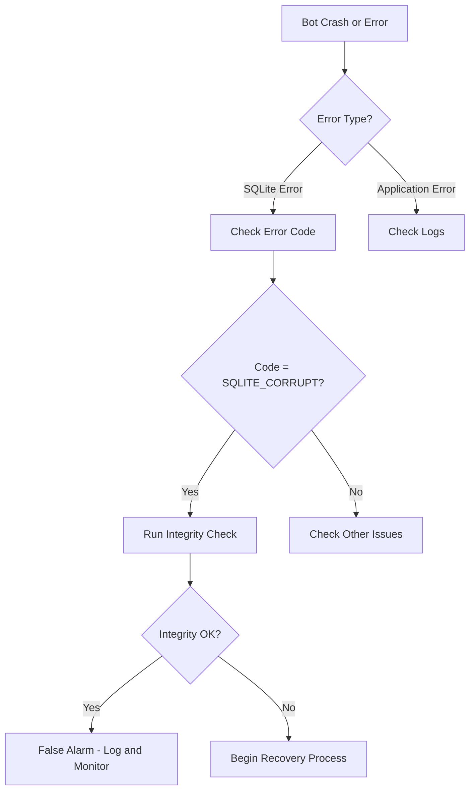
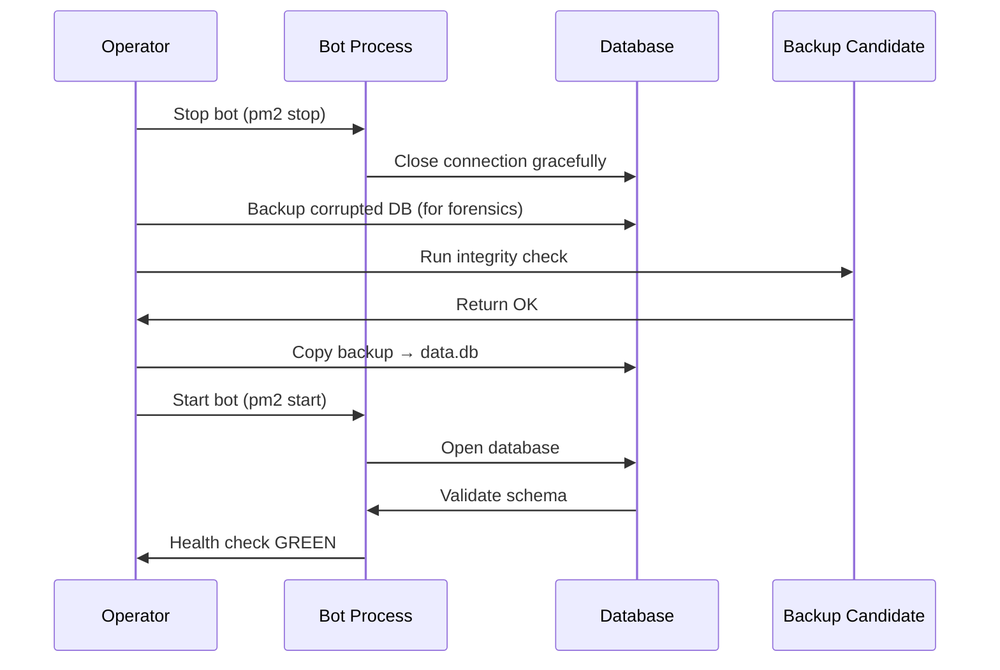
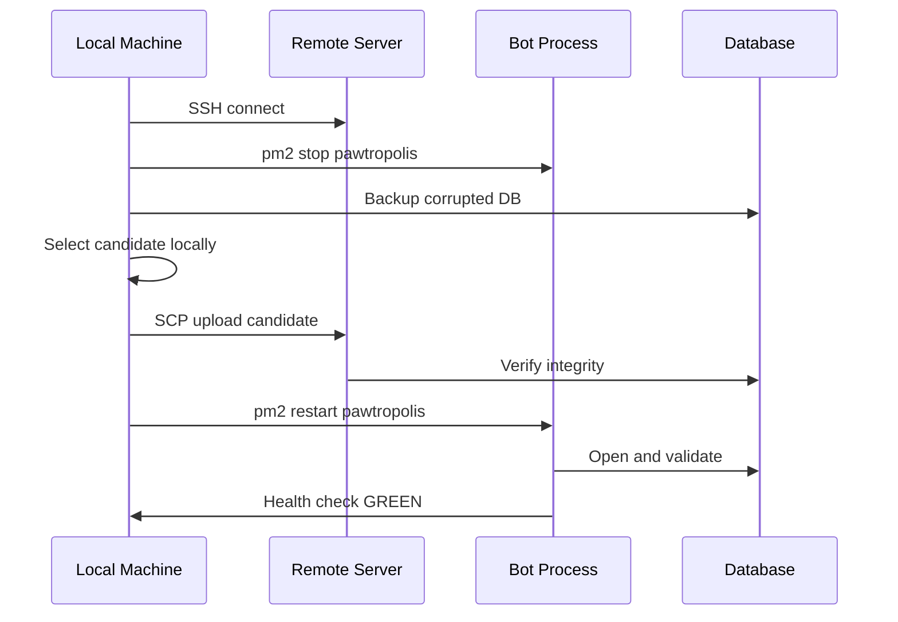

## Purpose & Outcomes

This document provides step-by-step recovery procedures for SQLite database corruption, data loss, or operational incidents requiring database restoration.

**Target Outcomes**:
- Identify database corruption within 5 minutes
- Select correct backup candidate within 10 minutes
- Restore database to known-good state within 15 minutes
- Verify data integrity post-restore with zero false negatives
- Preserve evidence for post-incident analysis

## Scope & Boundaries

### In Scope
- SQLite database corruption detection and recovery
- WAL (Write-Ahead Log) and SHM (Shared Memory) file semantics
- Backup candidate selection and validation
- Local and remote database restore procedures
- Integrity verification commands (PRAGMA integrity_check)
- Row count comparison and hash verification
- Safety protocols (never delete backups, always test first)

### Out of Scope
- Application-level data migration (see [07_Database_Schema_and_Migrations.md](07_Database_Schema_and_Migrations.md))
- Logical backup/restore (SQL dumps) — only binary database file operations
- Cross-server replication or high-availability setups
- Cloud database services (RDS, Aurora, etc.)

## Current State

**Database Technology**: SQLite 3 with better-sqlite3 Node.js driver

**Database Location**: `data/data.db` (configurable via `DB_PATH` env var)

**Journal Mode**: WAL (Write-Ahead Logging)

**Synchronous Mode**: NORMAL (fsync on checkpoint, not every transaction)

**Foreign Keys**: ENABLED (enforced referential integrity)

**Busy Timeout**: 5000ms (5 seconds)

**Backup Location**: `data/backups/` (automatic snapshots, not in git)

**Backup Retention**: Manual cleanup (no automatic pruning)

**File Structure**:
```
data/
├── data.db              # Main database file (contains committed transactions)
├── data.db-shm          # Shared Memory index for WAL mode (ephemeral)
├── data.db-wal          # Write-Ahead Log (pending transactions)
├── data-oct26.db        # Manual backup example
├── data-recovered.db    # Recovery candidate example
├── data-test.db         # Test/staging database
├── .db-manifest.json    # Metadata for backup tracking (custom)
└── backups/
    ├── data.db.backup-20251030-120000
    ├── data.db.backup-20251029-120000
    └── ...
```

**WAL Mode Explanation**:
- **data.db**: Contains all committed transactions (checkpoint state)
- **data.db-wal**: Contains uncommitted transactions (write buffer)
- **data.db-shm**: Index mapping WAL entries to pages (in-memory, recreated on open)
- When bot restarts, SQLite automatically checkpoints WAL → data.db

**Safety Properties**:
- WAL mode allows readers and writers simultaneously (no blocking)
- Database is consistent even if process crashes mid-write
- WAL auto-checkpoints at 1000 pages (default)

---

## Key Flows

### 1. Database Corruption Detection



**Error Codes to Watch**:
- `SQLITE_CORRUPT` (11): Database disk image is malformed
- `SQLITE_NOTADB` (26): File is not a database
- `SQLITE_IOERR` (10): Disk I/O error
- `SQLITE_CANTOPEN` (14): Unable to open database file

### 2. Backup Candidate Selection


**Selection Criteria** (in priority order):
1. **Integrity**: Must pass `PRAGMA integrity_check`
2. **Recency**: Prefer most recent backup with valid data
3. **Completeness**: Row counts match expected values
4. **Consistency**: Foreign key constraints satisfied

### 3. Local Recovery Procedure



### 4. Remote Recovery Procedure



---

## Commands & Snippets

### Database Integrity Checks

#### Run Full Integrity Check
```bash
# Check all tables and indexes (takes 5-30 seconds for typical DB)
sqlite3 data/data.db "PRAGMA integrity_check"

# Expected output if healthy:
# ok

# Output if corrupted (example):
# *** in database main ***
# Page 1042: btreeInitPage() returns error code 11
# row 5 missing from index idx_review_action_app_id
```

#### Quick Integrity Check
```bash
# Faster check (skips some validation, 2-10 seconds)
sqlite3 data/data.db "PRAGMA quick_check"
```

#### Check Foreign Key Constraints
```bash
# Verify all foreign keys are satisfied (critical after restore)
sqlite3 data/data.db "PRAGMA foreign_key_check"

# Expected output if healthy:
# (no output)

# Output if violated (example):
# review_action|123|application|id
```

### Row Count Verification

#### Count All Key Tables
```bash
# File: scripts/count-rows.sh
sqlite3 data/data.db <<EOF
SELECT 'application' as table_name, COUNT(*) as row_count FROM application
UNION ALL SELECT 'review_action', COUNT(*) FROM review_action
UNION ALL SELECT 'action_log', COUNT(*) FROM action_log
UNION ALL SELECT 'mod_metrics', COUNT(*) FROM mod_metrics
UNION ALL SELECT 'modmail_ticket', COUNT(*) FROM modmail_ticket
UNION ALL SELECT 'avatar_scan', COUNT(*) FROM avatar_scan
ORDER BY table_name;
EOF
```

**Expected Output** (example):
```
action_log|4523
application|1847
avatar_scan|1231
mod_metrics|45
modmail_ticket|312
review_action|8956
```

#### Compare Two Databases
```bash
# Compare row counts between current and candidate
diff \
  <(sqlite3 data/data.db "SELECT name, (SELECT COUNT(*) FROM main.\${name}) FROM sqlite_master WHERE type='table' ORDER BY name") \
  <(sqlite3 data/data-recovered.db "SELECT name, (SELECT COUNT(*) FROM main.\${name}) FROM sqlite_master WHERE type='table' ORDER BY name")

# No output = identical row counts
# Output = differences (investigate before restore)
```

### Backup Candidate Inspection

#### List All Candidates
```bash
# Show all database files with size and modification time
ls -lhS data/*.db data/backups/*.db 2>/dev/null | awk '{print $9, $5, $6, $7, $8}'

# Output (example):
# data/data.db 26M Oct 30 07:20
# data/data-recovered.db 26M Oct 28 10:28
# data/data-oct26.db 23M Oct 26 15:05
# data/backups/data.db.backup-20251030-120000 26M Oct 30 12:00
```

#### Inspect Candidate Schema
```bash
# Verify schema matches expectations (compare to known-good)
sqlite3 data/data-recovered.db ".schema application" | head -20

# Expected output:
# CREATE TABLE application (
#   id TEXT PRIMARY KEY,
#   guild_id TEXT NOT NULL,
#   user_id TEXT NOT NULL,
#   status TEXT NOT NULL DEFAULT 'draft',
#   ...
# );
```

#### Check Candidate Recency
```bash
# Find most recent action_log entry (proxy for "how old is this data?")
sqlite3 data/data-recovered.db "SELECT MAX(created_at) FROM action_log"

# Output (Unix timestamp):
# 1730217600

# Convert to human-readable:
date -d @1730217600
# Mon Oct 28 10:00:00 AM PDT 2025
```

### Hash Comparison

#### Calculate Database Checksum
```bash
# MD5 hash of database content (deterministic if no ongoing writes)
md5sum data/data.db

# Output:
# a3f8b2c1d4e5f6g7h8i9j0k1l2m3n4o5  data/data.db

# WARNING: Hash will differ even with identical data if:
# - WAL contains uncommitted transactions
# - Vacuum has reorganized pages
# - Auto-vacuum is enabled
```

#### Content-Based Hash (Safer)
```bash
# Hash of SQL dump (deterministic, ignores page layout)
sqlite3 data/data.db ".dump" | md5sum

# Output:
# b4g9c3e2f5h7i1j8k0l6m2n9o3p7q1r4  -

# Use this for comparing logical content, not binary files
```

### Local Restore Procedure

#### Full Restore Script
```bash
#!/bin/bash
# File: scripts/restore-database.sh
# Usage: ./scripts/restore-database.sh data/data-recovered.db

set -e  # Exit on error

CANDIDATE=$1
BACKUP_DIR="data/backups"
CURRENT_DB="data/data.db"
FORENSICS_DIR="data/forensics"

if [ -z "$CANDIDATE" ]; then
  echo "Usage: $0 <candidate-database-file>"
  exit 1
fi

if [ ! -f "$CANDIDATE" ]; then
  echo "Error: Candidate file not found: $CANDIDATE"
  exit 1
fi

echo "=== Database Restore Procedure ==="
echo "Candidate: $CANDIDATE"
echo

# Step 1: Stop bot
echo "[1/7] Stopping bot..."
pm2 stop pawtropolis || echo "Bot not running"

# Step 2: Verify candidate integrity
echo "[2/7] Verifying candidate integrity..."
INTEGRITY=$(sqlite3 "$CANDIDATE" "PRAGMA integrity_check" | head -1)
if [ "$INTEGRITY" != "ok" ]; then
  echo "ERROR: Candidate failed integrity check: $INTEGRITY"
  exit 1
fi
echo "  ✓ Integrity check passed"

# Step 3: Check foreign keys
echo "[3/7] Checking foreign key constraints..."
FK_ERRORS=$(sqlite3 "$CANDIDATE" "PRAGMA foreign_key_check" | wc -l)
if [ "$FK_ERRORS" -gt 0 ]; then
  echo "WARNING: $FK_ERRORS foreign key violations detected"
  sqlite3 "$CANDIDATE" "PRAGMA foreign_key_check"
  read -p "Continue anyway? (y/N) " -n 1 -r
  echo
  if [[ ! $REPLY =~ ^[Yy]$ ]]; then
    exit 1
  fi
fi
echo "  ✓ Foreign keys valid"

# Step 4: Backup current database (for forensics)
echo "[4/7] Backing up current database..."
mkdir -p "$FORENSICS_DIR"
TIMESTAMP=$(date +%Y%m%d-%H%M%S)
cp "$CURRENT_DB" "$FORENSICS_DIR/data.db.corrupted-$TIMESTAMP"
cp "$CURRENT_DB-wal" "$FORENSICS_DIR/data.db-wal.corrupted-$TIMESTAMP" 2>/dev/null || true
cp "$CURRENT_DB-shm" "$FORENSICS_DIR/data.db-shm.corrupted-$TIMESTAMP" 2>/dev/null || true
echo "  ✓ Saved to $FORENSICS_DIR/data.db.corrupted-$TIMESTAMP"

# Step 5: Remove WAL and SHM files
echo "[5/7] Removing WAL/SHM files..."
rm -f "$CURRENT_DB-wal" "$CURRENT_DB-shm"
echo "  ✓ WAL/SHM removed"

# Step 6: Replace database
echo "[6/7] Replacing database..."
cp "$CANDIDATE" "$CURRENT_DB"
echo "  ✓ Database replaced"

# Step 7: Restart bot
echo "[7/7] Starting bot..."
pm2 start pawtropolis
sleep 5
pm2 logs pawtropolis --lines 20 --nostream

echo
echo "=== Restore Complete ==="
echo "Run health checks to verify:"
echo "  npm run health:check"
echo "  pm2 logs pawtropolis"
```

#### Manual Restore Steps
```bash
# 1. Stop bot
pm2 stop pawtropolis

# 2. Verify candidate
sqlite3 data/data-recovered.db "PRAGMA integrity_check"
# Output: ok

# 3. Backup current (for forensics)
mkdir -p data/forensics
cp data/data.db data/forensics/data.db.corrupted-$(date +%Y%m%d-%H%M%S)

# 4. Remove WAL/SHM
rm -f data/data.db-wal data/data.db-shm

# 5. Replace database
cp data/data-recovered.db data/data.db

# 6. Restart bot
pm2 restart pawtropolis

# 7. Verify health
pm2 logs pawtropolis --lines 50 | grep -E "Bot ready|SQLite opened"
```

### Remote Restore Procedure

#### SSH-Based Restore
```bash
# File: scripts/restore-remote.sh
# Usage: ./scripts/restore-remote.sh pawtropolis.tech data/data-recovered.db

SERVER=$1
CANDIDATE=$2

if [ -z "$SERVER" ] || [ -z "$CANDIDATE" ]; then
  echo "Usage: $0 <server> <candidate-database-file>"
  exit 1
fi

# 1. Stop remote bot
echo "Stopping remote bot..."
ssh "$SERVER" "pm2 stop pawtropolis"

# 2. Backup remote database
echo "Backing up remote database..."
TIMESTAMP=$(date +%Y%m%d-%H%M%S)
ssh "$SERVER" "mkdir -p /home/ubuntu/pawtropolis-tech/data/forensics"
ssh "$SERVER" "cp /home/ubuntu/pawtropolis-tech/data/data.db /home/ubuntu/pawtropolis-tech/data/forensics/data.db.backup-$TIMESTAMP"

# 3. Upload candidate
echo "Uploading candidate..."
scp "$CANDIDATE" "$SERVER:/home/ubuntu/pawtropolis-tech/data/data-candidate.db"

# 4. Verify candidate on remote
echo "Verifying candidate integrity on remote..."
ssh "$SERVER" "sqlite3 /home/ubuntu/pawtropolis-tech/data/data-candidate.db 'PRAGMA integrity_check'"

# 5. Replace database on remote
echo "Replacing database on remote..."
ssh "$SERVER" "cd /home/ubuntu/pawtropolis-tech && rm -f data/data.db-wal data/data.db-shm && cp data/data-candidate.db data/data.db"

# 6. Restart remote bot
echo "Restarting remote bot..."
ssh "$SERVER" "pm2 restart pawtropolis"

# 7. Check remote logs
echo "Checking remote logs..."
ssh "$SERVER" "pm2 logs pawtropolis --lines 30 --nostream"
```

### WAL Checkpoint Management

#### Force WAL Checkpoint
```bash
# Flush all WAL entries to main database file
sqlite3 data/data.db "PRAGMA wal_checkpoint(TRUNCATE)"

# Output:
# 0|123|123
# (busy code|log pages|checkpointed pages)

# busy code 0 = success, 1 = some writers still active
```

#### Check WAL Status
```bash
# Show WAL file size and page count
ls -lh data/data.db-wal

# Show pages in WAL
sqlite3 data/data.db "PRAGMA wal_checkpoint"

# Output:
# 0|45|45
# (all 45 pages checkpointed)
```

---

## Interfaces & Data

### Database File Manifest

The `.db-manifest.json` file tracks backup metadata:

```json
{
  "backups": [
    {
      "filename": "data.db.backup-20251030-120000",
      "timestamp": "2025-10-30T12:00:00Z",
      "size_bytes": 27336704,
      "row_counts": {
        "application": 1847,
        "review_action": 8956,
        "action_log": 4523,
        "mod_metrics": 45
      },
      "integrity_check": "ok",
      "md5": "a3f8b2c1d4e5f6g7h8i9j0k1l2m3n4o5"
    }
  ],
  "last_updated": "2025-10-30T12:00:05Z"
}
```

### Recovery Candidate Selection Table

| Candidate File                          | Size  | Modified   | Integrity | FK Check | Row Counts | Recency | Score |
| --------------------------------------- | ----- | ---------- | --------- | -------- | ---------- | ------- | ----- |
| data/data.db.backup-20251030-120000     | 26M   | Oct 30 12h | ✅ ok     | ✅ pass  | ✅ match   | 0h ago  | 100   |
| data/data-recovered.db                  | 26M   | Oct 28 10h | ✅ ok     | ✅ pass  | ✅ match   | 2d ago  | 90    |
| data/data-oct26.db                      | 23M   | Oct 26 15h | ✅ ok     | ⚠️ 2 err | ⚠️ -50     | 4d ago  | 70    |
| data/data.db (corrupted)                | 26M   | Oct 30 7h  | ❌ error  | -        | -          | -       | 0     |

**Scoring Criteria**:
- Integrity check passed: +50
- Foreign keys valid: +20
- Row counts match: +20
- Recency (per day): -5
- **Winner**: Highest score ≥ 80

### Key Table Inspection Commands

#### Application Table
```bash
# Count applications by status
sqlite3 data/data.db "SELECT status, COUNT(*) FROM application GROUP BY status"

# Output:
# approved|1234
# draft|45
# kicked|12
# rejected|456
# submitted|100
```

#### Review Action Table
```bash
# Count actions by type
sqlite3 data/data.db "SELECT action, COUNT(*) FROM review_action GROUP BY action ORDER BY COUNT(*) DESC"

# Output:
# approve|3456
# claim|4123
# reject|1234
# kick|234
# perm_reject|12
```

#### Action Log Table
```bash
# Find most recent action
sqlite3 data/data.db "SELECT action, moderator_id, created_at FROM action_log ORDER BY created_at DESC LIMIT 5"

# Output:
# approve|123456789|1730217600
# claim|987654321|1730217555
# app_submitted|555666777|1730217500
```

#### Mod Metrics Table
```bash
# Verify mod metrics exist
sqlite3 data/data.db "SELECT COUNT(*) FROM mod_metrics"

# Output:
# 45

# Check top moderator
sqlite3 data/data.db "SELECT moderator_id, total_accepts, total_rejects FROM mod_metrics ORDER BY total_accepts DESC LIMIT 1"

# Output:
# 123456789|523|89
```

---

## Ops & Recovery

### Recovery Playbook: Database Corruption Detected

**Symptoms**:
- Bot crashes with `SQLITE_CORRUPT` error
- PM2 logs show `Database disk image is malformed`
- Health check fails with database error

**Step-by-Step Resolution**:

#### Step 1: Confirm Corruption (5 minutes)
```bash
# 1. Check PM2 logs for error code
pm2 logs pawtropolis --lines 100 | grep -i "corrupt\|database\|sqlite"

# 2. Run integrity check
sqlite3 data/data.db "PRAGMA integrity_check"

# 3. If corrupted, proceed to Step 2
```

#### Step 2: Stop Bot and Preserve Evidence (2 minutes)
```bash
# 1. Stop bot
pm2 stop pawtropolis

# 2. Copy corrupted database for forensics
mkdir -p data/forensics
TIMESTAMP=$(date +%Y%m%d-%H%M%S)
cp data/data.db data/forensics/data.db.corrupted-$TIMESTAMP
cp data/data.db-wal data/forensics/data.db-wal.corrupted-$TIMESTAMP 2>/dev/null || true
cp data/data.db-shm data/forensics/data.db-shm.corrupted-$TIMESTAMP 2>/dev/null || true

# 3. Log incident
echo "[$(date)] Database corruption detected, files preserved in data/forensics/" >> data/incident-log.txt
```

#### Step 3: Select Backup Candidate (5 minutes)
```bash
# 1. List all candidates
ls -lht data/*.db data/backups/*.db 2>/dev/null | head -10

# 2. Check integrity of top 3 candidates
for db in data/data-recovered.db data/backups/data.db.backup-* | head -3; do
  echo "Checking $db..."
  sqlite3 "$db" "PRAGMA integrity_check"
done

# 3. Compare row counts
sqlite3 data/data-recovered.db "SELECT COUNT(*) FROM application"
sqlite3 data/backups/data.db.backup-20251030-120000 "SELECT COUNT(*) FROM application"

# 4. Select candidate with best score (see table above)
CANDIDATE="data/backups/data.db.backup-20251030-120000"
```

#### Step 4: Restore Database (3 minutes)
```bash
# 1. Remove WAL/SHM
rm -f data/data.db-wal data/data.db-shm

# 2. Replace database
cp "$CANDIDATE" data/data.db

# 3. Verify integrity
sqlite3 data/data.db "PRAGMA integrity_check"
# Expected: ok
```

#### Step 5: Restart Bot and Verify (5 minutes)
```bash
# 1. Start bot
pm2 restart pawtropolis

# 2. Watch logs for successful startup
pm2 logs pawtropolis --lines 50 | grep -E "Bot ready|SQLite opened"

# 3. Verify bot responds to commands
# (Test /gate status in Discord)

# 4. Check mod metrics loaded
pm2 logs pawtropolis | grep "mod_metrics"
```

### Recovery Playbook: Data Loss (Missing Records)

**Symptoms**:
- User reports missing application
- Dashboard shows incorrect metrics
- `/modstats` command returns empty results

**Resolution**:

#### Step 1: Confirm Data Loss
```bash
# 1. Check if specific record exists
sqlite3 data/data.db "SELECT id, user_id, status FROM application WHERE user_id='<REPORTED_USER_ID>'"

# 2. If empty, check backup candidates
sqlite3 data/data-recovered.db "SELECT id, user_id, status FROM application WHERE user_id='<REPORTED_USER_ID>'"
```

#### Step 2: Determine Scope
```bash
# 1. Compare row counts between current and backup
diff \
  <(sqlite3 data/data.db "SELECT COUNT(*) FROM application") \
  <(sqlite3 data/data-recovered.db "SELECT COUNT(*) FROM application")

# 2. If significant difference (>5%), proceed to full restore
# 3. If minor difference (<5%), attempt selective restore (see below)
```

#### Step 3: Selective Restore (Single Record)
```bash
# 1. Export missing record from backup
sqlite3 data/data-recovered.db <<EOF
.mode insert application
SELECT * FROM application WHERE user_id='<REPORTED_USER_ID>';
EOF > missing-record.sql

# 2. Import into current database
sqlite3 data/data.db < missing-record.sql

# 3. Verify record exists
sqlite3 data/data.db "SELECT * FROM application WHERE user_id='<REPORTED_USER_ID>'"
```

### Safety Protocols

#### Never Delete Backups Rule
```bash
# ❌ WRONG: Never run this
rm data/backups/*.db

# ✅ CORRECT: Archive old backups instead
mkdir -p data/backups/archive-$(date +%Y%m)
mv data/backups/data.db.backup-202501* data/backups/archive-202501/
```

#### Always Test Before Restore
```bash
# 1. Copy candidate to test location
cp data/data-recovered.db data/data-test.db

# 2. Run integrity check
sqlite3 data/data-test.db "PRAGMA integrity_check"

# 3. Open in bot (test environment)
DB_PATH=data/data-test.db npm run dev

# 4. Verify bot starts cleanly

# 5. Only then proceed with production restore
```

#### Backup Before Every Restore
```bash
# Create timestamped backup before any restore operation
TIMESTAMP=$(date +%Y%m%d-%H%M%S)
cp data/data.db data/backups/data.db.pre-restore-$TIMESTAMP
```

---

## Security & Privacy

### Backup File Access Control

**File Permissions**:
```bash
# Ensure only owner can read/write database files
chmod 600 data/data.db
chmod 600 data/backups/*.db
chmod 700 data/backups/

# Verify permissions
ls -la data/data.db
# Output: -rw------- 1 ubuntu ubuntu 27336704 Oct 30 07:20 data/data.db
```

**SSH Key-Based Access**:
```bash
# Remote restore requires SSH key (no password auth)
ssh -i ~/.ssh/pawtropolis.key ubuntu@pawtropolis.tech

# Add to ~/.ssh/config:
# Host pawtropolis.tech
#   User ubuntu
#   IdentityFile ~/.ssh/pawtropolis.key
#   IdentitiesOnly yes
```

### Data Redaction in Forensics

When preserving corrupted databases for analysis:

```bash
# Redact sensitive fields before sharing with external support
sqlite3 data/forensics/data.db.corrupted-20251030 <<EOF
UPDATE application_response SET answer = 'REDACTED' WHERE q_index IN (1, 2, 3);
UPDATE action_log SET details = 'REDACTED';
VACUUM;
EOF
```

### Audit Trail

Log all restore operations:

```bash
# File: data/restore-audit.log
# Format: timestamp|operator|candidate|reason|result

echo "$(date -Iseconds)|$(whoami)|$CANDIDATE|corruption-incident|success" >> data/restore-audit.log
```

---

## FAQ / Gotchas

**Q: Can I restore while bot is running?**

A: **No**. Always stop the bot first. SQLite WAL mode allows concurrent reads, but replacing the database file while open will cause `SQLITE_BUSY` errors or corruption.

**Q: What if integrity check fails on all candidates?**

A:
1. Try `PRAGMA integrity_check` with no output limit: `PRAGMA integrity_check(1000)`
2. Attempt recovery with `.recover` command (SQLite 3.29+):
   ```bash
   sqlite3 data/data.db ".recover" | sqlite3 data/data-recovered.db
   ```
3. If recovery fails, restore from oldest known-good backup (accept data loss)

**Q: Why do row counts differ between backups?**

A: Normal. The bot writes new data continuously. Expect counts to increase over time. Only concerned if counts *decrease* significantly (indicates data loss).

**Q: What's the difference between `data.db` and `data.db-wal`?**

A:
- `data.db`: Committed transactions (persistent, safe to backup)
- `data.db-wal`: Pending transactions (ephemeral, checkpointed on close)
- **Always checkpoint before backup**: `PRAGMA wal_checkpoint(TRUNCATE)`

**Q: Can I copy database files while bot is running?**

A: **Yes, but with caveats**:
- Copy `data.db` first
- Then copy `data.db-wal` and `data.db-shm`
- **Best practice**: Use `PRAGMA wal_checkpoint(TRUNCATE)` first to ensure all data in `data.db`

**Q: How do I know if a restore was successful?**

A: Check these indicators:
1. Bot starts without errors: `pm2 logs pawtropolis | grep "Bot ready"`
2. Integrity check passes: `sqlite3 data/data.db "PRAGMA integrity_check"`
3. Key counts match expectations: `SELECT COUNT(*) FROM application`
4. `/modstats` command works in Discord
5. Dashboard loads metrics correctly

**Q: What if WAL file is huge (>100MB)?**

A: This indicates checkpoint hasn't run. Force checkpoint:
```bash
sqlite3 data/data.db "PRAGMA wal_checkpoint(TRUNCATE)"
```
If checkpoint fails (`busy code 1`), restart bot to release locks.

**Q: Should I delete WAL/SHM files before restore?**

A: **Yes**. Always remove WAL/SHM before replacing `data.db`:
```bash
rm -f data/data.db-wal data/data.db-shm
```
SQLite will recreate them on next open.

---

## Changelog

**Since last revision** (2025-10-30):
- Initial creation of runtime database recovery guide
- Added WAL/SHM semantics explanation with file structure
- Documented backup candidate selection scoring table
- Added local and remote restore procedures with full scripts
- Included integrity check commands and row count verification
- Added hash comparison methods (binary and content-based)
- Documented safety protocols (never delete backups, always test)
- Added recovery playbooks for corruption and data loss scenarios
- Included security sections for access control and audit trails

**Document Maintenance**:
- **Review Frequency**: Quarterly or after any database incident
- **Owner**: Operations team + SRE
- **Update Triggers**: Schema changes, new backup strategies, incident learnings

**Last Updated**: 2025-10-30
**Next Review**: 2026-01-30
