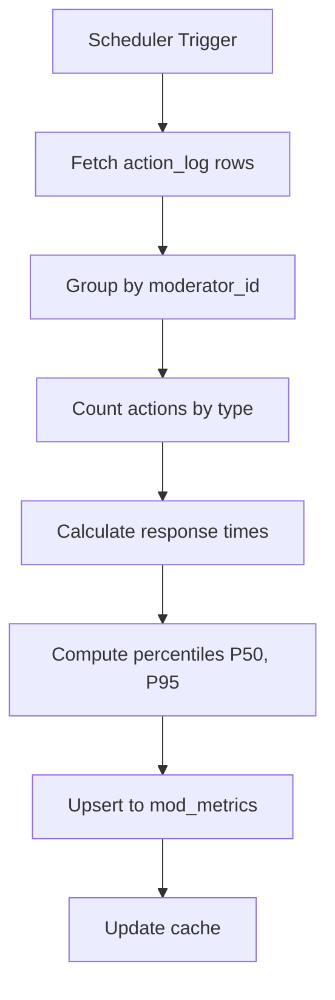
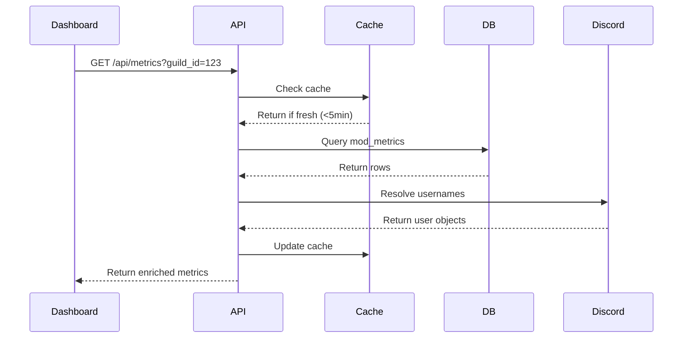
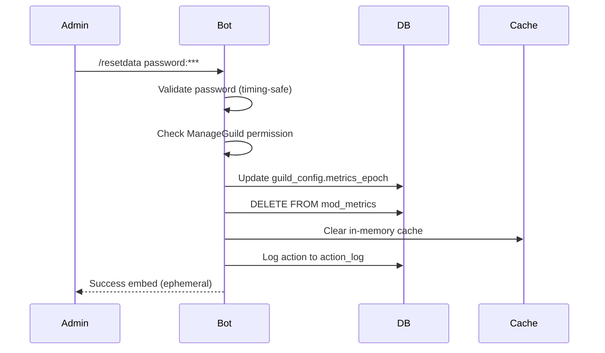

## Purpose & Outcomes

This document provides comprehensive technical documentation for the moderator performance analytics system, including:

- **Data Model**: Complete schema for `mod_metrics` and `action_log` tables
- **Key Metrics**: Computation methods for accepts, rejects, response times, percentiles
- **Query Patterns**: Optimized SQL for leaderboards, timeseries, and analytics
- **Caching Strategy**: In-memory cache with TTL and invalidation rules
- **Security Model**: Password-protected reset command with timing-safe comparison
- **Performance Optimization**: Index strategies and query optimization

## Scope & Boundaries

### In Scope
- `mod_metrics` table schema and migration
- `action_log` table structure and indexing
- Aggregation queries for moderator performance
- Percentile calculation (P50, P95) using nearest-rank algorithm
- Response time measurement (claim → decision)
- Leaderboard queries with guild filtering
- In-memory caching with TTL (5-minute default)
- `/resetdata` command security and idempotency
- Metrics epoch filtering for fresh-start scenarios
- Timeseries API endpoints for dashboard charts

### Out of Scope
- Real-time streaming analytics (all metrics are batch-computed)
- Predictive analytics or ML models
- Cross-guild aggregation (metrics are per-guild only)
- User-facing leaderboards (dashboard is admin-only)
- Historical data archival (retention is indefinite)

## Current State

**Primary Table**: `mod_metrics`
- **Purpose**: Persistent cache of per-moderator performance summaries
- **Cardinality**: One row per (moderator_id, guild_id) pair
- **Update Frequency**: Every 15 minutes via scheduler (configurable)
- **Cache Layer**: In-memory Map with 5-minute TTL

**Source Table**: `action_log`
- **Purpose**: Append-only log of all moderator actions
- **Cardinality**: ~10,000 rows per month (typical guild)
- **Indexed Fields**: `guild_id`, `moderator_id`, `created_at_s`, `action`, `app_id`
- **Retention**: Indefinite (no automatic pruning)

**Metrics Computation**: Driven by [src/features/modPerformance.ts](../src/features/modPerformance.ts)
- **Algorithm**: Nearest-rank percentile (no interpolation)
- **Response Time**: Time from `claim` action to `approve`/`reject`/`kick` action
- **Epoch Filtering**: Metrics respect `guild_config.metrics_epoch` for fresh starts

**API Endpoints**:
- `GET /api/metrics` — Fetch all moderator metrics for guild
- `GET /api/metrics/timeseries` — Fetch action counts over time (1h/1d buckets)
- `GET /api/metrics/latency` — Fetch response time percentiles over time
- `GET /api/metrics/join_submit` — Fetch join→submit ratio over time

---

## Key Flows

### 1. Metrics Computation Flow



**Step-by-Step**:
1. **Trigger**: Scheduler runs every 15 minutes (env: `MOD_METRICS_REFRESH_INTERVAL_MINUTES`)
2. **Fetch**: Query `action_log` for all actions since metrics epoch
3. **Group**: Aggregate by `(guild_id, moderator_id)`
4. **Count**: Sum occurrences of `claim`, `approve`, `reject`, `kick`, `modmail_open`
5. **Response Times**: Calculate `(decision_time - claim_time)` for each application
6. **Percentiles**: Apply nearest-rank algorithm to response time array
7. **Persist**: Upsert computed metrics to `mod_metrics` table
8. **Cache**: Update in-memory cache with new values

### 2. Leaderboard Query Flow



### 3. Reset Command Flow



---

## Commands & Snippets

### Table Schema

#### mod_metrics Table (Complete)
```sql
-- File: migrations/002_create_mod_metrics.ts
CREATE TABLE mod_metrics (
  moderator_id        TEXT NOT NULL,     -- Discord user ID (snowflake)
  guild_id            TEXT NOT NULL,     -- Discord guild ID (snowflake)
  total_claims        INTEGER NOT NULL DEFAULT 0,
  total_accepts       INTEGER NOT NULL DEFAULT 0,
  total_rejects       INTEGER NOT NULL DEFAULT 0,
  total_kicks         INTEGER NOT NULL DEFAULT 0,
  total_modmail_opens INTEGER NOT NULL DEFAULT 0,
  avg_response_time_s REAL DEFAULT NULL, -- Average seconds from claim to decision
  p50_response_time_s REAL DEFAULT NULL, -- Median response time (seconds)
  p95_response_time_s REAL DEFAULT NULL, -- 95th percentile response time (seconds)
  updated_at          TEXT NOT NULL DEFAULT (datetime('now')),  -- ISO 8601 timestamp
  PRIMARY KEY (moderator_id, guild_id)
);

-- Index for fast leaderboard queries (sorted by accepts descending)
CREATE INDEX idx_mod_metrics_guild_id
ON mod_metrics(guild_id, total_accepts DESC);
```

**Field Descriptions**:
- `moderator_id`: Discord user ID (18-digit snowflake)
- `guild_id`: Discord guild ID (18-digit snowflake)
- `total_claims`: Count of `claim` actions (viewing review card)
- `total_accepts`: Count of `approve` actions (approved applications)
- `total_rejects`: Count of `reject` actions (rejected applications)
- `total_kicks`: Count of `kick` actions (rejected + removed from guild)
- `total_modmail_opens`: Count of `modmail_open` actions (opened support tickets)
- `avg_response_time_s`: Average time from claim to decision (seconds)
- `p50_response_time_s`: Median response time (50th percentile, seconds)
- `p95_response_time_s`: 95th percentile response time (seconds)
- `updated_at`: Last update timestamp (ISO 8601 format)

#### action_log Table (Relevant Fields)
```sql
-- File: src/db/ensure.ts (referenced, not fully defined here)
CREATE TABLE action_log (
  id              INTEGER PRIMARY KEY AUTOINCREMENT,
  guild_id        TEXT NOT NULL,
  moderator_id    TEXT,           -- NULL for applicant actions
  app_id          TEXT,           -- Application ID (ULID)
  action          TEXT NOT NULL,  -- Action type (see MOD_ACTIONS below)
  created_at_s    INTEGER NOT NULL,  -- Unix timestamp (seconds)
  created_at      TEXT NOT NULL,     -- ISO 8601 timestamp
  details         TEXT,              -- JSON metadata
  -- ... additional fields
);

-- Key indexes
CREATE INDEX idx_action_log_guild_id ON action_log(guild_id, created_at_s DESC);
CREATE INDEX idx_action_log_moderator_id ON action_log(moderator_id, guild_id);
CREATE INDEX idx_action_log_app_id ON action_log(app_id);
```

**Action Types** (from [src/features/modPerformance.ts:21-29](../src/features/modPerformance.ts#L21-L29)):
```typescript
export const MOD_ACTIONS = new Set([
  "claim",            // Moderator claimed application for review
  "approve",          // Approved application
  "reject",           // Rejected application
  "perm_reject",      // Permanent rejection (cannot reapply)
  "kick",             // Rejected + kicked from guild
  "modmail_open",     // Opened modmail ticket
  "modmail_close",    // Closed modmail ticket
]);

export const APPLICANT_ACTIONS = new Set(["app_submitted"]);
```

### Core Queries

#### Count Actions by Moderator
```sql
-- Count all actions by moderator for a guild
SELECT
  moderator_id,
  SUM(CASE WHEN action = 'claim' THEN 1 ELSE 0 END) as total_claims,
  SUM(CASE WHEN action = 'approve' THEN 1 ELSE 0 END) as total_accepts,
  SUM(CASE WHEN action = 'reject' THEN 1 ELSE 0 END) as total_rejects,
  SUM(CASE WHEN action = 'kick' THEN 1 ELSE 0 END) as total_kicks,
  SUM(CASE WHEN action = 'modmail_open' THEN 1 ELSE 0 END) as total_modmail_opens
FROM action_log
WHERE guild_id = ?
  AND moderator_id IS NOT NULL
  AND created_at_s >= (SELECT COALESCE(
    strftime('%s', metrics_epoch),
    0
  ) FROM guild_config WHERE guild_id = ?)
GROUP BY moderator_id;
```

**Example Output**:
```
moderator_id      |claims|accepts|rejects|kicks|modmail_opens
123456789         |250   |180    |60     |10   |25
987654321         |180   |120    |50     |10   |18
555666777         |120   |80     |35     |5    |12
```

#### Compute Response Times
```sql
-- Calculate response time (claim → decision) for each application
WITH claim_times AS (
  SELECT
    app_id,
    moderator_id,
    MIN(created_at_s) as claimed_at
  FROM action_log
  WHERE action = 'claim'
    AND guild_id = ?
    AND moderator_id IS NOT NULL
  GROUP BY app_id, moderator_id
),
decision_times AS (
  SELECT
    app_id,
    moderator_id,
    MIN(created_at_s) as decided_at,
    action as decision_action
  FROM action_log
  WHERE action IN ('approve', 'reject', 'kick')
    AND guild_id = ?
    AND moderator_id IS NOT NULL
  GROUP BY app_id, moderator_id
)
SELECT
  c.moderator_id,
  c.app_id,
  c.claimed_at,
  d.decided_at,
  (d.decided_at - c.claimed_at) as response_time_s,
  d.decision_action
FROM claim_times c
INNER JOIN decision_times d
  ON c.app_id = d.app_id
  AND c.moderator_id = d.moderator_id
WHERE d.decided_at > c.claimed_at  -- Decision must come after claim
ORDER BY c.moderator_id, response_time_s;
```

**Example Output**:
```
moderator_id|app_id    |claimed_at |decided_at |response_time_s|decision_action
123456789   |01HQ8...  |1730217600 |1730221200 |3600           |approve
123456789   |01HQ9...  |1730218000 |1730225200 |7200           |reject
987654321   |01HQA...  |1730220000 |1730223600 |3600           |approve
```

#### Leaderboard Query (Top 10)
```sql
-- Fetch top 10 moderators by total accepts
SELECT
  moderator_id,
  guild_id,
  total_claims,
  total_accepts,
  total_rejects,
  total_kicks,
  total_modmail_opens,
  p50_response_time_s,
  p95_response_time_s,
  updated_at
FROM mod_metrics
WHERE guild_id = ?
ORDER BY total_accepts DESC
LIMIT 10;
```

**Example Output**:
```
moderator_id|total_accepts|p50_response_time_s|p95_response_time_s
123456789   |523          |3600               |10800
987654321   |412          |4200               |12600
555666777   |389          |3000               |9000
```

#### Single Moderator Metrics
```sql
-- Fetch metrics for specific moderator
SELECT
  moderator_id,
  guild_id,
  total_claims,
  total_accepts,
  total_rejects,
  total_kicks,
  total_modmail_opens,
  avg_response_time_s,
  p50_response_time_s,
  p95_response_time_s,
  updated_at
FROM mod_metrics
WHERE moderator_id = ?
  AND guild_id = ?
LIMIT 1;
```

### Percentile Calculation

#### Nearest-Rank Algorithm (TypeScript)
```typescript
// File: src/features/modPerformance.ts:88-99
/**
 * Calculate percentile from array using nearest-rank method.
 * Deterministic percentile computation for response time analytics.
 * METHOD: Nearest-rank (always picks existing value, no interpolation).
 */
function calculatePercentile(values: number[], percentile: number): number | null {
  if (values.length === 0) return null;

  // Copy array to avoid mutating input
  const sorted = [...values].sort((a, b) => a - b);

  // Nearest-rank method: p ∈ (0, 100]
  const rank = Math.ceil((percentile / 100) * sorted.length);
  const index = Math.min(sorted.length - 1, Math.max(0, rank - 1));

  return sorted[index];
}
```

**Example Usage**:
```typescript
const responseTimes = [3600, 7200, 1800, 5400, 10800];  // seconds

const p50 = calculatePercentile(responseTimes, 50);
// Result: 5400 (median)

const p95 = calculatePercentile(responseTimes, 95);
// Result: 10800 (95th percentile)

const p99 = calculatePercentile(responseTimes, 99);
// Result: 10800 (highest value for small dataset)
```

**Why Nearest-Rank?**
- **Deterministic**: Always returns actual observed value (no interpolation)
- **Simple**: Easy to understand and debug
- **Fast**: O(n log n) due to sort, acceptable for typical datasets (<1000 values per moderator)
- **No Edge Cases**: Works correctly with any array size (unlike linear interpolation)

### Caching Strategy

#### In-Memory Cache Implementation
```typescript
// File: src/features/modPerformance.ts:66-67
const _metricsCache = new Map<string, { metrics: ModMetrics[]; timestamp: number }>();
const _getTTL = () => Number(process.env.MOD_METRICS_TTL_MS ?? 5 * 60 * 1000);  // 5 minutes default
```

#### Cache Key Format
```typescript
// Cache key: guild_id
const cacheKey = guildId;  // e.g., "123456789012345678"
```

#### Cache Retrieval
```typescript
// File: src/features/modPerformance.ts (conceptual)
export async function getCachedMetrics(guildId: string): Promise<ModMetrics[]> {
  const cached = _metricsCache.get(guildId);

  if (cached) {
    const age = Date.now() - cached.timestamp;
    const ttl = _getTTL();

    if (age < ttl) {
      logger.debug({ guildId, age }, "Cache hit");
      return cached.metrics;
    }

    // Stale cache, evict
    _metricsCache.delete(guildId);
    logger.debug({ guildId, age, ttl }, "Cache miss (stale)");
  }

  // Cache miss, recompute
  const metrics = await recalcModMetrics(guildId);

  // Update cache
  _metricsCache.set(guildId, {
    metrics,
    timestamp: Date.now()
  });

  return metrics;
}
```

#### Cache Invalidation
```typescript
// File: src/features/modPerformance.ts:73-75
export function __test__clearModMetricsCache(): void {
  _metricsCache.clear();
}

// Used by /resetdata command to force recalculation
```

**Invalidation Triggers**:
- `/resetdata` command execution
- Metrics epoch update
- Manual clear via test utility (test isolation)

### Reset Command Security

#### Password Validation (Timing-Safe)
```typescript
// File: src/commands/resetdata.ts:41-50
import crypto from "node:crypto";

/**
 * Constant-time string comparison to prevent timing attacks.
 * Password validation must not leak information via timing.
 */
function constantTimeCompare(a: string, b: string): boolean {
  if (a.length !== b.length) {
    return false;
  }

  const bufA = Buffer.from(a, "utf8");
  const bufB = Buffer.from(b, "utf8");

  return crypto.timingSafeEqual(bufA, bufB);
}
```

**Why Timing-Safe?**
- **Security**: Prevents timing attacks where attacker measures comparison time to deduce password
- **Constant-Time**: Always takes same time regardless of how many characters match
- **Best Practice**: Required for all password/secret comparisons in security-sensitive contexts

#### Reset Command Flow
```typescript
// File: src/commands/resetdata.ts:60-171
export async function execute(ctx: CommandContext<ChatInputCommandInteraction>) {
  const { interaction } = ctx;
  await interaction.deferReply({ ephemeral: true });

  const password = interaction.options.getString("password", true);
  const guildId = interaction.guildId!;

  // 1. Validate password
  const correctPassword = process.env.RESET_PASSWORD;
  if (!correctPassword) {
    await interaction.editReply({ content: "❌ Reset password not configured." });
    return;
  }

  if (!constantTimeCompare(password, correctPassword)) {
    logger.warn({ userId: interaction.user.id, guildId }, "[resetdata] incorrect password");
    await interaction.editReply({ content: "❌ Incorrect password." });
    return;
  }

  // 2. Check permissions (ManageGuild OR ADMIN_ROLE_ID)
  const hasPermission = /* ... permission check ... */;
  if (!hasPermission) {
    await interaction.editReply({ content: "❌ No permission." });
    return;
  }

  // 3. Set new metrics epoch
  const epoch = new Date();
  setMetricsEpoch(guildId, epoch);

  // 4. Clear cache
  clearModMetricsCache();

  // 5. Delete cached metrics from DB
  db.prepare(`DELETE FROM mod_metrics WHERE guild_id = ?`).run(guildId);

  // 6. Log action
  await logActionPretty(interaction.guild, {
    actorId: interaction.user.id,
    action: "modmail_close",  // Repurposed for audit
    meta: { action_type: "metrics_reset", epoch: epoch.toISOString() }
  });

  // 7. Success response (ephemeral)
  await interaction.editReply({
    embeds: [new EmbedBuilder()
      .setTitle("✅ Metrics Data Reset")
      .setDescription("All metrics have been reset.")
      .addFields({ name: "New Epoch", value: `\`${epoch.toISOString()}\`` })
      .setColor(0x57f287)
    ]
  });
}
```

**Security Measures**:
- ✅ Password validation with `crypto.timingSafeEqual`
- ✅ Permission check (`ManageGuild` OR `ADMIN_ROLE_ID`)
- ✅ Ephemeral responses (password attempts not visible in channel)
- ✅ Audit logging (all attempts logged to `action_log`)
- ✅ Rate limiting (Discord command cooldown: 1 command per 2 seconds)

### Metrics Epoch Filtering

#### Epoch Configuration
```sql
-- File: migrations/004_metrics_epoch_and_joins.ts
ALTER TABLE guild_config ADD COLUMN metrics_epoch TEXT;  -- ISO 8601 timestamp

-- Example values:
-- NULL: No epoch set, use all historical data
-- '2025-10-30T00:00:00Z': Only count actions after this timestamp
```

#### Epoch Predicate Helper
```typescript
// File: src/features/metricsEpoch.ts (conceptual)
export function getEpochPredicate(guildId: string, columnName: string = 'created_at_s') {
  const epochRow = db.prepare(`
    SELECT metrics_epoch
    FROM guild_config
    WHERE guild_id = ?
  `).get(guildId) as { metrics_epoch: string | null };

  if (!epochRow || !epochRow.metrics_epoch) {
    // No epoch set, no filtering
    return { sql: '', params: [] };
  }

  const epochSeconds = Math.floor(new Date(epochRow.metrics_epoch).getTime() / 1000);

  return {
    sql: `AND ${columnName} >= ?`,
    params: [epochSeconds]
  };
}
```

#### Usage in Queries
```sql
-- Without epoch filtering:
SELECT COUNT(*) FROM action_log WHERE guild_id = ?

-- With epoch filtering:
SELECT COUNT(*) FROM action_log
WHERE guild_id = ?
  AND created_at_s >= ?  -- Epoch predicate

-- Generated dynamically:
const epochFilter = getEpochPredicate(guildId, 'created_at_s');
const query = `
  SELECT COUNT(*) FROM action_log
  WHERE guild_id = ?
    ${epochFilter.sql}
`;
const count = db.prepare(query).get(guildId, ...epochFilter.params);
```

---

## Interfaces & Data

### TypeScript Type Definitions

```typescript
// File: src/features/modPerformance.ts:39-51
export interface ModMetrics {
  moderator_id: string;
  guild_id: string;
  total_claims: number;
  total_accepts: number;
  total_rejects: number;
  total_kicks: number;
  total_modmail_opens: number;
  avg_response_time_s: number | null;
  p50_response_time_s: number | null;
  p95_response_time_s: number | null;
  updated_at: string;  // ISO 8601 timestamp
}
```

### API Response Formats

#### GET /api/metrics (All Moderators)
```json
{
  "items": [
    {
      "moderator_id": "123456789",
      "guild_id": "987654321",
      "total_claims": 250,
      "total_accepts": 180,
      "total_rejects": 60,
      "total_kicks": 10,
      "total_modmail_opens": 25,
      "avg_response_time_s": 4200,
      "p50_response_time_s": 3600,
      "p95_response_time_s": 10800,
      "updated_at": "2025-10-30T12:00:00Z"
    }
  ],
  "count": 45,
  "limit": 500
}
```

#### GET /api/metrics?moderator_id=123 (Single Moderator)
```json
{
  "metrics": {
    "moderator_id": "123456789",
    "guild_id": "987654321",
    "total_claims": 250,
    "total_accepts": 180,
    "total_rejects": 60,
    "total_kicks": 10,
    "total_modmail_opens": 25,
    "avg_response_time_s": 4200,
    "p50_response_time_s": 3600,
    "p95_response_time_s": 10800,
    "updated_at": "2025-10-30T12:00:00Z"
  }
}
```

#### GET /api/metrics/timeseries
```json
{
  "window": "30d",
  "bucket": "1d",
  "start": "2025-10-01T00:00:00Z",
  "end": "2025-10-30T00:00:00Z",
  "buckets": [
    {
      "t": "2025-10-01T00:00:00Z",
      "submissions": 45,
      "mod_actions": {
        "approve": 30,
        "reject": 12,
        "kick": 3,
        "claim": 48
      }
    },
    {
      "t": "2025-10-02T00:00:00Z",
      "submissions": 52,
      "mod_actions": {
        "approve": 38,
        "reject": 10,
        "kick": 4,
        "claim": 55
      }
    }
  ]
}
```

#### GET /api/metrics/latency
```json
{
  "window": "30d",
  "bucket": "1d",
  "start": "2025-10-01T00:00:00Z",
  "end": "2025-10-30T00:00:00Z",
  "buckets": [
    {
      "t": "2025-10-01T00:00:00Z",
      "avg_response_time_s": 4200,
      "p50_response_time_s": 3600,
      "p95_response_time_s": 10800,
      "count": 45
    },
    {
      "t": "2025-10-02T00:00:00Z",
      "avg_response_time_s": 3900,
      "p50_response_time_s": 3300,
      "p95_response_time_s": 9600,
      "count": 52
    }
  ]
}
```

---

## Ops & Recovery

### Metrics Recalculation (Manual)

```bash
# 1. Clear cache (restart bot)
pm2 restart pawtropolis

# 2. Verify cache cleared (check logs)
pm2 logs pawtropolis | grep "mod_metrics"

# 3. Trigger recalculation (run scheduler manually)
# (Not implemented as CLI command, must wait for next scheduled run)

# Alternative: Delete cached metrics, will recalc on next /modstats
sqlite3 data/data.db "DELETE FROM mod_metrics WHERE guild_id='123456789'"
```

### Debugging Missing Metrics

```bash
# 1. Check if action_log has data
sqlite3 data/data.db "SELECT COUNT(*) FROM action_log WHERE moderator_id='123456789'"

# 2. Check if metrics row exists
sqlite3 data/data.db "SELECT * FROM mod_metrics WHERE moderator_id='123456789'"

# 3. Check metrics epoch
sqlite3 data/data.db "SELECT metrics_epoch FROM guild_config WHERE guild_id='987654321'"

# 4. Manually recompute for testing
# (Run computation logic in REPL or test script)
```

### Performance Optimization

#### Index Verification
```sql
-- Verify index exists and is used
EXPLAIN QUERY PLAN
SELECT * FROM mod_metrics
WHERE guild_id = '987654321'
ORDER BY total_accepts DESC
LIMIT 10;

-- Expected output:
-- SEARCH mod_metrics USING INDEX idx_mod_metrics_guild_id (guild_id=?)
```

#### Slow Query Analysis
```sql
-- Enable query logging (if DB_TRACE=1)
-- Check logs for queries >1000ms

-- Alternative: Use SQLite's built-in profiling
.timer ON
SELECT * FROM action_log WHERE moderator_id = '123456789';
-- Run Time: real 0.003 user 0.002 sys 0.001
```

---

## Security & Privacy

### Data Retention

- **action_log**: Indefinite retention (no automatic pruning)
- **mod_metrics**: Indefinite retention (cleared only by `/resetdata`)
- **Cache**: 5-minute TTL (automatically evicted)

**Privacy Considerations**:
- Moderator IDs are Discord snowflakes (public identifiers)
- No PII stored in metrics tables
- Response times are aggregated (not per-application)

### Access Control

- **Dashboard**: Requires OAuth2 + `ADMIN_ROLE_ID`
- **API Endpoints**: All protected by `verifySession` middleware
- **Reset Command**: Requires `RESET_PASSWORD` + `ManageGuild` OR `ADMIN_ROLE_ID`

---

## FAQ / Gotchas

**Q: Why are my metrics showing zero?**

A: Check if metrics epoch was recently reset. Run:
```sql
SELECT metrics_epoch FROM guild_config WHERE guild_id='<YOUR_GUILD_ID>';
```
If epoch is recent, only actions after that timestamp count.

**Q: How often do metrics update?**

A: Metrics are recalculated every 15 minutes by the scheduler. In-memory cache has a 5-minute TTL, so dashboard may show stale data for up to 5 minutes after recomputation.

**Q: Why is P95 the same as P50 for some moderators?**

A: This occurs when the moderator has very few decisions (< 20). The nearest-rank algorithm returns actual values, so with small datasets, percentiles may cluster.

**Q: Can I export metrics to CSV?**

A: Yes, use `/modstats export` command in Discord. Alternatively, query the database directly:
```bash
sqlite3 -csv data/data.db "SELECT * FROM mod_metrics WHERE guild_id='123'" > metrics.csv
```

**Q: What happens if I reset metrics by accident?**

A: The `/resetdata` command only clears the `mod_metrics` table and sets a new epoch. The underlying `action_log` is preserved. You can:
1. Set `metrics_epoch` back to NULL to use all historical data
2. Run `/resetdata` again with an earlier epoch value (requires code change)

**Q: How do I change the cache TTL?**

A: Set environment variable:
```bash
MOD_METRICS_TTL_MS=300000  # 5 minutes (default)
MOD_METRICS_TTL_MS=60000   # 1 minute (faster updates)
```

---

## Changelog

**Since last revision** (2025-10-30):
- Initial creation of ModStats data model documentation
- Complete schema for `mod_metrics` and `action_log` tables
- Documented nearest-rank percentile calculation algorithm
- Added caching strategy with TTL and invalidation rules
- Documented `/resetdata` security model with timing-safe password comparison
- Added all SQL queries for leaderboards, timeseries, and response times
- Included API response format specifications
- Added debugging procedures for missing metrics
- Documented metrics epoch filtering for fresh-start scenarios

**Document Maintenance**:
- **Review Frequency**: Quarterly or after schema changes
- **Owner**: Platform team + Data engineering
- **Update Triggers**: New metrics added, schema migrations, API changes

**Last Updated**: 2025-10-30
**Next Review**: 2026-01-30
