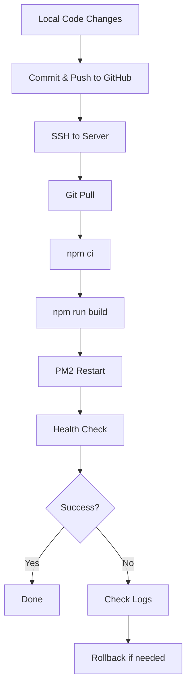

# Pawtropolis Tech - Deployment Scripts

This folder contains scripts and configuration for deploying and managing the Pawtropolis Discord bot and web dashboard.

## 📁 Contents

| File                          | Purpose                                                  |
| ----------------------------- | -------------------------------------------------------- |
| **setup-apache-proxy.sh**     | Automated Apache reverse proxy setup (HTTPS → Node app) |
| **verify-proxy-setup.sh**     | Health checks for proxy configuration                    |
| **remote-deploy.sh**          | Full deployment workflow (build + restart + verify)      |
| **apache-vhost.conf**         | Apache vhost template for pawtropolis.tech               |
| **APACHE-PROXY-SETUP.md**     | Detailed Apache setup guide with troubleshooting         |
| **REMOTE-CONTROL.md**         | Service control documentation (start/stop/restart)       |

## 🚀 Quick Start

### First-Time Setup

1. **Setup Apache reverse proxy** (run once on new server):

   ```bash
   scp deploy/setup-apache-proxy.sh ubuntu@pawtropolis.tech:/tmp/
   ssh ubuntu@pawtropolis.tech "sudo bash /tmp/setup-apache-proxy.sh"
   ```

2. **Deploy application:**
   ```bash
   scp deploy/remote-deploy.sh ubuntu@pawtropolis.tech:/tmp/
   ssh ubuntu@pawtropolis.tech "bash /tmp/remote-deploy.sh"
   ```

3. **Verify everything works:**
   ```bash
   scp deploy/verify-proxy-setup.sh ubuntu@pawtropolis.tech:/tmp/
   ssh ubuntu@pawtropolis.tech "bash /tmp/verify-proxy-setup.sh"
   ```

### Regular Updates

For code updates after initial setup:

```bash
# From your local machine
ssh ubuntu@pawtropolis.tech "cd ~/pawtech-v2 && bash deploy/remote-deploy.sh"
```

Or use the Windows scripts in project root:

```cmd
.\start.cmd --remote --fresh
```

## 📖 Detailed Guides

- **[Apache Proxy Setup](APACHE-PROXY-SETUP.md)** - Complete Apache configuration guide
- **[Remote Control](REMOTE-CONTROL.md)** - Service management and troubleshooting

## 🔧 Script Options

### setup-apache-proxy.sh

```bash
# Full setup (default)
sudo bash setup-apache-proxy.sh

# Dry-run (test without applying changes)
sudo bash setup-apache-proxy.sh --dry-run

# Show help
bash setup-apache-proxy.sh --help
```

### verify-proxy-setup.sh

```bash
# Standard verification
bash verify-proxy-setup.sh

# Verbose output
bash verify-proxy-setup.sh --verbose

# Quiet mode (errors only)
bash verify-proxy-setup.sh --quiet
```

### remote-deploy.sh

```bash
# Deploy from current directory
bash remote-deploy.sh

# Deploy with custom app name
PM2_APP=my-bot bash remote-deploy.sh

# Skip git pull (use local changes)
bash remote-deploy.sh --no-pull
```

## 📋 Prerequisites

All scripts assume:

- **OS:** Ubuntu 22.04+ (should work on 20.04+)
- **Node.js:** v20+ installed
- **PM2:** Installed globally (`npm i -g pm2`)
- **Apache:** Version 2.4+ (for proxy scripts)
- **SSL:** Let's Encrypt certificate installed at `/etc/letsencrypt/live/pawtropolis.tech/`
- **Git:** Repository cloned to `/home/ubuntu/pawtech-v2` or `/srv/pawtropolis`

## 🛡️ Security Notes

1. **Run as appropriate user:**
   - Apache scripts require `sudo` (modify system config)
   - Deploy scripts run as `ubuntu` user (application-level)

2. **SSH Key Authentication:**
   - Never use passwords for SSH
   - Use SSH config (`~/.ssh/config`) with key paths

3. **Environment Variables:**
   - All secrets in `.env` file (never committed)
   - Use `dotenvx` or similar for env management

4. **Firewall:**
   - Only ports 80, 443, 22 should be open
   - Node app binds to `127.0.0.1:3000` (not publicly accessible)

## 🐛 Troubleshooting

### Common Issues

| Problem                      | Solution                                              |
| ---------------------------- | ----------------------------------------------------- |
| "Permission denied"          | Use `sudo` for Apache scripts                         |
| "pm2: command not found"     | Install PM2: `npm i -g pm2`                           |
| "Port 3000 already in use"   | Kill old process: `pm2 stop pawtropolis`              |
| "502 Bad Gateway"            | Check if Node app is running: `pm2 status`            |
| "404 on /auth/login"         | Run `setup-apache-proxy.sh` to configure proxy        |
| "CORS errors"                | Set `CORS_ORIGIN=https://pawtropolis.tech` in `.env` |
| "Session not persisting"     | Set `TRUST_PROXY=1` and `NODE_ENV=production`         |
| "Certificate not found"      | Run certbot: `sudo certbot --apache`                  |
| "Git pull fails"             | Check remote tracking: `git branch -vv`               |
| "Build fails with out of memory" | Increase Node memory: `NODE_OPTIONS=--max-old-space-size=4096` |

### Get Help

```bash
# Check Apache status
systemctl status apache2

# Check Node app status
pm2 status

# View Apache logs
sudo tail -f /var/log/apache2/pawtropolis-error.log

# View Node logs
pm2 logs pawtropolis

# Test local Node app
curl http://127.0.0.1:3000/auth/login

# Test public endpoint
curl -I https://pawtropolis.tech/auth/login
```

## 🔄 Deployment Workflow

Standard deployment process:



## 📝 File Locations

On the remote server:

```
/home/ubuntu/pawtech-v2/          # Application code
├── .env                                # Environment variables (not in git)
├── dist/                               # Compiled JavaScript
├── data/                               # SQLite database files
└── logs/                               # Application logs

/etc/apache2/sites-available/           # Apache configs
└── pawtropolis.tech.conf               # Vhost configuration

/var/www/pawtropolis/website/           # Static website files
├── index.html
├── app.js
└── styles.css

/var/log/apache2/                       # Apache logs
├── pawtropolis-error.log
└── pawtropolis-access.log
```

## 🎯 Architecture Overview

```
┌─────────────┐
│   Client    │
│  (Browser)  │
└──────┬──────┘
       │ HTTPS
       ▼
┌─────────────────────────────────────┐
│  Apache (Port 443)                  │
│  ┌──────────────────────────────┐   │
│  │ Static Files                 │   │
│  │ /var/www/pawtropolis/website │   │
│  └──────────────────────────────┘   │
│                                      │
│  ┌──────────────────────────────┐   │
│  │ Reverse Proxy                │   │
│  │ /api/* → 127.0.0.1:3000      │   │
│  │ /auth/* → 127.0.0.1:3000     │   │
│  └──────────────────────────────┘   │
└──────────────┬───────────────────────┘
               │
               ▼
       ┌───────────────┐
       │  Fastify App  │
       │  (Port 3000)  │
       │  ┌──────────┐ │
       │  │   API    │ │
       │  │   Auth   │ │
       │  │Dashboard │ │
       │  └──────────┘ │
       └───────┬───────┘
               │
               ▼
       ┌───────────────┐
       │ Discord API   │
       │   SQLite DB   │
       └───────────────┘
```

## 🔗 Related Documentation

- [Root start.cmd](../start.cmd) - Local and remote start wrapper (Windows)
- [Root start.ps1](../start.ps1) - PowerShell deployment script
- [Project README](../README.md) - Main project documentation
- [Migration Guide](../migrations/README.md) - Database migrations

## 📄 License

These deployment scripts are part of the Pawtropolis Tech project.
See [LICENSE](../LICENSE) for details.

---

**Last Updated:** 2025-01-17
**Maintainer:** Pawtropolis Development Team
