# Pawtropolis Moderation Handbook

> Last Updated: December 2025

---

## Table of Contents

1. [Introduction](#1-introduction)
2. [Staff Structure & Role Descriptions](#2-staff-structure--role-descriptions)
   - [Community Manager(s)](#community-managers)
   - [Administrator(s)](#administrators)
   - [Senior Moderator(s)](#senior-moderators)
   - [Moderator(s)](#moderators)
3. [Staff Conduct & Expectations](#3-staff-conduct--expectations)
   - [Professionalism](#professionalism)
   - [Attitude & Demeanor](#attitude--demeanor)
   - [Responsiveness & Engagement](#responsiveness--engagement)
   - [Accountability](#accountability)
   - [Team Collaboration](#team-collaboration)
   - [Prohibited Conduct](#prohibited-conduct)
   - [Transparency](#transparency)
4. [Moderation Protocols](#4-moderation-protocols)
   - [Warning Level System](#warning-level-system)
   - [Escalation Guidelines](#escalation-guidelines)
   - [How to File Actions](#how-to-file-actions)
5. [Incident Reporting & Escalation](#5-incident-reporting--escalation)
   - [Incident Types](#incident-types)
   - [Logging Requirements](#logging-requirements)
   - [Response Timeline](#response-timeline)
   - [Response Procedure](#response-procedure)
   - [Decision Flow](#decision-flow)
   - [Appeals](#appeals)
6. [Community Rules Reference](#6-community-rules-reference)
   - [Prohibited Topics](#prohibited-topics)
   - [AI Policy](#ai-policy)
   - [DM Advertising](#dm-advertising)
   - [Adult Content](#adult-content)
   - [Links & Advertisement](#links--advertisement)
   - [Art Rules](#art-rules)
7. [Training Guide](#7-training-guide)
   - [Training Structure](#training-structure)
   - [Trainer Responsibilities](#trainer-responsibilities)
   - [Trainee Responsibilities](#trainee-responsibilities)
   - [Gatekeeping Process](#gatekeeping-process)
8. [Cross Banning & Outside Drama](#8-cross-banning--outside-drama)
   - [Cross Banning Policy](#cross-banning-policy)
   - [Outside Drama Policy](#outside-drama-policy)
9. [Ticket Guide](#9-ticket-guide)
   - [Rules for Handling Tickets](#rules-for-handling-tickets)
   - [Ticket Types](#ticket-types)
10. [Server Artist Program](#10-server-artist-program)
    - [Overview](#overview)
    - [How the Queue Works](#how-the-queue-works)
    - [Art Job Tracking System](#art-job-tracking-system)
    - [Artist Commands](#artist-commands)
    - [Recipient Commands](#recipient-commands)
    - [Staff Commands](#staff-commands)
    - [Workflow Summary](#workflow-summary)
    - [Best Practices for Artists](#best-practices-for-artists)
    - [Best Practices for Staff](#best-practices-for-staff)
11. [Server Audit Tools](#11-server-audit-tools)
    - [Overview](#overview-1)
    - [/audit members — Bot Account Detection](#audit-members--bot-account-detection)
    - [/audit nsfw — Avatar NSFW Detection](#audit-nsfw--avatar-nsfw-detection)
    - [Manual Flagging with /flag](#manual-flagging-with-flag)

---

## 1. Introduction

Welcome to the Pawtropolis Moderation Team.

This handbook outlines the responsibilities, expectations, and procedures for all staff roles. It serves as the central guide for staff behavior, moderation policy, and internal operations.

By joining the team, you agree to uphold the values and standards defined here.

---

## 2. Staff Structure & Role Descriptions

### Community Manager(s)

- Leads and supervises the entire staff team.
- Handles server-wide initiatives, announcements, and events.
- Reviews staff performance and manages internal systems and communications.
- Coordinates with moderators and administrators on high-impact community actions.
- Represents server leadership in community interactions.

### Administrator(s)

- Maintains day-to-day technical aspects of the server (channels, permissions, etc.).
- Supports moderation and ensures rules, bots, and internal tools are functioning.
- Assists with documentation and setup tasks—not responsible for community-wide direction.
- Works with Sr. Mods and Mods to ensure reports and issues are addressed correctly.

### Senior Moderator(s)

- Oversees moderators and ensures proper enforcement of rules.
- Reviews and handles escalated or sensitive moderation cases.
- Provides training and mentorship to new mods.
- Acts as liaison between Mods and Admins/Community Managers.

### Moderator(s)

- Enforces rules fairly and consistently across the server.
- Manages behavior in text and voice channels.
- Uses appropriate tools (warn, mute, kick, ban) following the server's escalation guidelines.
- Files proper modlogs and communicates issues internally.
- Maintains a helpful, approachable presence within the community.

---

## 3. Staff Conduct & Expectations

As a staff member of the community, you are held at higher expectations. This includes you being a role model towards other community members. You should be helpful and friendly to community members. It's what makes users want to come back.

**Key principles:**

- First impressions is important. How you act is how the community will see you.
- Representing the server professionally and respectfully at all times.
- Remaining neutral in conflicts; avoid arguing with members in public.
- Not misusing power or permissions for personal gain or vendettas.
- Following server rules yourselves—staff are held to a higher standard.
- Being transparent in your actions; always leave a log and reasoning.
- Respecting team hierarchy and trust the chain of command.

### Professionalism

Remain composed and diplomatic, especially during disputes or heated conversations. Emotional outbursts or reactive behavior can escalate situations.

Exercise discretion when handling sensitive issues. Discussions involving bans, reports, or member disputes should remain internal.

### Attitude & Demeanor

Avoid superiority complexes. Treat every member, regardless of their status, with equal respect and fairness.

Lead by example. Your tone, interactions, and presence set the culture of the community. If you expect respect, you must model it first.

### Responsiveness & Engagement

Respond to mod pings and server needs in a timely manner. If unavailable, mark your status appropriately or communicate with the team.

Stay involved in daily activity. Even small contributions like greeting users or cleaning up spam help maintain engagement.

Track progress transparently. For tasks, reports, or events, mark them complete using designated tools like Trello boards, bot logs, or dedicated staff channels.

### Accountability

Acknowledge your mistakes proactively. If an error in judgment occurs, document it and notify senior staff.

Always log moderation actions. This includes reasons, evidence, and context—especially in kicks, bans, and warns.

Seek help when uncertain. Do not guess your way through critical decisions that could affect the community.

### Team Collaboration

Present a unified front. Avoid public disagreements with other staff members. If you believe a teammate is in the wrong, take it to the staff areas where they should be discussed and handled.

Practice respectful internal dialogue. Feedback, disagreement, or corrections should be constructive and private.

Use team communication tools responsibly. Keep clutter and casual chatter out of moderation channels.

### Prohibited Conduct

- Never abuse permissions. This includes editing roles, deleting messages, or muting members without proper justification.
- Avoid favoritism. Friends and frequent users must be held to the same standards as all others.
- Do not share staff discussions. Screenshots, summaries, or leaks of internal conversations are grounds for immediate removal.
- Venting about users or staff in public chats is prohibited. Maintain professionalism across all areas of interaction.

### Transparency

Record decisions with accuracy and clarity. Reports should include time stamps, usernames, and the nature of the issue.

Separate emotion from fact. When logging, avoid inserting personal feelings, assumptions, or opinions.

Keep decision-making observable. Whenever possible, explain actions taken in mod channels to keep the team aligned.

---

## 4. Moderation Protocols

### Warning Level System

We manage a multi-tier 3-strike system. Each warning level has different severity and decay periods. Staff make notes on users to track offenses and determine correct action.

| Level | Name | Decay Period | Notes |
|-------|------|--------------|-------|
| **L-1** | Low/Minor | Falls off after 30 days | Spam, caps, minor drama |
| **M-2** | Medium | Falls off after 2 months | Harassment, VC abuse, repeated offenses |
| **H-3** | High/Major | **Never falls off** | Hate speech, threats, slurs |

**Important:** H-3 (Major) offenses remain on record permanently if the user hasn't been removed prior.

### Escalation Guidelines

We are a 3 strike rule community. Any minor or medium infraction may follow this rule. Please use discretion when making actions. All moderation actions are reviewed by Community Managers & Administrators.

#### L-1: Minor Infractions
*Examples: Spam, Caps, Drama*

| Offense | Action |
|---------|--------|
| First | Verbal/Written Warn |
| Second | Mute (2 Hours) |
| Third/Final | Mute (2 days) |

Repeated offenses after will result in a removal from the community.

#### M-2: Medium Infractions
*Examples: Toxic Behavior, Harassment, Suggestive topics*

| Offense | Action |
|---------|--------|
| First | Written Warn |
| Second | Mute (3 Days) |
| Third/Final | Removal from the community |

#### H-3: Major Infractions
*Examples: Slurs, Threats, Raiding*

| Offense | Action |
|---------|--------|
| First/Final | Automatic Ban |

#### Special Cases

| Violation | Action | Notes |
|-----------|--------|-------|
| Adult/18+ Content | Automatic 3-Strike | Discussion of 18+ topics |
| DM Advertising | Ban | Unsolicited DMs about selling |
| Trolling/Raiding | Automatic Ban | Immediate removal |

### How to File Actions

Running a community, people will break the rules. It happens in the real world as much as it happens on Discord. Below will give you a brief guide on how it works. All moderation actions will be utilized under Dyno /commands.

All moderation actions must be done in the mod-actions channel unless there is an immediate need to remove a user from the community (e.g., User spamming Slurs, etc.).

#### Verbal/Written Warnings

**Verbal Warnings:** Verbal Warns are warnings towards a user for violating the rules. It does not have to be to manually logged with any of the moderation bots. You may communicate it with the team if needed but not required.

**Written Warnings:** Written Warns have to be manually logged. You may use Dyno to log your warning.

```
/warn user: @user reason: Reason for the warn
```

#### Muting

Mutes: Muting can be an effective tool to halt users in their tracks from committing more rule breaks. It may stop a large argument between two users.

```
/mute user: @user limit: (e.g, 5m, 3h, 1d) reason: Reason for the mute
```

*Please follow our escalation guidelines for duration.*

#### Kicking/Banning

**Kicks:** Kicking removes a user from the server. However, the user can rejoin at anytime. Unlike where a ban is permanent. It can be used in scenarios where a user has violated a set of rules after an event. This is a much softer approach than a ban.

```
/kick user: @user reason: Reason for the kick
```

**Bans:** Banning a user is an effective but a last resort tool to moderate users. Such as a troll, someone saying slurs or just overly violating the rules.

```
/ban user: @user reason: Reason for the ban duration: (if temp ban) preserve_messages: true no_appeal: false
```

**Important:**
- Set `preserve_messages` to `true` to contain evidence for ban-log
- Set `no_appeal` to `false` or leave blank
- ALL BANS MUST BE MANUALLY LOGGED in ban-log
- Only exception is bans prior to gatekeeping (e.g., a troll joining and spamming slurs)

---

## 5. Incident Reporting & Escalation

**Purpose:** This section ensures all staff respond fairly, consistently, and with clear documentation. It protects users, holds staff accountable, and prevents miscommunication.

### Incident Types

| Level | Name | Examples | Decay |
|-------|------|----------|-------|
| L-1 | Low | Minor spam, general warnings | 30 days |
| M-2 | Medium | Harassment, VC abuse, repeated offenses | 2 months |
| H-3 | High | Hate speech, direct threats, identity attacks | Never |
| C-4 | Critical | Raids, doxxing, illegal content distribution | N/A (Ban) |

### Logging Requirements

- Record time (UTC), offender ID, and channel/message links.
- Provide a clear, unbiased summary and actions taken.
- Use format: `INC-YYYYMMDD-###`

### Response Timeline

| Stage | Who | Deadline |
|-------|-----|----------|
| Initial Response | You | Within 2 mins |
| Ban-Log Entry | You | Within 5-10 mins |
| Alert Admin | You | Immediately |
| Admin Review | Admin | Within 48 hours |
| Owner Alert (C-4) | Lead/Admin | Immediately |

### Response Procedure

1. **Secure:** Mute, timeout, kick; screenshot before deleting messages.
2. **Collect:** Gather IDs, message links, and evidence.
3. **Log:** Post a formatted summary in ban-log. When posting your evidence, utilize threads to keep the channel cleaner.
4. **Escalate:** Alert Admin if incident is M-2 or above.
5. **Close:** Admin finalizes the case and posts outcome.

### Decision Flow

```mermaid
flowchart TD
    START([Incident Detected]) --> SECURE[1. Secure: Mute/Timeout user]
    SECURE --> SCREEN[2. Screenshot BEFORE deleting]
    SCREEN --> Q1{Content illegal?}

    Q1 -->|Yes| C4["C-4: Critical
    ━━━━━━━━━━
    • Raids
    • Doxxing
    • CSAM
    • Illegal content"]
    Q1 -->|No| Q2{Severity?}

    Q2 -->|Slurs/Threats| H3["H-3: High
    ━━━━━━━━━━
    • Hate speech
    • Direct threats
    • Identity attacks"]
    Q2 -->|Harassment/Repeat| M2["M-2: Medium
    ━━━━━━━━━━
    • Harassment
    • VC abuse
    • Repeated L-1s"]
    Q2 -->|Spam/Minor| L1["L-1: Low
    ━━━━━━━━━━
    • Spam/Caps
    • Minor drama
    • First offense"]

    C4 --> BAN1["/ban preserve_messages: true"]
    H3 --> BAN2["/ban preserve_messages: true"]
    M2 --> MUTE["/mute or /warn"]
    L1 --> WARN["/warn or verbal"]

    BAN1 --> LOG["📋 Log in #ban-log
    ━━━━━━━━━━━━━━━━
    Use thread for evidence"]
    BAN2 --> LOG

    LOG --> FORMAT["Format: INC-YYYYMMDD-###
    ━━━━━━━━━━━━━━━━━━━━
    Include:
    • User ID
    • Time (UTC)
    • Channel/message links
    • Clear reason
    • Action taken"]

    FORMAT --> OWNER{C-4?}

    OWNER -->|Yes| NOTIFY["🚨 Notify Owner IMMEDIATELY
    + Admin alert"]
    OWNER -->|No| REVIEW["Admin Review
    within 48 hours"]

    MUTE --> ESCALATE{M-2 or above?}
    WARN --> DONE([Complete])

    ESCALATE -->|Yes| ADMIN[Alert Admin in staff chat]
    ESCALATE -->|No| DONE

    NOTIFY --> DONE
    REVIEW --> DONE
    ADMIN --> DONE

    style C4 fill:#ff6b6b,color:#fff
    style H3 fill:#ee5a24,color:#fff
    style M2 fill:#f9ca24,color:#000
    style L1 fill:#7bed9f,color:#000
    style LOG fill:#5f27cd,color:#fff
    style FORMAT fill:#341f97,color:#fff
```



**Example Ban Log Entry:**
```
INC-20251130-001
User: @username (ID: 123456789)
Time: 2025-11-30 14:32 UTC
Channel: #general
Violation: H-3 - Hate speech (slur usage)
Evidence: [message link] + screenshots in thread
Action: Permanent ban, preserve_messages: true
Moderator: @yourname
```

Regardless of this tree, C-4 violations should be properly logged in ban-log.

### Appeals

- Appeals handled via the appeals channel (Admin & Community Manager access only).
- Ban Appeals: https://dyno.gg/form/b18001d3
- Reviewed by uninvolved Admins within 48 hours.
- Decisions are final unless new evidence emerges.

---

## 6. Community Rules Reference

This section summarizes the rules you are enforcing. Knowing these helps you make consistent moderation decisions.

### Prohibited Topics

The following topics are **not allowed** in public channels. Staff can determine if a topic is too sensitive for chat. Anyone unwilling to drop heated subjects or take situations into DMs will be muted or warned.

**Disallowed Topics:**
- Suicide / Self-harm / Acts of Violence
- Substance Abuse / Drug Talk (including legal substances)
- Alcohol
- Politics / Religion
- Graphic Content / Imagery of Weapons (guns, knives, etc.)
- Homophobia / Transphobia / Racism / Sexism
- Begging for Nitro or Free Art

**Action:** Messages related to such topics will be deleted and punishment issued if needed. Violation results in mute/warn punishments and as severe as ban/reports.

**Resource:** If someone mentions self-harm, you may share: https://suicidepreventionlifeline.org/

### AI Policy

Pawtropolis does not support the use of AI to replace artists. Breaking AI rules will likely result in a ban.

**Not Allowed:**
- AI art posting in art channels
- AI-generated memes in meme channels
- AI art commissions
- Asking for people's art to feed into AI (even if willingly given)
- Using images to feed AI without the provider's knowledge

**Disallowed AI Discussion Topics:**
> Image generation, text/fiction writing, poetry generation, script writing, character creation, concept art generation, illustration generation, graphic design automation, logo generation, animation generation, video generation, cinematic scene generation, music composition, vocal synthesis, sound-effect generation, voice cloning, 3D asset generation, 3D character modeling, texture generation, environment/level art generation, photo editing automation, and creative style transfer AI.

**Allowed AI Discussion Topics:**
> Protein design, drug/molecule generation, biological sequence modeling, weather/physics simulation, tabular data generation, synthetic data creation, time-series generation, speech-to-text transcription, OCR, document classification, spam detection, code analysis, audio noise removal, audio enhancement, speech separation, robotics control, action-policy generation, autonomous navigation, reinforcement-learning agents.

### DM Advertising

To protect members from scams, users may not DM others about selling artwork without explicit consent or request from the user.

**Action:** Violating this rule results in a **ban for DM ADVERTISING**.

### Adult Content

This is a 100% SFW Community. To comply with Discord's Terms and keep teens safe, we do not have an official adult area.

**Not Allowed:**
- Discussion of 18+ topics
- Any NSFW content

**Action:** Discussion of 18+ topics is an **automatic 3-strike penalty**.

*Remember: This is a 13+ community with minors present.*

### Links & Advertisement

**Prohibited:**
- Discord invite links
- Links that do not comply with our terms
- Malicious linking
- Using your "display name" to advertise
- Asking/begging for users
- DM Advertising (counted as unsolicited DMs)

### Art Rules

#### Art Bases

Users may post artwork with P2U (Pay to Use) and F2U (Free to Use) bases as long as proper credit is given.

**Action:** Posts using bases without credit will be deleted. User will be asked to repost with proper credit.

*Art theft has serious consequences including copyright infringement and financial loss to artists.*

#### Commission Ad Posting (Verified Artists)

Verified Artists may post commission ads in the commissions channel with these limits:

- **Frequency:** Once per day, AND at least 10 posts between your ads
- **Length:** Less than 15 lines (should fit on mobile without scrolling)
- **Images:** Maximum 9 images/videos

**Escalation for repeated violations:**
1. Warning
2. Warning
3. Warning
4. Removal of Verified Artist role

---

## 7. Training Guide

### Purpose

Training gets our new staff ready to keep our Discord community fun and safe. It's about learning how to use our tools, handle new member applications, and make sure everyone's following the rules. We want you to feel confident jumping into your role!

### How it works

**Trainers:** Only Senior Moderators (Sr. Mod) or higher-ups can lead training. They will be the ones who will provide you with enough knowledge to do your role efficiently.

**Their Job:** During your training, your trainer will teach you how to utilize staff materials and how the community works.

### Training Structure

#### Onboarding Session

- Conducted in a voice channel (VC) by a Senior Moderator or higher-ranking staff member.
- Trainers share their screens to present community rules, staff responsibilities, moderation tools (e.g., bot commands), and the process for reviewing new member applications.
- Includes an overview of the staff handbook and essential policies.

#### Role-Specific Training

- Held in a VC with trainers using screen-sharing to explain tasks specific to the trainee's role, such as moderating channels or evaluating applications.
- Trainees practice using tools, handling scenarios like conflict resolution, and assessing applications (e.g., identifying clear, engaged responses or flagging incomplete submissions).
- Trainers provide feedback to community managers to support skill development.

#### Observation Phase

Trainees join a VC to observe a Senior Moderator or higher performing live tasks, such as moderating discussions or processing applications. Trainees may assist under supervision, with trainers offering guidance through voice and screen-sharing.

#### Evaluation

Trainers assess trainees' understanding of guidelines, proficiency with tools, and ability to manage the application review process.

Successful completion requires approval from both the trainer and a designated Community Manager or Community Development Lead.

### Trainer Responsibilities

- **Preparation:** Assemble training materials, such as sample applications and tool guides, prior to VC sessions.
- **Clarity:** Present information clearly during screen-sharing to ensure understanding.
- **Support:** Provide actionable feedback and respond to trainee questions during and after sessions.
- **Documentation:** Record trainee progress in the training channel using the format `TRN-UserID` (e.g., `TRN-8393461970144985159`), utilizing threads for organization.

### Trainee Responsibilities

- Attend all VC sessions and engage actively with presented materials.
- Review the staff handbook and familiarize themselves with community guidelines.
- Apply feedback provided by trainers and adhere to the training guide.
- Seek clarification on any unclear topics during sessions.

### Training Schedule

Sessions are conducted via VCs, scheduled based on the availability of Senior Moderators and higher ranks. New staff receive their training schedule within seven days of acceptance. The training process lasts up to one week, depending on the trainee's role and progress.

### Gatekeeping Process

New community members must submit an application to join the server. Trainees learn to evaluate applications, responses and identifying potential issues (e.g., vague or suspicious submissions).

Approved applications are logged. You may deny or modmail for further questioning per question.

### Contact Information

For questions or concerns about training, reach out to a Senior Moderator or higher via direct message or in the staff chat. Staff leadership is available to provide support and ensure a smooth training experience.

---

## 8. Cross Banning & Outside Drama

### Vision

Our #1 goal is to keep users safe in our community. Our community is not a court room, and goes without saying more and more situation have arisen where staff are asked to take action based on allegations, drama, or bans that occurred in other communities or an other platforms. We understand the concern for safety of our community members, it is coherent to give users fair chances here.

### Cross Banning Policy

Cross banning is an act of banning someone from the community because of another ban from different community due to their reputation elsewhere—regardless of their behavior here.

#### Why We Don't Enforce It

**We Moderate Based on Local Behavior:**
- A user's past in another community does not determine their future here. Unless they violate rules here, we don't enforce action.

**Reputation ≠ Evidence:**

Staff are often shown screenshots, ban logs, or hearsay reports from other servers. This could lead to:
- Often lacking full context
- Unverifiable by our moderation team relying on such evidence undermines fair and impartial moderation
- Easy to fake, crop, or misrepresent

Someone being banned elsewhere, or being disliked by others, is not a valid reason to punish them here. It invites bias, gossip-based moderation, and unfair treatment.

**Ethical Concerns:**

Moderation Actions based on behavior in other communities especially without verifiable, first hand evidence risks:
- Defamation or false accusations
- Targeted harassment or witch hunting
- Discriminatory or biased enforcement

### Outside Drama Policy

"Outside drama" refers to conflicts, callouts, social disputes, or interpersonal issues that occur outside of our server including in private DMs, friend groups, or in other communities that we are not affiliated with.

#### Our Position

We do not intervene in outside drama unless it begins to affect our community directly. We're here to moderate our server, not the internet at large.

#### Why We Don't Get Involved

**We Can't Moderate the Entire Internet**
- Our role is to keep this server safe and healthy — not to resolve every personal conflict or social fallout that happens online. We do not have the context, the involvement, or the authority to fairly handle off-server drama.

**It's Often One-Sided, Emotional, or Incomplete**
- Reports often come from one person's perspective.
- Evidence (like screenshots or messages) may be cropped, edited, or shared selectively.
- Even when accurate, it may lack the full story or may be rooted in personal history that staff are unfamiliar with.

**It Turns Moderation Into a Popularity Contest**
- Taking action based on external drama encourages people to "win over" staff or weaponize moderation to silence others.
- This creates a culture where the loudest voice or biggest group determines who gets punished — and that's not how we run things.

**It Burns Out Staff and Damages Trust**
- Staff are volunteers and human. Getting pulled into emotionally charged situations from outside the community is mentally and emotionally draining. When moderation is seen as reactive to drama rather than focused on clear behavior, it erodes member confidence in fair enforcement.

#### Limitations

We will only get involved in outside drama if it crosses into our space and begins to harm the community. For example:
- A private argument escalates and becomes harassment in server DMs.
- Members start using our public channels to continue or amplify external conflicts.
- Someone from another server begins targeting or threatening our members here.

In these cases, staff will act — but only based on what happens inside our server, not on external allegations alone.

#### What Members Should Do Instead

If someone is experiencing harassment or serious issues outside of our server, we recommend:
- Blocking the person involved.
- Reporting them to Discord Trust & Safety if it involves ToS violations (e.g., harassment, threats, stalking): https://dis.gd/report
- Not bringing the drama into our channels — we want this space to remain calm, inclusive, and drama-free.

---

## 9. Ticket Guide

Welcome to the ticket guide. Tickets is a great way for users to utilize private conversations with staff for different variants of support. This section will explain how our tickets work and handled.

### Rules for Handling Tickets

As much as we love our staff helping users out in tickets, please be mindful that we have rules to how they are handled:

**Limit to 1 member of staff in each ticket**
- Each ticket should be handled with one team member at a time. You may request another team member to assist but after consulting outside the ticket for assistance. It can cause confusion and layering between multiple staff handling a ticket at once.

**Prevent consulting inside the ticket**
- Refrain from discussions between team members in the ticket. It's unprofessional and can clog the tickets.

**Make sure that the user gets the support they need**
- It's important that a user has their ticket handled in a timely manner. It also comes with respect with the user. Make sure their needs are met, and to close the ticket. Before closing the ticket, you may ask "Is there anything else I may assist with?"

**Transcript your tickets**
- It is required that all tickets are logged appropriately. You can do this by clicking the transcript button after the ticket is closed. Once the ticket it saved, you may delete the ticket.

### Ticket Types

#### General Support

Our general support tickets is a good way to get support for basic community needs:
- Redeem role items
- Community Rewards
- How to do something
- Consulting with staff before posting

*Access: Moderators and Senior Moderators*

#### User Report

Members need a way to report users in bad faith. This ticket allows bad faith actors to be reported to us. Some reports may include:
- DM Advertisers
- Rule violators
- DM Issues
- Drama
- An argument in one of the talkative channels

Remember to only enforce violations made by our guidelines. Refer to section 8 on outside drama and issues.

*Access: Senior Moderators*

#### Staff Report

Members have rights to report staff for any wrongdoing. It is important that we are transparent with the community.

*Access: Community Managers only*

#### Verified Artist Program

This program allows fellow artists to verify their artwork which gains them access to advertising commissions.

Please be mindful, there are many scammers that try to verify. It's important that you consult with other staff members if you are unsure about verifying artwork.

**What to look for:**

- **Check profile** for any links in their bio, avatar descriptors, account age. These are common types of errors you may see that align with most common types of art scammers.

- **Look at signature styles** - A lot of the time, the artwork that is provided can be inconsistent and not match linework. Some Artists will plant their stolen artwork into a graphic design software that make it look like they drew the real thing.

- **AI Generation** - With AI becoming more accessible for consumer use, Scammers like to utilize AI generated artwork, and claim their artwork. Look for errors in their artwork such as more fingers between same art pieces, missing tooth, different color in different areas. AI struggles with consistency, and it can be easy to spot sometimes.

- **Verify with commission pages, social medias, or Speed paints** - All these are common ways to verify someone's legitimacy. Some scammers can't provide these or at least with minimal effort.

Always consult with another team member if you are unsure.

*Access: Moderators and Senior Moderators*

#### VRChat World Bug Report

With the new launch of our VRChat World, there are bugs to come. These tickets are all handled by the VRChat development team.

---

## 10. Server Artist Program

The Server Artist Program is a reward system where verified artists in the community take turns creating art for members who have earned art rewards through community engagement.

### Overview

Server Artists are members with the **Server Artist** role who have volunteered to create artwork for community reward recipients. The system automatically manages a rotation queue to ensure fair distribution of assignments.

### How the Queue Works

When someone receives the Server Artist role:
- They are automatically added to the end of the rotation queue
- When the role is removed, they are automatically removed from the queue

The queue operates on a **round-robin** basis: the artist at position #1 gets the next assignment, then moves to the back of the line.

### Art Job Tracking System

Every assignment creates a **job** that artists can track and manage. Jobs have:
- **Job Number**: Personal ID for the artist (e.g., #0001, #0002)
- **Global Number**: Server-wide ID for staff reference
- **Status**: Current progress stage
- **Client**: The user receiving the artwork
- **Type**: Headshot, Half-body, Emoji, or Full-body

#### Job Statuses

| Status | Description |
|--------|-------------|
| Assigned | Job created, not started |
| Sketching | Working on initial sketch |
| Lining | Line art in progress |
| Coloring | Adding color/shading |
| Done | Artwork completed |

### Artist Commands

Artists use the `/art` command to manage their jobs:

#### `/art jobs`
View all your active (incomplete) jobs.

**Example Output:**
```
Your Art Jobs

#0001 | @User's Headshot
✏️ Sketching • Assigned 3 days ago
📝 "Working on pose"

#0002 | @User2's Half-body
📋 Assigned • Assigned 1 day ago

2 active jobs
```
*Note: Timestamps are live-updating Discord relative timestamps.*

#### `/art bump`
Update a job's status or add progress notes.

**Usage Options:**
- By job ID: `/art bump id:1 stage:sketching`
- By client: `/art bump user:@Client type:headshot stage:lining`
- Add notes: `/art bump id:1 notes:"Starting lineart today"`

**Available Stages:** `sketching`, `lining`, `coloring`

#### `/art finish`
Mark a job as complete.

**Usage Options:**
- By job ID: `/art finish id:1`
- By client: `/art finish user:@Client type:headshot`

This sets the status to "Done" and records the completion time.

#### `/art view`
View detailed information about a specific job.

**Usage Options:**
- By job ID: `/art view id:1`
- By client: `/art view user:@Client type:headshot`

**Example Output:**
```
Job #0001 (Global #0042)
Client: @Username
Type: OC Headshot
Status: ✏️ Sketching
Assigned: Nov 28, 2025 (4 days ago)
Notes: "Working on pose"
```
*Note: Timestamps are live-updating Discord relative timestamps.*

#### `/art leaderboard`
View completion statistics for all Server Artists.

Shows:
- **This Month**: Artists ranked by completions this month
- **All Time**: Artists ranked by total completions

### Recipient Commands

Members who have redeemed an art reward can check on their art's progress:

#### `/art getstatus`
Check the status of your art reward(s).

This command is available to anyone and shows only your own art jobs. The response is private (only visible to you).

**Example Output:**
```
Your Art Status

Headshot by @ArtistName
✏️ Sketching • Assigned 3 days ago
📝 Artist notes: "Working on the lineart today!"

Half-body by @OtherArtist
📋 Assigned • Assigned 1 day ago

2 pieces in progress
```
*Note: Timestamps are live-updating Discord relative timestamps.*

If you have no art being worked on, you'll see: "You don't have any art being worked on!"

### Staff Commands

Staff members have additional commands to manage the program:

#### `/art all`
View all active jobs across all artists (staff only).

Shows global job numbers, assigned artist, client, type, and status for every incomplete job in the server.

#### `/art assign`
Manually assign a job to an artist (staff only).

**For User Assignments:**
```
/art assign artist:@Artist scope:user recipient:@Client type:headshot
```

**For Special Tasks:**
```
/art assign artist:@Artist scope:special description:"Create server banner"
```

Special tasks appear in the artist's job list without a client mention, showing only the task description.

#### `/artistqueue` Commands

| Command | Description |
|---------|-------------|
| `/artistqueue list` | View the current rotation order |
| `/artistqueue sync` | Re-sync queue with Server Artist role holders |
| `/artistqueue move @user position` | Manually reorder an artist |
| `/artistqueue skip @user [reason]` | Temporarily skip an artist |
| `/artistqueue unskip @user` | Remove skip status |
| `/artistqueue history [@user]` | View assignment history |
| `/artistqueue setup` | Initial setup (permissions + sync) |

#### `/redeemreward`
Assign an art reward to a user.

```
/redeemreward user:@Recipient type:headshot [artist:@Artist]
```

- If no artist specified, the next artist in queue is selected
- If artist specified, that's an "override" and doesn't affect queue position
- Creates a job automatically for the assigned artist

### Workflow Summary

```
1. Member earns art reward (tokens, raffle, etc.)
2. Ambassador uses /redeemreward user:@Winner type:headshot
3. Bot confirms assignment, creates job for artist
4. Artist receives notification, sees job in /art jobs
5. Recipient can check progress anytime with /art getstatus
6. Artist updates progress with /art bump
7. Artist completes work with /art finish
8. Artist moves to back of queue for next assignment
```

### Best Practices for Artists

- **Update your status regularly** - Use `/art bump` to keep clients informed
- **Add notes** - Brief descriptions help track where you left off
- **Finish promptly** - Use `/art finish` when done so the job is recorded
- **Check /art jobs daily** - Stay on top of your active assignments

### Best Practices for Staff

- **Run /artistqueue sync** after manually adding/removing Server Artist role
- **Use /art all** to monitor overall workload and identify bottlenecks
- **Use /artistqueue skip** if an artist needs a temporary break
- **Check /art leaderboard** to recognize top contributors

---

## 11. Server Audit Tools

### Overview

The server uses automated tools to detect and flag suspicious accounts and inappropriate content. The `/audit` command has two subcommands:
- `/audit members` — Detect bot-like accounts
- `/audit nsfw` — Scan member avatars for NSFW content

**Who can use it:** Community Managers and Bot Developer only

### `/audit members` — Bot Account Detection

The `/audit members` command performs a bulk scan of all server members and flags accounts that match bot-like patterns.

#### What gets detected:

| Detection | Points | Description |
|-----------|--------|-------------|
| No avatar | 2 | Default Discord profile picture |
| New account | 3 | Account created less than 7 days ago |
| No activity | 2 | Never sent a message in the server |
| Low level | 1 | No Level 5+ Amaribot role |
| Bot username | 2 | Patterns like `user_1234`, random strings |

Accounts scoring **4 or more points** are automatically flagged.

#### Running a members audit:

1. Use `/audit members` in any staff channel
2. Review the confirmation showing member count
3. Click **Confirm** to start (this will send many messages)
4. Watch for flagged accounts appearing with detailed embeds
5. Review the final summary for statistics

#### What to do with flagged accounts:

Flagged accounts aren't automatically actioned — staff should review them:

- **Check profile**: Look at their Discord profile for signs of legitimacy
- **Check activity**: Have they interacted anywhere in the server?
- **Check age**: Brand new accounts deserve more scrutiny
- **Cross-reference**: Check if they appear in other community reports

For confirmed bot accounts:
- Ban using `/ban user:@user reason:Bot account (audit)`
- For suspected alts of banned users, use permanent reject

#### When to run members audits:

- **After suspected raids**: If you notice unusual join patterns
- **Periodic cleanup**: Monthly or quarterly maintenance
- **Before events**: Ensure member quality before big server events

### `/audit nsfw` — Avatar NSFW Detection

The `/audit nsfw` command scans member avatars using Google Vision API to detect NSFW content.

#### Scope options:

| Scope | Description | Use case |
|-------|-------------|----------|
| All members | Scan every server member | Server-wide avatar policy enforcement |
| Flagged members only | Only scan already-flagged members | Cost-effective follow-up after `/audit members` |

#### Running an NSFW audit:

1. Use `/audit nsfw` and select the **scope** (all or flagged)
2. Review the confirmation showing member count and API warning
3. Click **Confirm** to start
4. Watch for NSFW flagged avatars appearing with score percentages
5. Review the final summary showing scan stats and API calls

#### NSFW detection threshold:

**80%+ adult content** = Hard Evidence (flagged)

This conservative threshold reduces false positives. The bot uses Google Vision's SafeSearch API which is effective at detecting explicit content in various art styles.

#### What to do with NSFW flagged avatars:

NSFW flags require manual review:

- **Check the avatar**: View the flagged avatar to confirm it's actually inappropriate
- **Context matters**: Some edge cases may need moderator judgment
- **False positives**: Not every 80%+ score is actually explicit content

For confirmed NSFW avatars:
- DM the user asking them to change their avatar
- If they refuse, mute until compliant
- For egregious violations, escalate as appropriate

#### AI Image Detection Tools

When reviewing artwork or images (avatars, submissions, etc.), use these online tools to check if content is AI-generated:

- **[Hive Moderation](https://hivemoderation.com/ai-generated-content-detection)** — Comprehensive AI content detection
- **[Was It AI](https://wasitai.com/)** — Quick AI image checker
- **[SightEngine](https://sightengine.com/detect-ai-generated-images)** — AI-generated image detection

These are useful for verifying art authenticity in applications or submissions.

#### API cost considerations:

Google Vision API has costs after the free tier (~$1.50 per 1000 calls).

**Cost optimization tips:**
- Use "Flagged members only" scope after running `/audit members` first
- This targets suspicious accounts instead of scanning everyone
- Reduces API calls while still catching high-risk avatars

### Manual Flagging with `/flag`

Any staff member can manually flag suspicious users:

```
/flag user:@SuspiciousUser reason:Alt of banned user
```

Flagged users show warning badges on their applications, alerting reviewers to look more carefully.

---

## Quick Reference

### Warning Levels & Decay

| Level | Decay | Examples |
|-------|-------|----------|
| L-1 (Low) | 30 days | Spam, caps, minor drama |
| M-2 (Medium) | 2 months | Harassment, VC abuse |
| H-3 (High) | Never | Hate speech, slurs, threats |

### Escalation Quick Guide

| Severity | Strike 1 | Strike 2 | Strike 3 |
|----------|----------|----------|----------|
| Minor | Warn | 2hr Mute | 2d Mute |
| Medium | Warn | 3d Mute | Ban |
| Major | **Ban** | - | - |

### Instant Actions

| Violation | Action |
|-----------|--------|
| Slurs/Hate Speech | Ban |
| Raiding/Trolling | Ban |
| DM Advertising | Ban |
| 18+ Content | 3-Strike |
| AI Art Posting | Ban |

### Commands

| Action | Command |
|--------|---------|
| Warn | `/warn user: @user reason: text` |
| Mute | `/mute user: @user limit: duration reason: text` |
| Kick | `/kick user: @user reason: text` |
| Ban | `/ban user: @user reason: text preserve_messages: true` |

---

*This handbook is maintained by Pawtropolis Leadership. For questions, contact a Senior Moderator or higher.*

*Ban Appeals: https://dyno.gg/form/b18001d3*
