# /audit security Command Flow

```mermaid
flowchart TD
    subgraph User["User Interaction"]
        A["/audit security"]
    end

    subgraph Auth["Permission Check"]
        B{Has allowed role?}
        B1[Community Manager OR Server Dev]
        B2[Or shouldBypass]
        DENY[Permission Denied]
    end

    subgraph Fetch["Data Fetching (Discord API)"]
        C1[fetchRoles]
        C2[fetchChannels]
        C3[fetchServerInfo]
        C1 --> |"Role data + member counts"| D
        C2 --> |"Channel data + overwrites"| D
        C3 --> |"Server metadata"| D
    end

    subgraph Analyze["Security Analysis"]
        D[analyzeSecurityIssues]
        D --> E1{Admin on non-bot role?}
        D --> E2{Ban + ManageRoles combo?}
        D --> E3{ManageWebhooks on user role?}
        D --> E4{Wide @everyone mention?}
        D --> E5{Dangerous @everyone perms?}
        D --> E6{Sensitive channel accessible?}
        D --> E7{Orphaned overwrites?}

        E1 --> |CRITICAL| I[Issues List]
        E2 --> |HIGH| I
        E3 --> |MEDIUM| I
        E4 --> |LOW| I
        E5 --> |CRITICAL| I
        E6 --> |MEDIUM| I
        E7 --> |LOW| I
    end

    subgraph Generate["Document Generation"]
        I --> G1[generateRolesDoc]
        I --> G2[generateChannelsDoc]
        I --> G3[generateConflictsDoc]
        I --> G4[generateServerInfoDoc]

        G1 --> W1[ROLES.md]
        G2 --> W2[CHANNELS.md]
        G3 --> W3[CONFLICTS.md]
        G4 --> W4[SERVER-INFO.md]

        W1 --> WRITE[Write to docs/internal-info/]
        W2 --> WRITE
        W3 --> WRITE
        W4 --> WRITE
    end

    subgraph Push["Git Push to GitHub"]
        WRITE --> GIT1{Any changes?}
        GIT1 --> |No| NOCHANGE["No changes to commit"]
        GIT1 --> |Yes| GIT2[git config user]
        GIT2 --> GIT3[git add docs/internal-info/]
        GIT3 --> GIT4[git commit]
        GIT4 --> GIT5[git push to main]
        GIT5 --> URL[Commit URL generated]
    end

    subgraph Response["User Response"]
        NOCHANGE --> EMBED
        URL --> EMBED
        EMBED[Embed with results]
        EMBED --> R1["✅ Roles: X"]
        EMBED --> R2["✅ Channels: X"]
        EMBED --> R3["✅ Issues Found: X"]
        EMBED --> R4["Issue Breakdown by severity"]
        EMBED --> R5["📎 View commit on GitHub"]
    end

    A --> B
    B --> |No| DENY
    B --> |Yes via| B1
    B --> |Yes via| B2
    B1 --> C1
    B2 --> C1
    C1 -.-> C2
    C2 -.-> C3

    style DENY fill:#ff6b6b
    style I fill:#ffd93d
    style WRITE fill:#6bcb77
    style URL fill:#4d96ff
    style EMBED fill:#6bcb77
```

## Issue Detection Details

| Check | Severity | What It Finds |
|-------|----------|---------------|
| Admin on user role | 🔴 Critical | Non-bot roles with Administrator permission |
| Admin on bot role | 🟡 Medium | Bot roles with full Admin (may be over-permissioned) |
| Ban + ManageRoles | 🟠 High | Privilege escalation risk |
| ManageWebhooks | 🟡 Medium | Webhook impersonation risk |
| Wide MentionEveryone | 🟢 Low | Many users can ping everyone |
| @everyone dangerous perms | 🔴 Critical | All members have mod-level permissions |
| Sensitive channel visible | 🟡 Medium | Channels named "mod", "admin", etc. without explicit deny |
| Orphaned overwrites | 🟢 Low | Permission overwrites for deleted roles |

## Generated Documents

| File | Contents |
|------|----------|
| `ROLES.md` | Role hierarchy, permission matrix, staff/bot role details |
| `CHANNELS.md` | Channel hierarchy, permission overwrites per channel |
| `CONFLICTS.md` | All security issues found, sorted by severity |
| `SERVER-INFO.md` | Server settings, statistics, feature flags |
