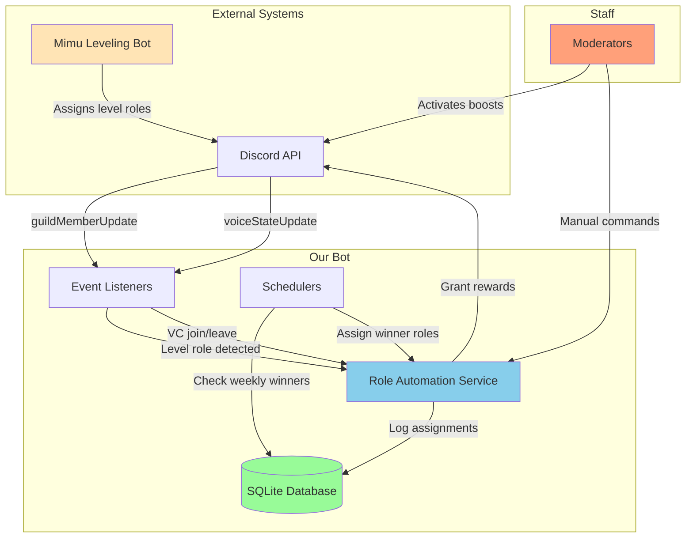
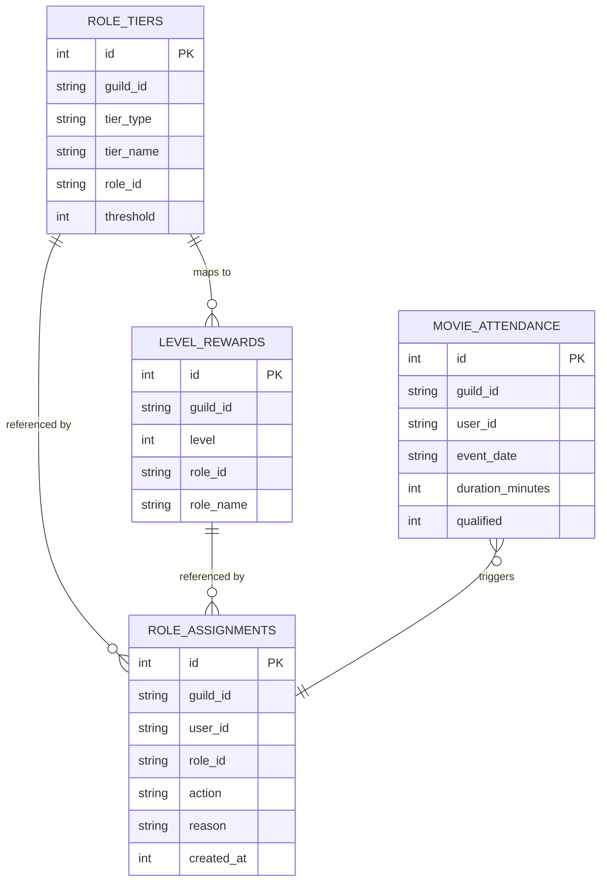
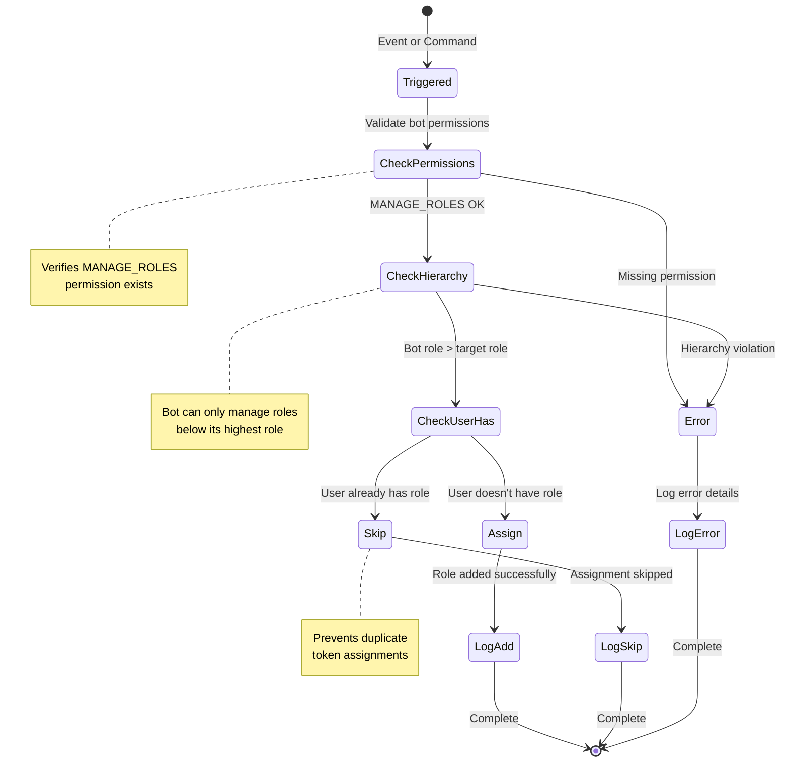
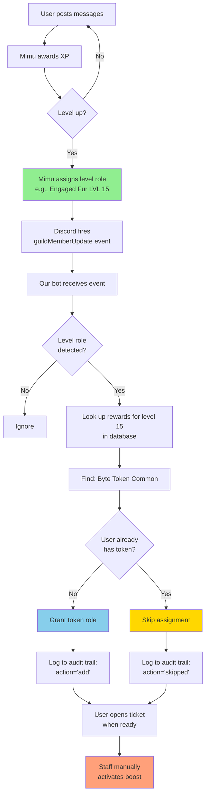
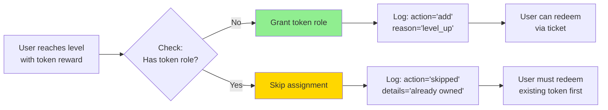
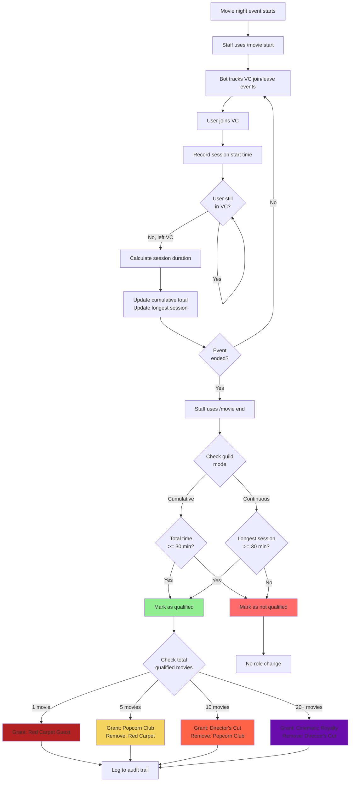
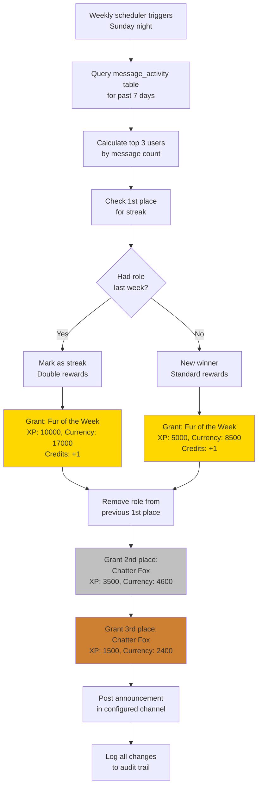
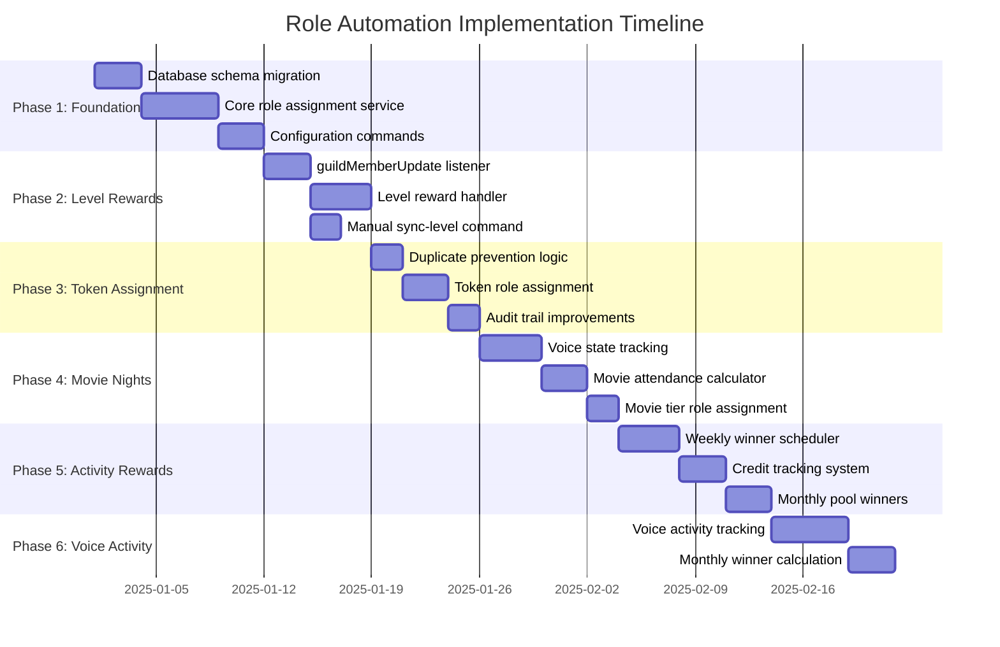
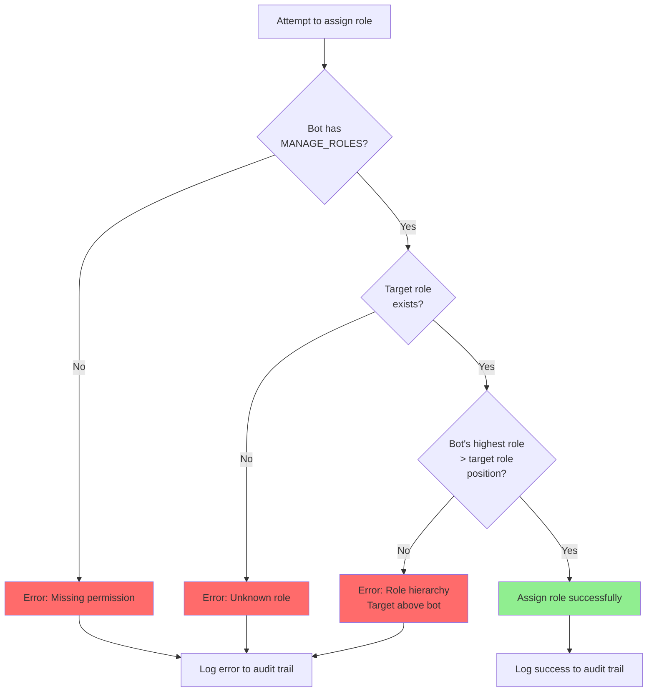

# Role Automation Roadmap

> **Status**: Planning Phase
> **Prerequisite**: Bot must receive the Senior Moderator role (ID: `1095757038899953774`)
> **Key Permission**: `MANAGE_ROLES` (bit 28) - allows managing roles below Senior Mod in hierarchy

---

## Overview

This document outlines the implementation plan for automating role management in Pawtropolis. Currently, staff manually assigns reward roles and tier roles. With the `MANAGE_ROLES` permission, the bot can automate:

1. **Level Rewards** - Detect when Mimu assigns level roles, grant corresponding token/ticket rewards
2. **Movie Night Attendance** - Track VC participation and assign tier roles
3. **Activity Rewards** - Weekly winner roles and streak tracking

**Key Notes:**
- Mimu handles level role assignment (Newcomer Fur, Beginner Fur, etc.)
- Our bot reacts to role changes and grants reward tokens/tickets
- Token redemption (activating boosts) remains manual via staff tickets
- This keeps users in control of when they activate their rewards

### System Architecture



---

## Current Bot Capabilities

| Feature | Status | Notes |
|---------|--------|-------|
| Role assignment on approval | Partial | Only `accepted_role_id` on gate approval |
| Message activity tracking | Full | `message_activity` table tracks all messages |
| User join tracking | Full | `user_activity` tracks joins and first messages |
| Scheduled tasks | Full | Existing scheduler pattern in `src/scheduler/` |
| Action audit logging | Full | `action_log` tracks all mod actions |

**Missing Components:**
- Role tier configuration (level role ID → reward mappings)
- Role assignment history (audit trail)
- VC presence tracking (for movie nights)
- `guildMemberUpdate` event handler (detect when Mimu assigns level roles)

---

## Phase 1: Foundation

### Architecture Overview



### 1.1 Database Schema

Create new migrations for role automation tables:

```sql
-- migrations/025_role_automation.sql

-- Configurable role tiers per guild
CREATE TABLE IF NOT EXISTS role_tiers (
    id INTEGER PRIMARY KEY AUTOINCREMENT,
    guild_id TEXT NOT NULL,
    tier_type TEXT NOT NULL,           -- 'level', 'movie_night', 'activity_reward'
    tier_name TEXT NOT NULL,           -- 'Newcomer Fur', 'Popcorn Club', etc.
    role_id TEXT NOT NULL,             -- Discord role ID to assign
    threshold INTEGER NOT NULL,         -- Level number, attendance count, etc.
    created_at INTEGER DEFAULT (strftime('%s', 'now')),
    UNIQUE(guild_id, tier_type, tier_name)
);

-- Level reward mappings (token/ticket roles granted at each level)
CREATE TABLE IF NOT EXISTS level_rewards (
    id INTEGER PRIMARY KEY AUTOINCREMENT,
    guild_id TEXT NOT NULL,
    level INTEGER NOT NULL,
    role_id TEXT NOT NULL,             -- Token/ticket role to grant
    role_name TEXT NOT NULL,           -- For display purposes
    created_at INTEGER DEFAULT (strftime('%s', 'now')),
    UNIQUE(guild_id, level, role_id)
);

-- Movie night attendance tracking
CREATE TABLE IF NOT EXISTS movie_attendance (
    id INTEGER PRIMARY KEY AUTOINCREMENT,
    guild_id TEXT NOT NULL,
    user_id TEXT NOT NULL,
    event_date TEXT NOT NULL,          -- YYYY-MM-DD format
    voice_channel_id TEXT NOT NULL,
    duration_minutes INTEGER NOT NULL,        -- Total cumulative time
    longest_session_minutes INTEGER NOT NULL, -- Longest continuous session
    qualified INTEGER DEFAULT 0,              -- 1 if >= 30 min (based on guild mode)
    created_at INTEGER DEFAULT (strftime('%s', 'now')),
    UNIQUE(guild_id, user_id, event_date)
);

-- Role assignment audit trail
CREATE TABLE IF NOT EXISTS role_assignments (
    id INTEGER PRIMARY KEY AUTOINCREMENT,
    guild_id TEXT NOT NULL,
    user_id TEXT NOT NULL,
    role_id TEXT NOT NULL,
    role_name TEXT,                    -- Denormalized for easy audit viewing
    action TEXT NOT NULL,              -- 'add', 'remove', 'skipped'
    reason TEXT,                       -- 'level_up', 'movie_tier', 'weekly_winner'
    triggered_by TEXT,                 -- 'system', 'command', user_id
    details TEXT,                      -- JSON for extra context (e.g., "already had role")
    created_at INTEGER DEFAULT (strftime('%s', 'now'))
);

CREATE INDEX idx_role_tiers_guild ON role_tiers(guild_id, tier_type);
CREATE INDEX idx_level_rewards_guild ON level_rewards(guild_id, level);
CREATE INDEX idx_movie_attendance_guild_user ON movie_attendance(guild_id, user_id);
CREATE INDEX idx_role_assignments_user ON role_assignments(guild_id, user_id);
CREATE INDEX idx_role_assignments_time ON role_assignments(created_at);
```

### 1.2 Configuration Commands

Extend `/config` to manage role tier and reward mappings:

```
/config roles add-level-tier <level> <role>         -- Map level number to level role
/config roles add-level-reward <level> <role>       -- Map level to reward token/ticket
/config roles add-movie-tier <tier> <role> <count>  -- Movie attendance tier role
/config roles add-activity <type> <role>            -- Weekly winner roles
/config roles list [type]                           -- View current mappings
/config roles remove <type> <identifier>            -- Remove a mapping
```

**Example setup:**
```
/config roles add-level-tier 15 @Engaged Fur ‹‹ LVL 15 ››
/config roles add-level-reward 15 @Byte Token [Common]
/config roles add-movie-tier 1 @Red Carpet Guest 1
/config roles add-activity weekly-1st @Fur of the Week
```

**Tier Types:**
- `level` - Level milestone roles that Mimu assigns
- `level_reward` - Token/ticket roles granted when user reaches a level
- `movie_night` - Movie attendance tier roles
- `activity_reward` - Weekly/monthly winner roles

### 1.3 Core Role Management Service

Create `src/features/roleAutomation.ts`:

```typescript
// Core functions needed:

interface RoleAssignmentResult {
  success: boolean;
  roleId: string;
  roleName: string;
  action: 'add' | 'remove' | 'skipped';
  reason?: string;
}

// Assign role with full audit trail
async function assignRole(
  guild: Guild,
  userId: string,
  roleId: string,
  reason: string,
  triggeredBy: string
): Promise<RoleAssignmentResult>

// Remove role with audit trail (for weekly winner rotation, etc.)
async function removeRole(
  guild: Guild,
  userId: string,
  roleId: string,
  reason: string,
  triggeredBy: string
): Promise<RoleAssignmentResult>

// Check and apply level-based roles + rewards for a user
async function syncLevelRoles(
  guild: Guild,
  userId: string,
  newLevel: number
): Promise<RoleAssignmentResult[]>

// Get assignment history for a user (for staff review)
async function getAssignmentHistory(
  guildId: string,
  userId: string,
  limit?: number
): Promise<RoleAssignment[]>
```

#### Role Assignment State Machine



---

## Phase 2: Level Rewards System

### 2.1 Level Role Tiers

Based on the server's current structure:

| Level | Role | Additional Rewards |
|-------|------|-------------------|
| 1 | Newcomer Fur | Media posting, VC video/streaming |
| 5 | Beginner Fur | Embed links, looking-for-comms history |
| 10 | Chatty Fur | - |
| 15 | Engaged Fur | Soundboards, main-chat media, Byte Token [Common] |
| 20 | Active Fur | Link embeds in main-chat, poll creation |
| 30 | Known Fur | Byte Token [Rare], known-chat access |
| 40 | Experienced Fur | - |
| 50 | Noble Fur | AllByte [Epic], OC Headshot Ticket |
| 60 | Veteran Fur | Byte Token [Mythic] |
| 70 | Elite Fur | - |
| 80 | Legendary Fur | Byte Token [Legendary], AllByte [Legendary] |
| 90 | Mythic Fur | - |
| 100+ | Eternal Fur | AllByte [Mythic], Byte Token [Mythic], OC Headshot Ticket |

### 2.2 Integration with Mimu (Leveling Bot)

**How it works:**
- Mimu automatically assigns level roles when users level up
- Our bot listens for `guildMemberUpdate` events
- When a level role is added, bot grants the corresponding reward tokens/tickets

**Implementation:**
```typescript
client.on('guildMemberUpdate', async (oldMember, newMember) => {
  // Get newly added roles
  const addedRoles = newMember.roles.cache.filter(
    role => !oldMember.roles.cache.has(role.id)
  );

  // Check if any of the new roles are level roles
  for (const [roleId, role] of addedRoles) {
    const levelTier = getLevelTierByRoleId(newMember.guild.id, roleId);
    if (!levelTier) continue; // Not a level role

    // Grant rewards for this level
    await grantLevelRewards(newMember, levelTier.threshold);
  }
});
```

**Backup option:**
- `/sync-level @user <level>` - Manual command for staff to grant missing rewards

**Flow diagram:**



### 2.3 Level-Up Handler

```typescript
// src/features/levelRewards.ts

async function handleLevelUp(
  guild: Guild,
  userId: string,
  newLevel: number
): Promise<void> {
  // 1. Get all tier configs for this guild
  const tiers = getLevelTiers(guild.id);

  // 2. Find newly unlocked tiers
  const unlocked = tiers.filter(t => t.threshold === newLevel);

  // 3. Apply roles
  for (const tier of unlocked) {
    await assignRole(guild, userId, tier.role_id, 'level_up', 'system');
  }

  // 4. Grant items (Byte tokens, tickets)
  const rewards = getLevelRewards(guild.id, newLevel);
  for (const reward of rewards) {
    await grantReward(guild, userId, reward);
    // Log to action_log for audit
  }

  // 5. Announce in configured channel
  await announceLevelUp(guild, userId, newLevel, unlocked, rewards);
}
```

---

## Phase 3: Reward Token Assignment

### 3.1 Scope

**Bot handles**: Assigning token/ticket roles when users reach level milestones
**Mods handle**: Activating boosts when users open tickets to redeem

This keeps the human-in-the-loop for redemption since users often want to save tokens for later.

### 3.2 Level Reward Mappings

| Level | Token/Ticket Roles to Assign |
|-------|------------------------------|
| 15 | Byte Token [Common] |
| 30 | Byte Token [Rare] |
| 50 | AllByte Token [Epic], OC Headshot Ticket |
| 60 | Byte Token [Mythic] |
| 80 | Byte Token [Legendary], AllByte Token [Legendary] |
| 100+ | AllByte Token [Mythic], Byte Token [Mythic], OC Headshot Ticket |

### 3.3 Assignment Logic

```typescript
// When user reaches a milestone level
async function grantLevelRewards(guild: Guild, userId: string, level: number) {
  const rewards = LEVEL_REWARDS[level];
  if (!rewards) return;

  for (const roleId of rewards.tokenRoles) {
    // Check if user already has the role (prevent duplicates)
    const member = await guild.members.fetch(userId);
    if (member.roles.cache.has(roleId)) continue;

    await member.roles.add(roleId, `Level ${level} reward`);
    // Log to role_assignments table
  }
}
```

### 3.4 Duplicate Prevention

Users can only hold ONE of each token type at a time (per server rules). The bot should:
1. Check if user already has the token role before assigning
2. Skip assignment if they do (they haven't redeemed the previous one)
3. Log the skip for staff visibility

This matches the existing rule: "You can earn one @Byte Token [Rare] but can't get another until that previous token is redeemed."



---

## Phase 4: Movie Night Attendance

### 4.1 Attendance Tracking

**Event Detection:**
- Staff creates Discord scheduled event for movie night
- Bot listens to `voiceStateUpdate` events
- Track users in designated VC during event hours

**30-Minute Qualification Rule:**

The bot supports two tracking modes (configurable per guild):

1. **Cumulative Mode** (Default): Total time across all sessions
   - User joins for 15 min → leaves → joins for 15 min = 30 min total ✅ Qualified
   - Easier for users who have connection issues or brief interruptions

2. **Continuous Mode** (Stricter): Must have one uninterrupted session
   - User joins for 15 min → leaves → joins for 20 min = ❌ Not qualified (longest session = 20 min)
   - Prevents gaming by joining/leaving repeatedly

**Tracking Logic:**
```typescript
// Track voice channel presence during movie events
interface MovieSession {
  currentSessionStart: number | null;  // Current session start time
  longestSessionMinutes: number;       // Longest continuous session
  totalMinutes: number;                // Cumulative total across all sessions
}

const movieSessions = new Map<string, MovieSession>();

client.on('voiceStateUpdate', (oldState, newState) => {
  const key = `${newState.guild.id}:${newState.member?.id}`;
  const activeEvent = getActiveMovieEvent(newState.guild.id);
  if (!activeEvent) return;

  // User joined VC
  if (!oldState.channelId && newState.channelId === activeEvent.channelId) {
    const session = movieSessions.get(key) || {
      currentSessionStart: null,
      longestSessionMinutes: 0,
      totalMinutes: 0
    };
    session.currentSessionStart = Date.now();
    movieSessions.set(key, session);
  }

  // User left VC
  if (oldState.channelId === activeEvent.channelId && !newState.channelId) {
    const session = movieSessions.get(key);
    if (session?.currentSessionStart) {
      const sessionMinutes = Math.floor((Date.now() - session.currentSessionStart) / 60000);
      session.totalMinutes += sessionMinutes;
      session.longestSessionMinutes = Math.max(session.longestSessionMinutes, sessionMinutes);
      session.currentSessionStart = null;
      movieSessions.set(key, session);
    }
  }
});

// At event end:
async function finalizeMovieAttendance(guildId: string, eventDate: string) {
  const config = getGuildConfig(guildId);
  const mode = config.movie_attendance_mode || 'cumulative'; // 'cumulative' or 'continuous'

  for (const [key, session] of movieSessions) {
    const [guildId, userId] = key.split(':');

    // Close any open session
    if (session.currentSessionStart) {
      const sessionMinutes = Math.floor((Date.now() - session.currentSessionStart) / 60000);
      session.totalMinutes += sessionMinutes;
      session.longestSessionMinutes = Math.max(session.longestSessionMinutes, sessionMinutes);
    }

    // Determine if qualified based on mode
    const qualified = mode === 'continuous'
      ? session.longestSessionMinutes >= 30
      : session.totalMinutes >= 30;

    await db.run(`
      INSERT INTO movie_attendance (
        guild_id, user_id, event_date, voice_channel_id,
        duration_minutes, longest_session_minutes, qualified
      ) VALUES (?, ?, ?, ?, ?, ?, ?)
    `, [
      guildId, userId, eventDate, activeEvent.channelId,
      session.totalMinutes, session.longestSessionMinutes, qualified ? 1 : 0
    ]);
  }

  movieSessions.clear();
}
```

### 4.2 Tier Progression

| Tier | Role | Movies Required | Perks |
|------|------|-----------------|-------|
| 1 | Red Carpet Guest | 1 | - |
| 2 | Popcorn Club | 5 | 2x Chat XP |
| 3 | Director's Cut | 10 | 3x Chat XP |
| 4 | Cinematic Royalty | 20+ | 5x Chat XP, Art Piece |



### 4.3 Movie Night Commands

```
/movie start <voice_channel>           -- Start tracking attendance (staff only)
/movie end                             -- End tracking, finalize attendance
/movie attendance [@user]              -- Check attendance count + session details
/movie leaderboard                     -- Top movie night attendees
/config movie-mode <cumulative|continuous>  -- Set 30-min qualification mode
```

**Attendance Display Example:**
```
User: @JohnDoe
Total Qualified Movies: 8

Last Event (2025-01-15):
• Total Time: 45 minutes ✅ Qualified
• Longest Session: 25 minutes
• Sessions: 3 (20min, 25min, 5min)

Current Tier: Popcorn Club (5 movies)
Next Tier: Director's Cut (2 more movies needed)
```

---

## Phase 5: Weekly Activity Rewards

### 5.1 Weekly Winner Detection

Use existing `message_activity` table to calculate weekly activity:

```sql
SELECT
  user_id,
  COUNT(*) as message_count
FROM message_activity
WHERE guild_id = ?
  AND created_at_s >= ? -- Start of week (Unix timestamp)
  AND created_at_s < ?  -- End of week
GROUP BY user_id
ORDER BY message_count DESC
LIMIT 3;
```

### 5.2 Reward Tiers

| Place | Role | XP Bonus | Currency | Credits |
|-------|------|----------|----------|---------|
| 1st | Fur of the Week | +5000 | +8500 | 1 monthly |
| 2nd | Chatter Fox | +3500 | +4600 | - |
| 3rd | Chatter Fox | +1500 | +2400 | - |

**Streak Bonus**: 1st place doubles if user has consecutive wins.

### 5.3 Credit System

Track monthly credits for 1st place winners:

```sql
CREATE TABLE IF NOT EXISTS activity_credits (
    guild_id TEXT NOT NULL,
    user_id TEXT NOT NULL,
    month TEXT NOT NULL,          -- 'YYYY-MM' format
    credits INTEGER DEFAULT 0,
    redeemed INTEGER DEFAULT 0,   -- 1 if already redeemed this month
    PRIMARY KEY (guild_id, user_id, month)
);
```

**Credit Rewards:**
- 1 Credit: Headshot art piece
- 2 Credits: Half-body art piece
- 3 Credits: 2x $5 Discord Shop items
- 4 Credits: $9.99 Nitro 2x Boost

### 5.4 Scheduled Jobs

```typescript
// src/scheduler/activityRewardsScheduler.ts

// Run weekly (Sunday night / Monday morning)
async function processWeeklyWinners() {
  // 1. Calculate top 3 for each guild
  // 2. Check for streaks
  // 3. Assign roles (remove from previous winners)
  // 4. Grant XP and currency
  // 5. Update credits for 1st place
  // 6. Post announcement embed
}

// Run monthly (1st of month)
async function resetMonthlyCredits() {
  // 1. Archive previous month's credits
  // 2. Post monthly winner announcement
  // 3. Reset redeemed flags
}
```



---

## Phase 6: Voice Activity Tracking

### 6.1 Monthly Pool Winners

Track both text AND voice activity for monthly rewards:

```sql
CREATE TABLE IF NOT EXISTS voice_activity (
    id INTEGER PRIMARY KEY AUTOINCREMENT,
    guild_id TEXT NOT NULL,
    user_id TEXT NOT NULL,
    channel_id TEXT NOT NULL,
    joined_at INTEGER NOT NULL,
    left_at INTEGER,
    duration_minutes INTEGER,
    date TEXT NOT NULL,           -- YYYY-MM-DD for daily aggregation
    UNIQUE(guild_id, user_id, channel_id, joined_at)
);

CREATE INDEX idx_voice_activity_date ON voice_activity(guild_id, date);
```

### 6.2 Voice Tracking Implementation

```typescript
const voiceSessions = new Map<string, number>(); // `${guildId}:${userId}` -> joinedAt

client.on('voiceStateUpdate', (oldState, newState) => {
  const key = `${newState.guild.id}:${newState.member?.id}`;

  // User joined VC
  if (!oldState.channelId && newState.channelId) {
    voiceSessions.set(key, Date.now());
  }

  // User left VC
  if (oldState.channelId && !newState.channelId) {
    const joinedAt = voiceSessions.get(key);
    if (joinedAt) {
      const duration = Math.floor((Date.now() - joinedAt) / 60000);
      // Record to voice_activity table
      voiceSessions.delete(key);
    }
  }

  // User moved channels
  if (oldState.channelId && newState.channelId && oldState.channelId !== newState.channelId) {
    // End previous session, start new one
  }
});
```

---

## Implementation Priority



### High Priority (Phase 1-2)
1. Database schema migration
2. Core role assignment service with audit logging
3. Configuration commands for role tiers and reward mappings
4. `guildMemberUpdate` event listener (detect Mimu level role additions)
5. Manual `/sync-level @user <level>` command (for backfills/fixes)

### Medium Priority (Phase 3-4)
6. Token/ticket role assignment on level-up
7. Movie night attendance tracking
8. Movie tier role assignment

### Lower Priority (Phase 5-6)
9. Weekly activity winner automation
10. Voice activity tracking
11. Monthly credit system

---

## Required Permissions Check

Before each role operation, verify:

```typescript
async function canManageRole(guild: Guild, roleId: string): Promise<boolean> {
  const botMember = guild.members.me;
  if (!botMember) return false;

  // Check MANAGE_ROLES permission
  if (!botMember.permissions.has('ManageRoles')) return false;

  // Check role hierarchy
  const targetRole = guild.roles.cache.get(roleId);
  if (!targetRole) return false;

  const botHighestRole = botMember.roles.highest;
  return botHighestRole.position > targetRole.position;
}
```

**Important**: The bot can only manage roles BELOW the Senior Moderator role (position 200) in the hierarchy. Ensure all automated roles are positioned below this.



---

## Error Handling

All role operations should handle:

- `50013` - Missing Permissions
- `50001` - Missing Access
- `10007` - Unknown Member
- `10011` - Unknown Role
- Rate limiting (429)

Log failures to `action_log` with error details for debugging.

---

## Testing Checklist

- [ ] Bot can add roles below Senior Mod position
- [ ] Bot cannot add roles above Senior Mod position (graceful error)
- [ ] Role assignments are logged in `role_assignments` table
- [ ] `/sync-level` grants correct level role
- [ ] `/sync-level` grants correct token/ticket roles for that level
- [ ] Duplicate token roles are skipped (user already has unredeemed token)
- [ ] Skipped assignments are logged with reason
- [ ] Movie attendance is tracked accurately (30 min threshold)
- [ ] Movie tier roles are assigned at correct attendance counts
- [ ] Weekly winners receive correct roles
- [ ] Previous weekly winners have roles removed
- [ ] Error handling prevents crashes on permission errors

---

## Future Considerations

1. **Automated Boost Activation**: If staff decides tokens should auto-activate, add temporary role scheduler
2. **Mimu Integration**: Direct API integration for inventory sync
3. **Reaction Roles**: Self-assignable roles via reactions
4. **Achievement System**: Badge roles for specific accomplishments
5. **Level-up Announcements**: Post to a channel when users hit milestones

---

## Appendix A: Senior Moderator Role Details

```json
{
  "id": "1095757038899953774",
  "name": "Senior Moderator",
  "position": 200,
  "permissions": "17601044414464"
}
```

**Decoded Permissions:**
- `MANAGE_ROLES` (bit 28) - Can manage roles below this one
- `MANAGE_EVENTS` (bit 33) - Can manage scheduled events
- `CREATE_EVENTS` (bit 44) - Can create scheduled events

The `MANAGE_ROLES` permission is sufficient for all planned automation features, provided target roles are positioned below position 200 in the hierarchy.

---

## Appendix B: Complete Role Reference Data

> Generated via `npx tsx scripts/fetch-role-data.ts`

### Level Roles (Positions 109-121)

| Level | Role Name | Role ID | Position | Color |
|-------|-----------|---------|----------|-------|
| 1 | Newcomer Fur ‹‹ LVL 1 ›› | `896070888712175687` | 109 | #d6a77a |
| 5 | Beginner Fur ‹‹ LVL 5 ›› | `896070888712175688` | 110 | #e3b16e |
| 10 | Chatty Fur ‹‹ LVL 10 ›› | `896070888712175689` | 111 | #e9a64d |
| 15 | Engaged Fur ‹‹ LVL 15 ›› | `1280767926147878962` | 112 | #d47a35 |
| 20 | Active Fur ‹‹ LVL 20 ›› | `896070888712175690` | 113 | #c24c28 |
| 30 | Known Fur ‹‹ LVL 30 ›› | `896070888712175691` | 114 | #b13b2d |
| 40 | Experienced Fur ‹‹ LVL 40 ›› | `1216956340245631006` | 115 | (unlisted) |
| 50 | Noble Fur ‹‹ LVL 50 ›› | `896070888712175692` | 116 | #7d3e4b |
| 60 | Veteran Fur ‹‹ LVL 60 ›› | `1214944241050976276` | 117 | #704c6c |
| 70 | Elite Fur ‹‹ LVL 70 ›› | `1280766451208421407` | 118 | #5a3b76 |
| 80 | Legendary Fur ‹‹ LVL 80 ›› | `1280766659539501117` | 119 | #462e85 |
| 90 | Mythic Fur ‹‹ LVL 90 ›› | `1280766667999285329` | 120 | #3a2a77 |
| 100+ | Eternal Fur ‹‹ LVL 100+ ›› | `896070888712175693` | 121 | #2b193d |

### Movie Night Tiers (Positions 93-96)

| Tier | Role Name | Role ID | Position | Color | Requirement |
|------|-----------|---------|----------|-------|-------------|
| 1 | Red Carpet Guest | `1388676461657063505` | 93 | #b22222 | 1 movie |
| 2 | Popcorn Club | `1388676662337736804` | 94 | #f4d35e | 5 movies |
| 3 | Director's Cut | `1388675577778802748` | 95 | (unlisted) | 10 movies |
| 4 | Cinematic Royalty | `1388677466993987677` | 96 | #6a0dad | 20+ movies |

### Byte Token Roles (Positions 85-92)

These are the **inventory item roles** (granted by Mimu when user has the token):

| Rarity | Personal Token Role | Role ID | Position |
|--------|---------------------|---------|----------|
| Common | Byte Token [Common] | `1385194063841722439` | 85 |
| Rare | Byte Token [Rare] | `1385194838890119229` | 86 |
| Epic | Byte Token [Epic] | `1385195081065173033` | 87 |
| Legendary | Byte Token [Legendary] | `1385054324295733278` | 88 |
| Mythic | Byte Token [Mythic] | `1385195450856112198` | 89 |

| Rarity | Global Token Role | Role ID | Position |
|--------|-------------------|---------|----------|
| Epic | AllByte Token [Epic] | `1385054283904323665` | 90 |
| Legendary | AllByte Token [Legendary] | `1385195806579097600` | 91 |
| Mythic | AllByte Token [Mythic] | `1385195929459494952` | 92 |

### Active XP Multiplier Roles (Positions 81-84)

These are the **active boost roles** (assigned when a token is redeemed):

| Multiplier | Role Name | Role ID | Position |
|------------|-----------|---------|----------|
| 2x | [2x] Byte | `1407484898910011443` | 81 |
| 3x | [3x] Byte | `1408385868414193744` | 82 |
| 5x | [5x] Byte | `1405369052829974543` | 83 |
| 10x | [x10] Byte | `1269171052836294787` | 84 |

### Activity Reward Roles (Positions 177-178)

| Role Name | Role ID | Position | Purpose |
|-----------|---------|----------|---------|
| Chatter Fox | `1371630364178645102` | 177 | 2nd/3rd place weekly |
| Fur of the Week | `973375865306120232` | 178 | 1st place weekly |

### Reward Item Roles

| Role Name | Role ID | Position | Color |
|-----------|---------|----------|-------|
| OC Headshot Ticket | `929950578379993108` | 65 | #aa65ff |
| OC Half-body Ticket | `1402298352560902224` | 67 | - |
| OC Emoji Ticket | `1414982808631377971` | 66 | - |
| Custom Text Channel Ticket | `1402318042926546984` | 68 | - |
| Custom Voice Channel Ticket | `1402318362721386557` | 69 | - |
| Custom Role Ticket (Solid-Color) | `1402318220030906513` | 70 | - |
| Custom Role Ticket (Gradient-Color) | `1402319113476640909` | 71 | - |

### Other Relevant Roles

| Role Name | Role ID | Position | Notes |
|-----------|---------|----------|-------|
| Fur Voter [ 2x EXP ] | `1139627178762453013` | 98 | top.gg voting reward |
| [2x XP Multiplier] | `1132431758837878166` | 76 | generic 2x boost |
| Community Member | `896070888703803462` | 106 | base verified role |

---

## Appendix C: Role Hierarchy Verification

All target roles are below position 200 (Senior Moderator):

```
[200] Senior Moderator ← Bot will receive this role
[199] Enter Key
...
[121] Eternal Fur ‹‹ LVL 100+ ›› ← Highest level role
...
[109] Newcomer Fur ‹‹ LVL 1 ›› ← Lowest level role
...
[96] Cinematic Royalty ← Highest movie tier
[93] Red Carpet Guest ← Lowest movie tier
...
[92] AllByte Token [Mythic] ← Highest byte token
[85] Byte Token [Common] ← Lowest byte token
...
[65] OC Headshot Ticket ← Reward item
```

**Conclusion**: All 40+ roles that need automation are below position 200. The bot will be able to manage all of them once it receives the Senior Moderator role.
